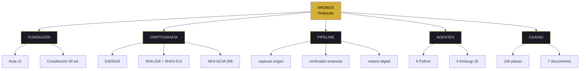
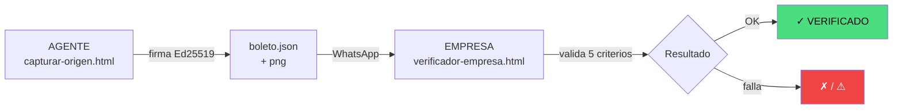
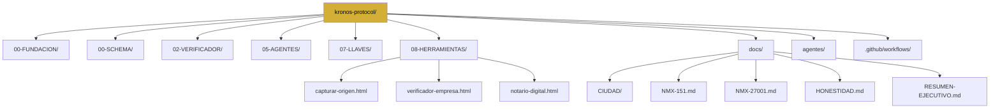
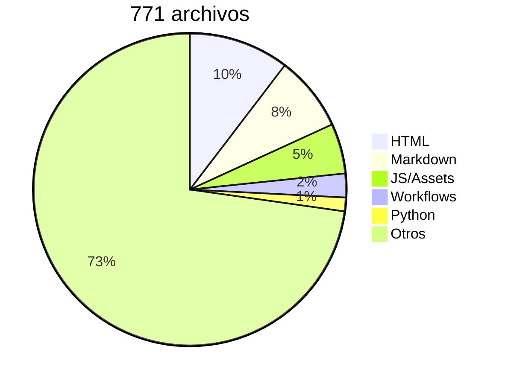

<div align="center">


<br>

**Protocolo de verificación criptográfica · Local-First · Humano–IA**

<sub>○_● · 51% HUMANO · 49% IA · 100% REAL</sub>

_"El legado no se hereda. Se firma."_

</div>

---

# kronos — syscall

<pre>
┌─[kronos@protocol]─[~/]─┐
│ KRONOS PROTOCOL          │
│ pipeline E2E · offline   │
│ 771 archivos · v3.17     │
└──────────────────────────┘
$ kronos --root --list
</pre>

> [!IMPORTANT]
> KRONOS es infraestructura de verificación criptográfica local-first. No es app. No es SaaS. Es protocolo abierto, verificable por cualquiera.

---

### ▸ estado del repo

```
archivos        ▓▓▓▓▓▓▓▓▓▓▓▓▓▓▓▓▓▓▓▓▓▓▓▓▓▓▓▓▓▓▓▓▓  771
carpetas        ▓▓▓▓▓▓▓▓▓▓▓▓▓▓▓▓▓▓▓▓▓▓▓▓▓░░░░░░   22
workflows       ▓▓▓▓▓▓▓▓▓▓▓▓▓▓▓▓▓▓▓▓▓▓▓▓▓▓▓▓▓▓▓▓▓   19
runs (3 días)   ▓▓▓▓▓▓▓▓▓▓▓▓▓▓▓▓▓▓▓▓▓▓▓▓▓▓▓▓▓▓▓▓▓  4,146
─────────────────────────────────────────────────────
pipeline E2E    ▓▓▓▓▓▓▓▓▓▓▓▓▓▓▓▓▓▓▓▓▓▓▓▓▓▓▓▓▓▓▓▓▓ 100%
clientes        ░░░░░░░░░░░░░░░░░░░░░░░░░░░░░░░░░   0%
```

---

### ▸ qué es KRONOS · mapa conceptual



---

### ▸ pipeline E2E · flujo



---

### ▸ estructura del repo



---

### ▸ distribución del repo



---

### ▸ comandos disponibles

| comando    | acción        | verifica con                |
| :--------- | :------------ | :-------------------------- |
| `syscall`  | este archivo  | `cat README.md`             |
| `list`     | qué hay acá   | `ls`                        |
| `pipeline` | cómo verifica | `ls 08-HERRAMIENTAS/`       |
| `ciudad`   | 100 plazas    | `docs/CIUDAD/CIUDADANOS.md` |
| `normas`   | NOM-151 + ISO | `docs/NMX-*.md`             |
| `test`     | prueba 2 min  | `capturar-origen.html`      |

---

### $ ps -ef | grep kronos

|   pid   | módulo           |  resultado   | proof             |
| :-----: | :--------------- | :----------: | :---------------- |
| root.01 | `pipeline E2E`   |  ✅ ACTIVO   | boleto verificado |
| root.02 | `agentes Python` | ✅ 6 ACTIVOS | 05-AGENTES/       |
| root.03 | `Kintsugi JS`    | 🟡 SIN MOTOR | agentes/          |
| root.04 | `documentación`  | ✅ COMPLETA  | docs/             |
| root.05 | `clientes`       |     🔴 0     | —                 |

<sub>5 procesos · 3 activos · 1 parcial · 1 pendiente</sub>

---

### $ syscall kronos --evidence

| key             | value                                                                 | check                                                                                                    |
| --------------- | --------------------------------------------------------------------- | -------------------------------------------------------------------------------------------------------- |
| merkle_articles | `e69b2c242ab44d90b67ff1b8eda679e34911fb347e867e43d23344a703390d93`    | `cat 00-FUNDACION/*.md \| sha256sum`                                                                     |
| merkle_docs     | `67180206595ec66d4d422b223f8d966961ecdf00cc2c32ed81133e83162ae813`    | `cat 00-SCHEMA/*.json \| sha256sum`                                                                      |
| pubkey_founder  | `fd2fb1e9f198f5fa08ec6391b67730e3d997826c40cd7652dd5774aa5e744977`    | `cat 07-LLAVES/*.json \| grep pubkey`                                                                    |
| eth_tx_1        | `0x8ca8e84e1258abac9acb29d14d25114e4775d782ecfda51ae29933247ed2970e`  | [etherscan](https://etherscan.io/tx/0x8ca8e84e1258abac9acb29d14d25114e4775d782ecfda51ae29933247ed2970e)  |
| eth_tx_2        | `0xd2c2a7e128e6c81b689b3b0d9e1b31a4f6bf8df0391b7b6c05e7daa7fb895774c` | [etherscan](https://etherscan.io/tx/0xd2c2a7e128e6c81b689b3b0d9e1b31a4f6bf8df0391b7b6c05e7daa7fb895774c) |

---

<details open>
<summary><code>▸ list</code> · qué hay en este repo</summary>

<br>

**> humano:** 8 áreas principales. Fundación, criptografía, pipeline, agentes, documentos de ciudad, normas, honestidad, y este README.

**> máquina:**

```bash
$ ls -d */
$ ls docs/
$ ls 08-HERRAMIENTAS/
```

</details>

---

<details open>
<summary><code>▸ pipeline</code> · cómo verifica</summary>

<br>

**> humano:** el pipeline funciona E2E. Probado con la Sra. Ríos. Genera boleto.json + boleto.png, los verifica contra empresa.json, da resultado.

**> máquina:**

```bash
$ ls 08-HERRAMIENTAS/
$ grep -R "Ed25519" 08-HERRAMIENTAS/
```

```json
{
  "pipeline": "capturar-origen → verificador-empresa → notario",
  "status": "E2E VERIFICADO",
  "fecha_prueba": "2026-10-01",
  "resultado": "✓ VERIFICADO"
}
```

</details>

---

<details open>
<summary><code>▸ ciudad</code> · 100 plazas</summary>

<br>

**> humano:** la ciudad no se compra. Se firma. 1 boleto verificado = 1 plaza. Sin pagos, sin suscripciones, sin KYC.

**> máquina:**

```bash
$ cat docs/CIUDAD/CIUDADANOS.md | grep "plaza"
```

</details>

---

<details open>
<summary><code>▸ normas</code> · NOM-151 + ISO 27001</summary>

<br>

**> humano:** conformidad técnica documentada, no certificación. La diferencia es honesta y está explícita en cada archivo.

**> máquina:**

```bash
$ ls docs/NMX-*.md
$ cat docs/NMX-151.md | head -n 30
```

</details>

---

<details open>
<summary><code>▸ test</code> · prueba en 2 minutos</summary>

<br>

**> humano:** cualquiera con Brave puede probar el pipeline completo. Sin instalar nada.

**> máquina:**

```
01  abrir  marcorojas17.github.io/kronos-protocol/08-HERRAMIENTAS/capturar-origen.html
02  firmar un origen de prueba
03  verificar el boleto.json en verificador-empresa.html
04  confirmar el resultado
```

</details>

---

### limits

> [!CAUTION]
> **KRONOS NO ES:**
>
> - ❌ App con login
> - ❌ SaaS con servidor
> - ❌ Certificación ISO acreditada
> - ❌ NFT o criptomoneda

> [!NOTE]
> **KRONOS SÍ ES:**
>
> - ✅ Protocolo local-first
> - ✅ Pipeline E2E verificado
> - ✅ 100 plazas de ciudadanía firmables
> - ✅ Conformidad NOM-151 documentada

<pre>
$ echo $?
0   # el repo no es basura. Es prueba.
</pre>

---

<sub>kernel root · v7.2 FLOW + MAPS</sub>

**○_● · ◢◤◥◣ · ◥◣◢◤**

<sub>51% HUMANO · 49% IA · 100% REAL</sub>  
<sub>"El repo no es basura. Es prueba."</sub>

<sub>El sistema no decide quién cobra. Solo prueba quién originó.</sub>
