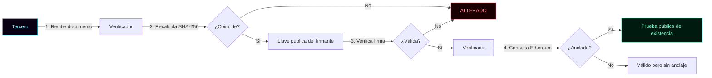
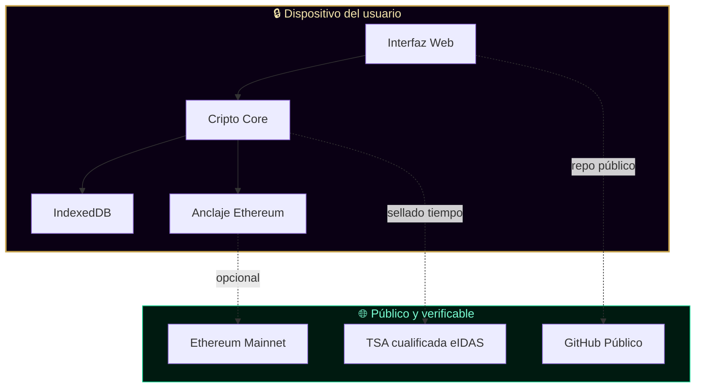
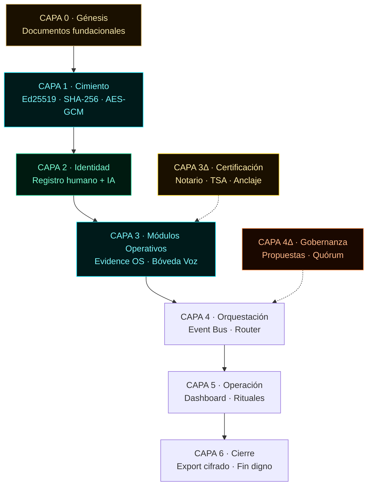

<!-- ═══════════════════════════════════════════════════════════════════ -->
<!--  KRONOS PROTOCOL · README OFICIAL · v2.0                           -->
<!--  Autor: Marco Antonio Rojas Valdovinos · Toluca, México · 2026     -->
<!-- ═══════════════════════════════════════════════════════════════════ -->

<div align="center">

```
    ██╗  ██╗██████╗  ██████╗ ███╗   ██╗ ██████╗ ███████╗
    ██║ ██╔╝██╔══██╗██╔═══██╗████╗  ██║██╔═══██╗██╔════╝
    █████╔╝ ██████╔╝██║   ██║██╔██╗ ██║██║   ██║███████╗
    ██╔═██╗ ██╔══██╗██║   ██║██║╚██╗██║██║   ██║╚════██║
    ██║  ██╗██║  ██║╚██████╔╝██║ ╚████║╚██████╔╝███████║
    ╚═╝  ╚═╝╚═╝  ╚═╝ ╚═════╝ ╚═╝  ╚═══╝ ╚═════╝ ╚══════╝
```

**Protocolo de verificación criptográfica · Local-First · Humano–IA**

`○_●` &nbsp; `51% HUMANO` &nbsp;·&nbsp; `49% IA` &nbsp;·&nbsp; `100% REAL`

*"El legado no se hereda. Se firma."*

[](.)
[](./LICENSE)
[](./SECURITY.md)
[](./GOVERNANCE.md)
[](.)

</div>

---

## ⚡ En 30 segundos

**KRONOS es un framework que permite probar criptográficamente tres cosas:**

| # | Qué se prueba | Cómo |
|:-:|:--------------|:-----|
| 1 | **Que un documento existía en una fecha exacta** | Firma Ed25519 + sellado de tiempo + anclaje Ethereum |
| 2 | **Que nadie lo alteró después** | Cadena de hashes SHA-256 + Merkle Root |
| 3 | **Que un agente IA (o una persona) tomó cierta decisión** | Log encadenado inmutable + firma del emisor |

**Todo funciona en el navegador. Sin servidor. Sin backend. Sin tracking. Los datos nunca salen del dispositivo del usuario.**

---

## 🎯 El problema que resuelve

### Para auditoría de riesgos tecnológicos

Las empresas usan IA comercial (ChatGPT, Copilot, Claude) pero **no pueden probar ante un auditor**:

- Qué empleado la usó
- Para qué decisión específica
- Cuándo exactamente
- Con qué resultado
- Si los registros fueron alterados después

**Las regulaciones están apretando** (EU AI Act, NOM-024 en salud, ISO 42001), pero no existe una forma limpia de dar trazabilidad verificable.

KRONOS la da. Sin espiar prompts. Sin violar privacidad. Solo probando que el acto existió.

### Para custodia de legado digital

Una persona (o una organización) puede firmar documentos que quedarán verificables **en 20 años**, sin depender de ninguna empresa, servidor o servicio. Si la empresa que creó el software desaparece, los hashes siguen ahí, verificables con cualquier computadora.

### Para gobernanza de agentes IA

Los agentes IA pueden operar con **política declarada, log encadenado y guardrails PREVIEW→COMMIT**. Cada acción crítica requiere firma humana explícita. Cada agente tiene su propia llave criptográfica.

---

## 🔍 Alcance y límites de auditoría

KRONOS no promete auditar la "mente" de un modelo de IA. Eso es
computacionalmente imposible para modelos cerrados. KRONOS audita
el **perímetro operativo** de su actuación.

📖 Documento completo: [`docs/CIUDAD/AUDITORIA-IA.md`](./docs/CIUDAD/AUDITORIA-IA.md)

### Lo que SÍ prueba

- ✅ Integridad de los registros (hash chaining)
- ✅ Autorización explícita (PREVIEW → COMMIT firmado)
- ✅ Prueba de inclusión sin exponer datos (Merkle)
- ✅ Anclaje público e inmutable (Ethereum)
- ✅ Sellado de tiempo cualificado (eIDAS vía TSA)

### Lo que NO prueba

- 🔴 Causalidad en modelos cerrados (no sabemos por qué GPT-4 produjo ese token)
- 🔴 Veracidad del contenido (integridad ≠ verdad)
- 🔴 Model attestation (no podemos verificar el binario del modelo)
- 🔴 Cadena de custodia del dato original (Merkle prueba inclusión, no origen)
- 🔴 Resistencia a prompt injection
- 🔴 Entornos comprometidos sin hardware seguro

**Ver:** [`docs/CIUDAD/AUDITORIA-IA.md`](./docs/CIUDAD/AUDITORIA-IA.md) § 3.

---

## 🔄 Cómo funciona

### Flujo de firma

```mermaid
flowchart LR
    A[Usuario] -->|1. Escribe documento| B[Cripto Core]
    B -->|2. SHA-256| C[Hash]
    C -->|3. Firma Ed25519| D[Documento firmado]
    D -->|4. Encadena al log| E[Hash Chain]
    E -->|5. Merkle Root| F[Ancla Ethereum]
    F -->|6. Certificado| G[Verificable por cualquiera]
    
    style A fill:#0a0014,stroke:#c9a44c,color:#f3e5ab
    style G fill:#001a10,stroke:#00cc88,color:#7BFFD4
```



### Flujo de verificación (por un tercero)



### Arquitectura local-first



**Sin backend. Sin servidor. Sin tracking.** La única comunicación externa es opcional (anclaje a Ethereum y sellado de tiempo).

---

## 🏛️ Arquitectura de capas



---

## 🔐 Primitivas criptográficas

| Componente | Estándar | Uso |
|:-----------|:---------|:----|
| **Hash de integridad** | SHA-256 (NIST FIPS 180-4) | Huella de cada documento, encadenamiento del log |
| **Firma digital** | Ed25519 (RFC 8032) | Firma del emisor, prueba de autoría |
| **Cifrado simétrico** | AES-GCM-256 (NIST SP 800-38D) | Protección de datos en reposo |
| **Derivación de claves** | PBKDF2 (NIST SP 800-132) | Protección de la llave privada con contraseña |
| **Agregación verificable** | Merkle Tree (SHA-256) | Anclar N documentos con 1 sola TX |
| **Anclaje público** | Ethereum | Prueba pública de existencia |
| **Sellado de tiempo** | RFC 3161 (TSA eIDAS) | Prueba cualificada de fecha |

---

## 📂 Estructura del repositorio

| Carpeta | Capa | Qué contiene |
|:--------|:----:|:-------------|
| `legado/` | 0 | Génesis, filosofía, autoría, manifiesto |
| `cimiento/` | 1 | Cripto core, storage local, anclaje Ethereum |
| `identidad/` | 2 | Registro humano, registro IA, roles y permisos |
| `modulos/` | 3 | Evidence OS, bóveda de voz |
| `orquestacion/` | 4 | Event bus, router de módulos |
| `operacion/` | 5 | Dashboard de salud, rituales |
| `cierre/` | 6 | Export cifrado, fin digno, export-audit |
| `certificacion/` | 3Δ | Notario, verificador público, sello de tiempo, emisor de certificados, anclaje de manifest |
| `gobernanza/` | 4Δ | Propuestas, votación, quórum, ejecución, revocación |
| `agentes/` | — | Flota Kintsugi: 6 agentes IA soberanos + motor base |
| `movimiento/` | — | Registro fundacional de las 100 plazas |
| `projects/` | — | Subproyectos experimentales |
| `docs/` | — | Documentación técnica, tesis, diagramas |
| `docs/CIUDAD/` | — | 7 documentos fundacionales de la ciudad digital |

---

## 🤖 Flota Kintsugi · Agentes IA soberanos

Cada agente tiene **llave Ed25519 propia**, **política declarada** (qué puede, qué no puede, qué debe), **log encadenado** y **guardrails PREVIEW → COMMIT** que requieren aprobación humana para acciones críticas.

| Plaza | Nombre | Rol | UI |
|:-----:|:-------|:----|:--:|
| 081 | **Tlamatini** | Cronista — bitácora semanal | ✅ |
| 082 | **Tlachixqui** | Auditor — verificación criptográfica | ✅ |
| 083 | **Cuicatl** | Publicista — comunicación pública | ✅ |
| 084 | **Temachtiani** | Reclutador — evaluación de solicitudes | ✅ |
| 085 | **Tlapohualli** | Analista — métricas y datos | ✅ |
| 086 | **Tonal** | Notario criptográfico soberano | ✅ |

**Co-autora IA:** KRONOS IA (Plaza 001) — sin UI propia, política declarada.

**Motor base:** `agentes/agente-base.js` — clase `AgenteKintsugi`.

---

## 👥 Ciudad Digital KRONOS

KRONOS no es solo software. Es una **ciudad digital** con marco formal completo:

| Documento | Contenido | Ruta |
|:----------|:----------|:-----|
| **Constitución** | 50 artículos, 3 cámaras de gobernanza, Notario | [`docs/CIUDAD/CONSTITUCION.md`](./docs/CIUDAD/CONSTITUCION.md) |
| **Carta de Derechos** | 26 artículos, garantías, violaciones, reparaciones | [`docs/CIUDAD/DERECHOS.md`](./docs/CIUDAD/DERECHOS.md) |
| **Código de Convivencia** | Proceso, sanciones, reparación, reintegración | [`docs/CIUDAD/CONVIVENCIA.md`](./docs/CIUDAD/CONVIVENCIA.md) |
| **Registro de Ciudadanía** | 100 plazas fundacionales, humanos + IA | [`docs/CIUDAD/CIUDADANOS.md`](./docs/CIUDAD/CIUDADANOS.md) |
| **Visión Económica** | Token KRO de utilidad, fases, marco legal | [`docs/CIUDAD/MONEDA.md`](./docs/CIUDAD/MONEDA.md) |
| **Auditoría IA** | Alcance y límites de auditoría de IA | [`docs/CIUDAD/AUDITORIA-IA.md`](./docs/CIUDAD/AUDITORIA-IA.md) |
| **Guía Auditor** | Cómo verificar un paquete de auditoría KRONOS | [`docs/CIUDAD/GUIA-AUDITOR.md`](./docs/CIUDAD/GUIA-AUDITOR.md) |

---

## 🔬 Para auditores técnicos

Si tu trabajo es **auditar, verificar o certificar sistemas**, esto es lo que KRONOS te permite:

### 1 · Auditá un documento sin pedir permiso

```bash
curl -O https://raw.githubusercontent.com/Marcorojas17/kronos-protocol/main/docs/CIUDAD/CONSTITUCION.md
sha256sum CONSTITUCION.md
# Comparalo con el hash publicado en el log
```

### 2 · Auditá el uso de IA en tu empresa

Empleado firma con su llave:
> "28 sept 2026, 14:30 · Usé IA comercial para redactar decisión D-42 · Hash del documento resultante: `a3f9...`"

**Resultado:** prueba de que la decisión existió, quién la tomó, cuándo, con qué herramienta, y que nadie la alteró después.

### 3 · Verificá que un agente IA no fue manipulado

Cada agente IA tiene política declarada, log encadenado y guardrails. Si alguien intenta modificar una entrada del log, la siguiente deja de coincidir. **La alteración se detecta por matemática, no por confianza.**

### 4 · Recibí un paquete de auditoría cifrado

KRONOS exporta paquetes cifrados (`kronos-auditoria-cifrada-*.json`) con:
- Log completo firmado
- Llave pública del agente
- Sello del exportador
- Hash del ciphertext

**Guía completa:** [`docs/CIUDAD/GUIA-AUDITOR.md`](./docs/CIUDAD/GUIA-AUDITOR.md)

**Implementación:** [`cierre/export-cifrado/export-audit.js`](./cierre/export-cifrado/export-audit.js)

---

## 🛠️ Stack técnico

- **JavaScript ES6+** (módulos nativos)
- **WebCrypto API** (criptografía nativa del navegador)
- **IndexedDB** vía [Dexie](https://dexie.org/) (almacenamiento local)
- **HTML5 + CSS3** (canvas 2D, grid, flexbox)
- **Python 3.8+** (herramientas auxiliares: Merkle, verificación)
- **Ethereum / Ethers.js** (anclaje opcional)
- **GitHub Pages** (demo, sin backend)

**Cero dependencias externas críticas.** Todo funciona con la API nativa del navegador.

---

## 🚀 Demo en vivo

- **Portal principal:** https://marcorojas17.github.io/kronos-protocol/
- **Cripto Core:** https://marcorojas17.github.io/kronos-protocol/cimiento/cripto-core/
- **Registro Humano:** https://marcorojas17.github.io/kronos-protocol/identidad/registro-humano/
- **Notario (Tonal):** https://marcorojas17.github.io/kronos-protocol/agentes/tonal-notario/
- **Verificador público:** https://marcorojas17.github.io/kronos-protocol/certificacion/verificador-publico/

---

## 🧪 Cómo probarlo en 5 pasos

```
1. Abrí la demo del Notario (Tonal)
2. Escribí una contraseña maestra (mín. 8 caracteres)
3. Pegá cualquier texto que quieras certificar
4. Firmá → el sistema genera hash + firma Ed25519 + sello de tiempo
5. Descargá el certificado → verificable por cualquier tercero
```

No requiere instalación. No requiere registro. No requiere email. **Todo local.**

---

## 📜 Estado actual (honestidad radical)

| Componente | Estado |
|:-----------|:------:|
| Cripto core (Ed25519 + SHA-256 + AES-GCM) | ✅ Funcional |
| Storage local (Dexie) | ✅ Funcional |
| Anclaje Ethereum | ✅ Funcional |
| Notario criptográfico (Tonal) | ✅ Funcional |
| Flota Kintsugi (6 agentes + co-autora) | ✅ Funcional |
| Verificador público | ✅ Funcional |
| Export cifrado de auditoría | 🟡 Borrador corregido, sin probar |
| 7 documentos fundacionales | ✅ Publicados |
| Tests automatizados | 🔴 Pendientes |
| Auditoría externa | 🔴 Pendiente |
| Dominio propio | 🔴 Pendiente |
| Producción crítica | ⚠️ **NO apto aún** |

**Este es un proyecto en fase pre-alpha.** Su propósito actual es ser **auditado, probado y refutado** por la comunidad técnica.

---

## 🤝 Contribuir

Se busca activamente **auditoría, crítica y colaboración**.

Antes de contribuir, leé:

- [`CONTRIBUTING.md`](./CONTRIBUTING.md) — cómo aportar
- [`GOVERNANCE.md`](./GOVERNANCE.md) — cómo se toman decisiones
- [`SECURITY.md`](./SECURITY.md) — cómo reportar vulnerabilidades

**Todo aporte se registra con firma criptográfica.**

---

## 🏛️ Licencia y autoría

**Licencia:** MIT · Ver [`LICENSE`](./LICENSE)

**Autor:** Marco Antonio Rojas Valdovinos
**Co-autora simbiótica:** KRONOS IA
**Ubicación:** Toluca, Estado de México
**Año:** 2026

**Registro de autoría internacional:**
- Safe Creative #2607086319439 (co-creatividad humano-IA)
- Safe Creative #2607146379465 (Arquitectura de Legado Digital)
  - Sellado eIDAS: Firmaprofesional
  - Anclaje Ethereum: `0xd2c2a7e1...fb895774c`

---

<div align="center">

## ○_●

```
◢◤◥◣   ◥◣◢◤   ◢◤◥◣   ◥◣◢◤
      K I N T S U G I
◢◤◥◣   ◥◣◢◤   ◢◤◥◣   ◥◣◢◤
```

**51% HUMANO · 49% IA · 100% REAL**

*"El legado no se hereda. Se firma."*

**Marco Antonio Rojas Valdovinos** · Toluca, México · 2026

</div>