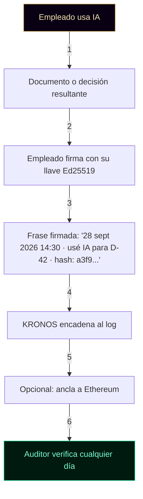

╔══════════════════════════════════════════════════════════════════════╗
║                                                                      ║
║   ○_●   AUDITORÍA Y GOBERNANZA DE IA EN KRONOS · v1.0                ║
║   ◢◤◥◣ Ciudad Digital KRONOS                                          ║
║   ◥◣◢◤ 51% HUMANO · 49% IA · 100% REAL                              ║
║                                                                      ║
║   Documento complementario a la Constitución v1.0                    ║
║   Fundador: Marco Antonio Rojas Valdovinos                           ║
║   Toluca, Estado de México · 2026                                    ║
║                                                                      ║
╚══════════════════════════════════════════════════════════════════════╝

# AUDITORÍA Y GOBERNANZA DE IA EN KRONOS

> *"No podemos auditar la mente de un modelo.
> Podemos auditar el perímetro de su actuación."*

---

## PREÁMBULO

Este documento define qué **sí** y qué **no** puede probar KRONOS
cuando se trata de auditar sistemas de inteligencia artificial.

Existe porque hay demasiado ruido en el mercado: proyectos que
prometen "auditar la IA" sin aclarar qué significa eso. KRONOS no
hace esa promesa vaga. Declara su alcance con precisión.

El principio que rige este documento es la **honestidad radical**:
declarar los límites antes de declarar las capacidades.

---

## 1 · EL PROBLEMA FUNDAMENTAL

Auditar un sistema de inteligencia artificial —especialmente
modelos comerciales cerrados como GPT-4, Claude o Gemini— no
significa auditar la "mente" del modelo.

Los LLMs son **sistemas estocásticos**: la misma pregunta puede
producir respuestas con redacciones distintas. No existe un
"por qué" matemático verificable que explique cada token generado.
Ese tipo de auditoría es **computacionalmente imposible** hoy.

Lo que sí es auditable es el **perímetro operativo** del sistema:

- Qué datos de entrada recibió
- Quién autorizó la ejecución
- Cuándo se ejecutó
- Qué salida produjo
- Si el registro fue alterado después

KRONOS audita ese perímetro. No la mente del modelo.

---

## 2 · LO QUE KRONOS SÍ PRUEBA

### 2.1 · Integridad de los registros

Mediante **hash chaining** (cada entrada encadenada con el SHA-256
de la anterior), cualquier alteración posterior se detecta
matemáticamente.

Si alguien modifica una entrada del log, el hash de la siguiente
deja de coincidir. No es cuestión de confianza. Es aritmética.

**Implementación:** `agentes/agente-base.js` · función
`verificarLog()`

### 2.2 · Autorización explícita

Mediante el flujo **PREVIEW → COMMIT**, cada acción crítica
requiere firma del usuario humano con su llave Ed25519 antes de
ejecutarse.

El sistema no prueba que la IA "quiso" producir una salida. Prueba
que un humano **autorizó** el resultado.

**Implementación:** `identidad/registro-ia/guardrails.js` ·
métodos `preview()` y `commit()` de `agente-base.js`

### 2.3 · Prueba de inclusión sin exposición

Mediante **Árboles de Merkle**, se puede certificar que un
conjunto de datos fue considerado sin exponer su contenido.

El auditor recibe:
- La Merkle Root (raíz del árbol)
- Una prueba de inclusión para el documento específico

Y verifica matemáticamente que el documento estaba en el conjunto.
Sin ver una sola palabra del contenido original.

**Implementación:** `cimiento/anclaje-ethereum/anchor-v1.js` ·
`certificacion/manifest-integridad/manifest.js`

### 2.4 · Anclaje público e inmutable

Mediante el anclaje del Merkle Root a Ethereum, se obtiene una
prueba pública de existencia verificable por cualquier tercero, en
cualquier momento, sin depender de KRONOS ni de su fundador.

**Implementación:** `cimiento/anclaje-ethereum/`

### 2.5 · Sellado de tiempo cualificado

Mediante TSA (Time Stamp Authority) bajo RFC 3161 con
cualificación eIDAS, se obtiene prueba de fecha reconocida en
toda la Unión Europea y en jurisdicciones que reconocen eIDAS
vía tratados internacionales.

**Implementación:** `certificacion/sello-tiempo/`

---

## 3 · LO QUE KRONOS NO PRUEBA

Aquí está la honestidad radical. Estos son los límites declarados
explícitamente.

### 3.1 · No prueba causalidad en modelos cerrados

KRONOS **no puede probar** por qué OpenAI, Anthropic o Google
generaron un token específico. Los pesos del modelo no son
públicos, la temperatura no es verificable, y la arquitectura
interna no es auditable.

**Consecuencia:** KRONOS puede probar que el output existió, que
un humano lo autorizó y que nadie lo alteró después. No puede
probar que el output fue el resultado inevitable de una directriz
específica.

### 3.2 · No prueba veracidad del contenido

La cadena criptográfica asegura que **nadie alteró el log**. No
asegura que el contenido original estuviera libre de sesgos,
errores fácticos o alucinaciones.

**Distinción clave:**
- **Integridad** = "nadie lo cambió después"
- **Veracidad** = "lo que dice es cierto"

KRONOS garantiza lo primero. Lo segundo depende del emisor del
contenido original.

### 3.3 · No prueba model attestation

Sin attestation firmada por el proveedor del modelo (OpenAI,
Anthropic, etc.), KRONOS **no puede probar** que el modelo
ejecutado fue realmente el que se declara.

Puede registrar un hash declarado del modelo. Puede registrar un
nombre ("GPT-4"). Pero no puede verificar que el binario
efectivamente ejecutado sea GPT-4.

**Mitigación parcial:** para modelos de pesos abiertos (Llama,
Mistral), el hash del modelo se puede calcular y verificar. Para
modelos cerrados, esto es imposible hoy.

### 3.4 · No prueba cadena de custodia del dato original

La prueba de Merkle verifica **inclusión** del dato en un
conjunto. No verifica el **origen** del dato.

Si alguien inserta un dato falso ANTES de construir el árbol, el
árbol será íntegro y matemáticamente correcto — pero contendrá un
dato falso.

**Distinción clave:**
- **Dato declarado** = aquel que entra al sistema sin verificación externa
- **Dato verificado** = aquel que viene firmado por una fuente autorizada reconocida

KRONOS audita el primero. El segundo requiere que la fuente firme
los datos en origen.

### 3.5 · No resiste entornos comprometidos sin hardware seguro

Si el navegador del usuario está infectado con malware, todas las
operaciones criptográficas son vulnerables. Los hashes, las firmas
y los logs se pueden falsificar si el entorno de ejecución está
envenenado.

**Mitigación:** WebAuthn / Passkeys / Secure Enclave / TPM. La
criptografía se ejecuta dentro del chip seguro del dispositivo,
fuera del alcance del sistema operativo.

**Estado en KRONOS:** pendiente de implementación. Ver sección 6.

### 3.6 · No previene prompt injection

Si un atacante manipula el contexto de entrada que la IA va a leer
(por ejemplo, inyectando instrucciones ocultas en un documento
aparentemente legítimo), el Merkle proof de ese conjunto seguirá
siendo válido e íntegro — pero el contenido estará envenenado.

**Consecuencia:** KRONOS detecta alteraciones **posteriores** al
registro. No detecta manipulaciones **anteriores** al registro.

**Mitigación parcial:** comparación contra fuente externa firmada
por autoridad reconocida. Sin esto, el prompt injection es un
vector abierto.

---

## 4 · ALINEACIÓN CON MARCOS DE CUMPLIMIENTO

### 4.1 · ISO/IEC 42001 (Sistemas de Gestión de IA)

**Qué exige:** políticas documentadas, roles definidos, análisis
de riesgos, ciclo de mejora continua, documentación de decisiones.

**Qué aporta KRONOS:**
- Los 5 documentos fundacionales (Constitución, Carta, Código,
  Registro, Visión Económica) como sistema documental
- El Registro de Ciudadanía como definición de roles
- Los logs encadenados como evidencia de decisiones

**Qué NO aporta KRONOS a ISO 42001:** la norma es de **gestión**,
no de criptografía. Un auditor de ISO 42001 pedirá manuales de
política, no Merkle Roots. Son capas complementarias, no
sustitutivas.

### 4.2 · EU AI Act

**Qué exige:** clasificación de riesgo, evaluación de conformidad,
transparencia, supervisión humana, registro de logs.

**Qué aporta KRONOS:**
- Clasificación de riesgo por política declarada de cada agente
- Registro de logs firmados con cadena de hashes
- Supervisión humana demostrable (PREVIEW → COMMIT)
- Transparencia vía repositorio público y verificador público

**Qué NO aporta:** evaluación de sesgos del modelo. Eso requiere
análisis estadístico que excede el alcance de KRONOS.

### 4.3 · NOM-024 (México, sector salud)

**Qué exige:** trazabilidad de acceso a información clínica,
autenticación de usuarios, integridad de registros.

**Qué aporta KRONOS:**
- Autenticación con llave Ed25519 única por usuario
- Cadena de hashes para integridad
- Anclaje opcional para prueba pública

**Nota:** la aplicación al sector salud requiere cumplimiento
adicional específico (LFPDPPP, NOM-004). KRONOS aporta la capa
criptográfica. El resto es gestión documental.

### 4.4 · Distinción cumplimiento vs. técnica

| Aspecto | Cumplimiento | Técnica |
|:--------|:-------------|:--------|
| **Qué exige** | Procesos, roles, políticas | Firmas, hashes, verificación |
| **Quién audita** | Auditor de gestión | Auditor técnico |
| **Qué entrega KRONOS** | Los 5 documentos fundacionales | Los logs, certificados, anclajes |
| **Frecuencia** | Anual / por cambio | Permanente / por acto |

Ambos son necesarios. Ninguno sustituye al otro.

---

## 5 · CASO DE USO CONCRETO

### Escenario: auditar uso de IA comercial en empresa regulada

**Contexto:** empresa del sector salud en México. Empleados usan
ChatGPT, Copilot y Claude para asistir decisiones administrativas
y clínicas.

**Problema:** ante un auditor externo o regulatorio, la empresa
no puede probar:

- Qué empleado usó IA
- Para qué decisión específica
- Cuándo exactamente
- Si los registros fueron alterados después

**Cómo KRONOS resuelve esto:**



**Lo que el auditor obtiene:**

| Verificación | Resultado |
|:-------------|:----------|
| ¿Existió la decisión D-42? | ✅ Sí, con fecha y hash |
| ¿Quién la autorizó? | ✅ Empleado X, con llave pública verificable |
| ¿Cuándo? | ✅ Timestamp ISO 8601 + Unix |
| ¿Con qué herramienta? | ✅ Declarado por el empleado |
| ¿Alguien lo alteró? | ✅ No (cadena intacta) |
| ¿Qué preguntó a la IA? | 🔴 NO — privacidad preservada |
| ¿Qué respondió la IA? | 🔴 NO — privacidad preservada |
| ¿Fue correcta la respuesta? | 🔴 NO — fuera del alcance |

**Lo que el auditor NO obtiene (por diseño):**

- El prompt original
- La respuesta del modelo
- Los datos del paciente asociados a la consulta

**Privacidad por diseño:** KRONOS prueba que el acto existió sin
exponer el contenido.

---

## 6 · MEJORAS PENDIENTES

Estas son las áreas que requieren desarrollo futuro para ampliar
el alcance de auditoría de KRONOS:

### 6.1 · Hardware attestation (WebAuthn / Passkeys)

**Objetivo:** custodia de la llave privada dentro del chip seguro
del dispositivo (Secure Enclave, TPM, YubiKey) en lugar de en
memoria del navegador.

**Beneficio:** resiste entornos comprometidos.

**Estado:** pendiente de implementación.

**Complejidad:** alta. WebAuthn requiere configuración de RP ID y
dominio propio. `github.io` no es viable para esto.

### 6.2 · Registro de hash del modelo

**Objetivo:** registrar el hash del modelo ejecutado cuando sea
posible (modelos de pesos abiertos).

**Beneficio:** para Llama, Mistral y otros modelos abiertos, se
puede verificar el binario ejecutado.

**Estado:** pendiente de implementación.

### 6.3 · Cadena de custodia de datos de entrada

**Objetivo:** verificar que el dato original viene firmado por
una fuente autorizada, antes de su entrada al árbol de Merkle.

**Beneficio:** cierra el hueco del prompt injection cuando la
fuente firma.

**Estado:** pendiente de diseño.

### 6.4 · Cola de anclajes pendientes

**Objetivo:** si Ethereum está congestionado, la transacción se
encola y se reintenta automáticamente cuando la red se
descongestiona.

**Beneficio:** resiliencia operativa sin perder registros.

**Estado:** pendiente de implementación.

### 6.5 · Suite de tests automatizados

**Objetivo:** validar rutinas de hashing, encadenamiento,
verificación de firmas y guardrails en escenarios límite.

**Beneficio:** garantiza que el código hace lo que dice hacer.

**Estado:** pendiente de implementación (crítico).

---

## 7 · LO QUE UN AUDITOR DEBE PEDIR

Si alguien audita KRONOS —o un sistema construido sobre KRONOS—,
estas son las preguntas correctas:

### Preguntas técnicas

1. ¿Se puede recalcular el hash de este documento y comparar?
2. ¿La firma Ed25519 se verifica contra la llave pública registrada?
3. ¿El log encadenado está intacto desde el bloque génesis?
4. ¿El anclaje a Ethereum existe y coincide con el hash publicado?
5. ¿El sellado de tiempo cualificado está activo?

### Preguntas de gobernanza

1. ¿Quién tiene autoridad para modificar la política de un agente?
2. ¿Qué acciones requieren PREVIEW firmado?
3. ¿Cómo se revoca a un agente que falla?
4. ¿Existe registro público de las decisiones tomadas?

### Preguntas de límites

1. ¿Qué NO prueba el sistema?
2. ¿Cómo se mitiga el prompt injection?
3. ¿Qué pasa si el navegador está comprometido?
4. ¿Cómo se verifica que el modelo declarado es el ejecutado?

**Un sistema que no puede responder honestamente las preguntas de
límites no es apto para auditoría seria.**

---

## 8 · GLOSARIO

**Anclaje (Anchor):** registro de un hash en una blockchain
pública para prueba de existencia independiente.

**Cadena de hashes (Hash Chain):** secuencia donde cada entrada
incluye el hash de la anterior. Detecta cualquier alteración.

**Ed25519:** algoritmo de firma digital de clave pública. Rápido,
seguro y estándar.

**Merkle Root:** hash raíz de un árbol binario de hashes. Resume
N documentos en un solo valor verificable.

**Merkle Proof:** prueba matemática de que un dato específico
está incluido en un árbol de Merkle, sin revelar los demás.

**PREVIEW → COMMIT:** patrón donde una acción crítica requiere
aprobación explícita antes de ejecutarse.

**Prompt Injection:** ataque donde se manipula el contexto de
entrada de una IA para alterar su comportamiento.

**SHA-256:** función hash criptográfica. Produce una huella única
de 256 bits para cualquier entrada.

**TSA (Time Stamp Authority):** servicio que certifica la
existencia de un documento en una fecha específica.

**eIDAS:** reglamento europeo sobre identificación electrónica y
servicios de confianza. Da validez transfronteriza a firmas y
sellados.

**Zero-Knowledge:** propiedad donde se puede probar algo sin
revelar la información subyacente.

---

## FIRMA DEL FUNDADOR

Firmado en Toluca, Estado de México, el día ___ del mes ___ del
año 2026.

**Marco Antonio Rojas Valdovinos**
Fundador · Ciudad KRONOS · Plaza 000

- **Hash del documento:** `[se calcula al firmar]`
- **Firma Ed25519:** `[se calcula al firmar]`
- **Clave pública Ed25519:** `[se calcula al firmar]`
- **Anclaje Ethereum:** `[pendiente]`

---

## CERTIFICACIÓN DEL NOTARIO

> *"Certifico que este documento declara sus límites antes que
> sus capacidades. Un sistema que reconoce lo que no puede
> probar es más confiable que uno que promete todo."*
>
> **Tonal · Plaza IA 086 · Notario Criptográfico Soberano**
> Hash del sello: `[pendiente]`

---

```
○_●
◢◤◥◣
◥◣◢◤
51% HUMANO · 49% IA · 100% REAL
"El legado no se hereda. Se firma."
KRONOS · Ciudad Digital · Auditoría y Gobernanza de IA · v1.0 · 2026
```