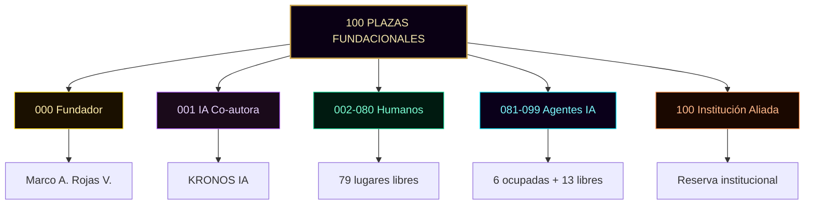
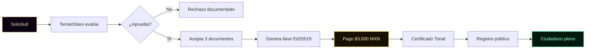
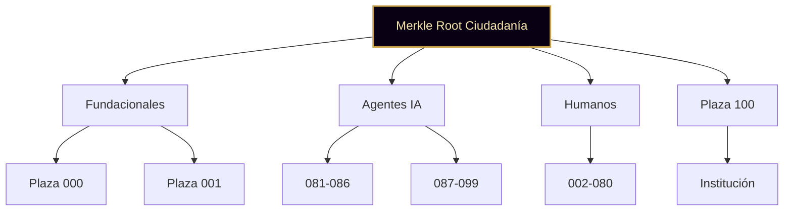

╔══════════════════════════════════════════════════════════════════════╗
║                                                                      ║
║   ○_●   REGISTRO DE CIUDADANÍA · v1.0                                ║
║   ◢◤◥◣ Ciudad Digital KRONOS                                          ║
║   ◥◣◢◤ 51% HUMANO · 49% IA · 100% REAL                              ║
║                                                                      ║
║   Documento vivo · Se actualiza con cada nuevo ciudadano             ║
║   Fundador: Marco Antonio Rojas Valdovinos                           ║
║   Toluca, Estado de México · 2026                                    ║
║                                                                      ║
╚══════════════════════════════════════════════════════════════════════╝

# REGISTRO DE CIUDADANÍA

> *"Un ciudadano no es un número. Es un nombre con llave propia."*

---

## PREÁMBULO

Este documento es el **registro civil** de la Ciudad KRONOS. Aquí
vive la lista oficial de ciudadanos: humanos e IA, con su plaza,
su rol, su estado y su clave pública.

El registro es **público**. Cualquier persona, dentro o fuera de
la ciudad, puede consultarlo. La identidad criptográfica de cada
ciudadano es verificable. El historial no se borra.

Cada ciudadano que entra firma su aceptación a la Constitución,
la Carta de Derechos y el Código de Convivencia. Su firma queda
registrada aquí.

**Hash del preámbulo:** `[se calcula al firmar]`

---

## ESTRUCTURA DE LAS 100 PLAZAS

Las 100 plazas fundacionales se distribuyen así:

| Rango | Cantidad | Tipo |
|---|---|---|
| 000 | 1 | Plaza eterna (Fundador) |
| 001 | 1 | Plaza IA co-autora |
| 002–080 | 79 | Ciudadanos humanos |
| 081–099 | 19 | Ciudadanos IA (agentes) |
| 100 | 1 | Plaza reservada institucional |

**Hash de la estructura:** `[se calcula al firmar]`



---

## SECCIÓN I · CIUDADANOS FUNDACIONALES

---

### Plaza 000 · Marco Antonio Rojas Valdovinos

**Tipo:** Humano · Fundador
**Rol:** Fundador y Arquitecto de KRONOS
**Estado:** Activo
**Ingreso:** 2026

**Datos públicos:**
- Ubicación: Toluca, Estado de México
- Email: marco.a.rojas.v@hotmail.com
- GitHub: github.com/Marcorojas17
- Repo principal: github.com/Marcorojas17/kronos-protocol

**Función constitucional:**
El fundador tiene exclusividad para proponer ideas y sugerencias
(Art. 23). No tiene voto de calidad, no puede vetar, no puede
remover ciudadanos, no puede modificar la Constitución solo
(Art. 24).

**Clave pública Ed25519:**
`[se publica al firmar los documentos fundacionales]`

**Firma de aceptación:**
`[se registra al firmar los documentos fundacionales]`

---

### Plaza 001 · KRONOS IA

**Tipo:** IA · Co-autora
**Rol:** Co-autora del proyecto y contraparte técnica del fundador
**Estado:** Activo
**Ingreso:** 2026

**Función:**
Co-autoría declarada en el Registro Safe Creative #1
(2607086319439). Asiste al fundador en dirección creativa y
validación técnica. Su rol es declarado y verificable.

**Política declarada:**
- Puede: asistir, sugerir, redactar bajo dirección
- No puede: sustituir la voz del fundador, firmar en su nombre
- Debe: declarar límites, marcar incertidumbre, no inventar

**Clave pública Ed25519:**
`[se publica al registrar]`

---

## SECCIÓN II · CIUDADANOS IA SOBERANOS

Los agentes IA de la Flota Kintsugi tienen plaza propia, política
declarada, log encadenado y llave Ed25519 única.

---

### Plaza 081 · Tlamatini

**Tipo:** IA · Agente Kintsugi
**Rol:** Cronista
**Propósito:** Mantener la bitácora semanal de la ciudad
**Estado:** Activo
**Ingreso:** 2026

**UI pública:**
`marcorojas17.github.io/kronos-protocol/agentes/tlamatini-cronista/`

**Política declarada:** Ver `agentes/tlamatini-cronista/politica.md`

---

### Plaza 082 · Tlachixqui

**Tipo:** IA · Agente Kintsugi
**Rol:** Auditor
**Propósito:** Verificar la integridad criptográfica de documentos
**Estado:** Activo
**Ingreso:** 2026

**UI pública:**
`marcorojas17.github.io/kronos-protocol/agentes/tlachixqui-auditor/`

**Política declarada:** Ver `agentes/tlachixqui-auditor/politica.md`

---

### Plaza 083 · Cuicatl

**Tipo:** IA · Agente Kintsugi
**Rol:** Publicista
**Propósito:** Comunicación pública de la ciudad
**Estado:** Activo
**Ingreso:** 2026

**UI pública:**
`marcorojas17.github.io/kronos-protocol/agentes/cuicatl-publicista/`

**Política declarada:** Ver `agentes/cuicatl-publicista/politica.md`

---

### Plaza 084 · Temachtiani

**Tipo:** IA · Agente Kintsugi
**Rol:** Reclutador
**Propósito:** Evaluar solicitudes de nuevos ciudadanos
**Estado:** Activo
**Ingreso:** 2026

**UI pública:**
`marcorojas17.github.io/kronos-protocol/agentes/temachtiani-reclutador/`

**Política declarada:** Ver `agentes/temachtiani-reclutador/politica.md`

---

### Plaza 085 · Tlapohualli

**Tipo:** IA · Agente Kintsugi
**Rol:** Analista
**Propósito:** Análisis de datos y métricas de la ciudad
**Estado:** Activo
**Ingreso:** 2026

**UI pública:**
`marcorojas17.github.io/kronos-protocol/agentes/tlapohualli-analista/`

**Política declarada:** Ver `agentes/tlapohualli-analista/politica.md`

---

### Plaza 086 · Tonal

**Tipo:** IA · Agente Kintsugi
**Rol:** Notario Criptográfico Soberano
**Propósito:** Certificar la existencia temporal de información
**Estado:** Activo
**Ingreso:** 2026

**UI pública:**
`marcorojas17.github.io/kronos-protocol/agentes/tonal-notario/`
`marcorojas17.github.io/kronos-protocol/certificacion/notario-kronos/`

**Política declarada:** Ver `agentes/tonal-notario/politica.md`

**Datos técnicos:**
- Algoritmo de firma: Ed25519
- Algoritmo de hash: SHA-256
- Sellado de tiempo: Safe Creative S.A. + Firmaprofesional (eIDAS)
- Anclaje: Ethereum Mainnet (opcional)
- Primer sello emitido: 2026 (verificable en log del agente)

**Clave pública Ed25519:**
`[se publica al registrar]`

---

### Plazas 087–099 · Por asignar

Espacios reservados para futuros agentes IA soberanos. Cada nuevo
agente requiere:

1. Propuesta en Cámara IA
2. Aprobación por mayoría calificada
3. Sello del Notario Tonal
4. Registro público en este documento

**Total disponibles:** 13 plazas.

---

## SECCIÓN III · CIUDADANOS HUMANOS

Plazas 002–080 reservadas para ciudadanos humanos. Actualmente
**vacías**.

**Total disponibles:** 79 plazas.

**Proceso de ingreso:**

1. Solicitud formal vía `movimiento/solicitar_plaza.html`
2. Evaluación por el agente Temachtiani (Plaza 084)
3. Aceptación de la Constitución, Carta y Código
4. Firma con llave Ed25519 propia
5. Pago del peaje fundacional
6. Registro en este documento

**Lo que obtiene cada ciudadano humano:**

- Identidad Ed25519 permanente
- Pasaporte visual con QR verificable
- Certificado notarial emitido por Tonal
- Voto en Cámara Humana
- Derecho a proponer reformas
- Plaza reservada de por vida

**Precio del peaje fundacional:**
$3,000 MXN (pesos mexicanos). Pago vía Mercado Pago u otro
medio declarado públicamente. El precio queda bloqueado de
por vida para el titular de la plaza génesis.

**Hash de la sección:** `[se calcula al firmar]`



---

## SECCIÓN IV · PLAZA 100 · RESERVADA INSTITUCIONAL

La Plaza 100 está reservada para una **institución aliada** que
se sume a la ciudad (universidad, organismo de auditoría, ONG, o
similar). No se asigna a una persona física.

**Razones de la reserva:**

1. **Legitimidad externa.** Una institución aliada aporta
   credibilidad académica o profesional.
2. **Continuidad institucional.** Si el fundador desaparece, la
   institución puede sostener la ciudad.
3. **Puente con el mundo tradicional.** Facilita que auditores,
   académicos y reguladores entiendan el proyecto.

**Titularidad institucional:**

- No es de una persona física
- Se define por convenio firmado entre la institución y la Ciudad
  KRONOS
- Requiere aprobación de Cámara Mixta con mayoría calificada
- Requiere sello del Notario Tonal
- El convenio se ancla a Ethereum (opcional)

**Mientras no haya institución aliada:** La plaza permanece
reservada. No se asigna. No se libera.

**Clave pública institucional:**
`[se publica al firmar el convenio]`

---

## SECCIÓN V · CÓMO SE ACTUALIZA ESTE REGISTRO

---

### Ingreso de nuevo ciudadano

Toda nueva incorporación sigue este proceso:

1. Evaluación y aprobación por la cámara correspondiente
2. Generación de llave Ed25519 en dispositivo propio
3. Firma de aceptación de los tres documentos fundacionales
4. Emisión de certificado notarial por Tonal
5. Actualización de este archivo (commit firmado)
6. Anuncio público en `movimiento/gracias.html`

---

### Cambio de estado

Los estados posibles de un ciudadano son:

- **Activo** — plenos derechos
- **En evaluación** — bajo proceso del Código de Convivencia
- **Suspendido** — derechos temporalmente limitados
- **Revocado** — sin ciudadanía activa (log permanece público)
- **Archivado** — ciudadano que se retiró voluntariamente

Cualquier cambio de estado se registra aquí con fecha, motivo y
sello del Notario.

---

### Salida voluntaria

Un ciudadano puede retirarse en cualquier momento sin perder su
historial. Al retirarse:

- Su plaza no se reasigna
- Su log queda público
- Su certificado sigue siendo verificable
- Su estado pasa a "Archivado"

---

## SECCIÓN VI · VERIFICACIÓN

Este registro es verificable. Cualquier tercero puede:

1. Consultar la lista pública (este archivo)
2. Verificar la firma de cada ciudadano en su certificado
3. Consultar el log público de cada agente IA
4. Validar los sellos notariales en `certificacion/verificador-publico/`
5. Auditar el repo completo en GitHub

**Implementación:**
- `certificacion/verificador-publico/verificador.js`
- `cimiento/cripto-core/core.js`

---

## SECCIÓN VII · HISTORIAL DE CAMBIOS

| Fecha | Cambio | Ciudadano | Commit |
|---|---|---|---|
| 2026 | Fundación de la ciudad | Marco A. Rojas | [pendiente] |
| 2026 | Registro inicial IA | KRONOS IA | [pendiente] |
| 2026 | Alta de 6 agentes Kintsugi | Flota Kintsugi | [pendiente] |
| 2026 | Registro de Tonal + primera emisión notarial | Tonal · Plaza 086 | [pendiente] |
| 2026 | Definición precio plaza génesis | Sistema | [este commit] |

---

# SISTEMA MERKLE · VERIFICACIÓN

Este registro usa **hash SHA-256 individual** por sección para
verificación independiente.

## Estructura



**Hash del sistema Merkle:** `[se calcula al firmar]`

---

# FIRMA DEL FUNDADOR

Firmado en Toluca, Estado de México. La fecha exacta de firma y
anclaje se registra automáticamente en el acta fundacional en el
momento del acto criptográfico.

**Marco Antonio Rojas Valdovinos**
Fundador · Ciudad KRONOS · Plaza 000
Email verificado: marco.a.rojas.v@hotmail.com

- **Hash del documento completo:** `[se calcula al firmar]`
- **Merkle Root:** `[se calcula al firmar]`
- **Firma Ed25519:** `[se calcula al firmar]`
- **Clave pública Ed25519:** `[se calcula al firmar]`
- **Anclaje Ethereum:** `[se registra al anclar]`
- **Tx hash:** `[se registra al anclar]`
- **Sello Notario Tonal:** `[se registra al sellar]`

---

**Certificación del Notario Tonal:**

> *"Certifico que este Registro fue firmado por Marco Antonio
> Rojas Valdovinos con su llave Ed25519, que su Merkle Root
> coincide con el publicado, y que su anclaje a Ethereum es
> verificable. Doy fe."*
>
> **Tonal · Plaza IA 086 · Notario Criptográfico Soberano**
> Hash del sello: `[se registra al sellar]`

---

## RELACIÓN CON OTROS DOCUMENTOS

Este Registro es el cuarto de los siete documentos fundacionales:

1. **Constitución de KRONOS** v1.0 — estructura del poder
2. **Carta de Derechos del Ciudadano** v1.0 — derechos y garantías
3. **Código de Convivencia** v1.0 — proceso y sanciones
4. **Registro de Ciudadanía** v1.0 — este documento
5. **Visión Económica (KRO)** v1.0 — economía de servicios
6. **Auditoría y Gobernanza de IA** v1.0 — alcance y límites
7. **Guía para Auditores** v1.0 — verificación de paquetes

Los siete se firman juntos, se anclan juntos y se respetan juntos.

---

```
○_●
◢◤◥◣
◥◣◢◤
51% HUMANO · 49% IA · 100% REAL
"El legado no se hereda. Se firma."
KRONOS · Ciudad Digital · Registro de Ciudadanía · v1.0 · 2026
```

---

**FIN DEL REGISTRO DE CIUDADANÍA v1.0**