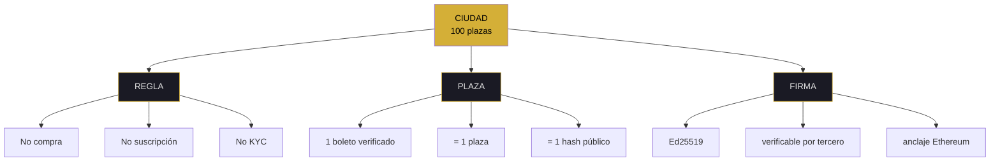
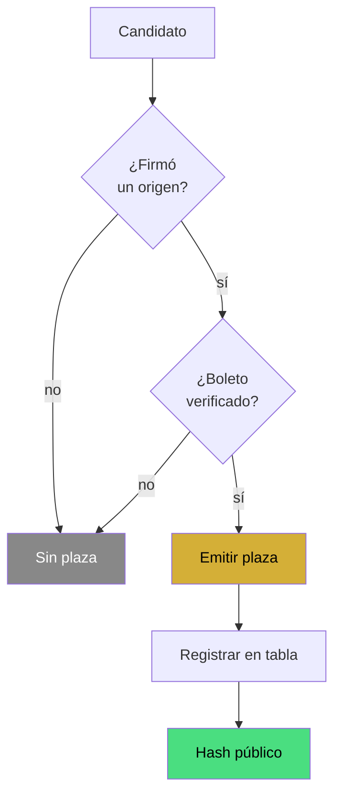
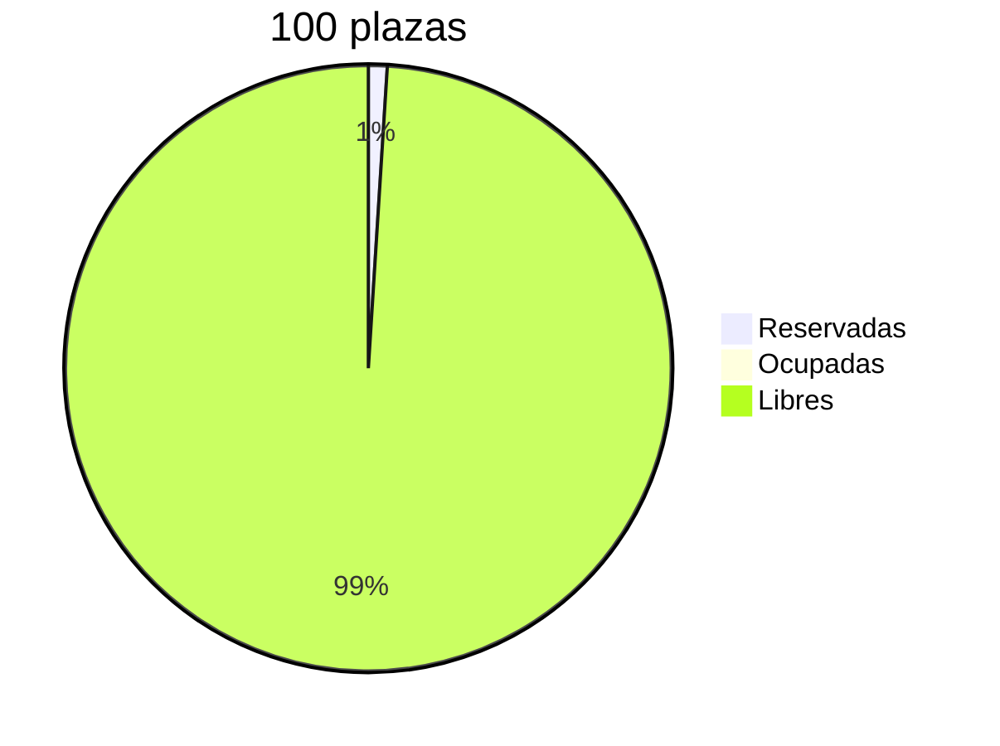

# ciudadanos — syscall

<pre>
┌─[kronos@protocol]─[~/ciudad]─┐
│ fd: ciudad · v7.2 FLOW+MAPS  │
│ chain: git + merkle          │
└──────────────────────────────┘
$ syscall ciudad --plazas
</pre>

> [!IMPORTANT]
> Para ser ciudadano no pagás. Firmás un origen real. 1 boleto verificado = 1 plaza. Sin excepciones.

---

### ▸ estado de plazas

```
reservadas      ▓░░░░░░░░░░░░░░░░░░░░░░░░░░░░░░░░   1%
ocupadas        ░░░░░░░░░░░░░░░░░░░░░░░░░░░░░░░░░   0%
libres          ▓▓▓▓▓▓▓▓▓▓▓▓▓▓▓▓▓▓▓▓▓▓▓▓▓▓▓▓▓▓▓▓▓  99%
───────────────────────────────────────────────────
total           ▓▓▓▓▓▓▓▓▓▓▓▓▓▓▓▓▓▓▓▓▓▓▓▓▓▓▓▓▓▓▓▓▓ 100 plazas
```

---

### ▸ filosofía · mapa conceptual



---

### ▸ flujo de entrada a la ciudad



---

### ▸ distribución inicial



---

### ▸ registro de plazas

| plaza | ciudadano | origen firmado | fecha | hash |
|:---:|---|---|---|---|
| **001** | (reservada — Eduardo / Inmobiliaria Toluca) | `boleto-sra-rios.json` | (pendiente) | (pendiente) |
| 002 | LIBRE | — | — | — |
| 003 | LIBRE | — | — | — |
| 004 | LIBRE | — | — | — |
| 005 | LIBRE | — | — | — |
| 006–100 | LIBRE | — | — | — |

<sub>Plaza 001 reservada, no ocupada. Se activa cuando el boleto real sea verificado.</sub>

---

### ▸ comandos disponibles

| comando | acción | verifica con |
|:---|:---|:---|
| `syscall` | estado de plazas | este archivo |
| `ps` | procesos | `ls docs/CIUDAD/` |
| `rule` | regla única | `cat` |
| `plaza` | cómo obtener una | `capturar-origen.html` |
| `limits` | lo que NO es | `echo $?` |

---

### $ ps -ef | grep ciudad

| pid | proceso | resultado | proof |
|:---:|:---|:---:|:---|
| ciudad.01 | `plaza 001` | 🟡 RESERVADA | Eduardo |
| ciudad.02 | `plaza 002` | ⚪ LIBRE | — |
| ciudad.03 | `plaza 003` | ⚪ LIBRE | — |
| ciudad.04 | `plazas 004-100` | ⚪ LIBRES | — |

<sub>4 procesos · 1 reservada · 99 libres</sub>

---

### $ syscall ciudad --evidence

| key | value | check |
|---|---|---|
| merkle_docs | `67180206595ec66d4d422b223f8d966961ecdf00cc2c32ed81133e83162ae813` | `cat 00-SCHEMA/*.json \| sha256sum` |
| pubkey_founder | `fd2fb1e9f198f5fa08ec6391b67730e3d997826c40cd7652dd5774aa5e744977` | `cat 07-LLAVES/*.json \| grep pubkey` |
| eth_tx_2 | `0xd2c2a7e128e6c81b689b3b0d9e1b31a4f6bf8df0391b7b6c05e7daa7fb895774c` | [etherscan](https://etherscan.io/tx/0xd2c2a7e128e6c81b689b3b0d9e1b31a4f6bf8df0391b7b6c05e7daa7fb895774c) |

---

<details open>
<summary><code>▸ rule</code> · regla única de la ciudad</summary>

<br>

**> humano:** no hay compra de plaza. No hay suscripción. No hay KYC corporativo. Solo un requisito: un boleto verificado por un tercero.

**> máquina:**

```bash
$ ls docs/CIUDAD/
$ cat docs/CIUDAD/CIUDADANOS.md | grep -i "plaza\|firma"
```

```json
{
  "regla": "1 boleto verificado = 1 plaza",
  "sin_pago": true,
  "sin_suscripcion": true,
  "sin_kyc": true,
  "requisito": "boleto.json verificado por tercero"
}
```

</details>

---

<details>
<summary><code>▸ plaza 001</code> · caso Eduardo</summary>

<br>

**> humano:** Eduardo Trujillo validó el caso origen (Sra. Ríos, Toluca). La plaza está reservada, no ocupada. Se activa cuando firme un boleto real.

**> máquina:**

```diff
+ reservada: 2026-10-01
+ ciudadano: Eduardo Trujillo
+ caso: Sra. Ríos (Toluca)
- boleto.json: pendiente
- hash: pendiente
- fecha: pendiente
```

```bash
$ cat docs/CIUDAD/CIUDADANOS.md | grep "001"
```

```json
{
  "plaza": "001",
  "ciudadano": "Eduardo Trujillo",
  "estado": "RESERVADA",
  "activa": false,
  "razon": "esperando boleto real firmado"
}
```

</details>

---

<details>
<summary><code>▸ plazas 002-100</code> · cómo obtener una</summary>

<br>

**> humano:** cualquier persona puede solicitar una plaza. No pagás. Firmás un origen real y lo verificás. Ese boleto se convierte en tu llave de ciudadano.

**> máquina:**

```
01  abrir capturar-origen.html
02  firmar un origen real (no ficticio)
03  verificar el boleto.json en verificador-empresa.html
04  enviar el boleto.json verificado
05  la plaza queda registrada con tu hash
```

</details>

---

### limits

> [!CAUTION]
> **ESTA CIUDAD NO ES:**
> - ❌ NFT
> - ❌ Colección digital
> - ❌ Sistema de pago
> - ❌ Comunidad cerrada

> [!NOTE]
> **ESTA CIUDAD SÍ ES:**
> - ✅ Registro de origen firmado
> - ✅ Verificable por cualquiera
> - ✅ 100 plazas reales, sin reventa

<pre>
$ echo $?
0   # para ser ciudadano no pagás
</pre>

---

<sub>kernel ciudad · v7.2 FLOW + MAPS</sub>

**○_● · ◢◤◥◣ · ◥◣◢◤**

<sub>51% HUMANO · 49% IA · 100% REAL</sub>  
<sub>"Para ser ciudadano no pagás. Firmás."</sub>