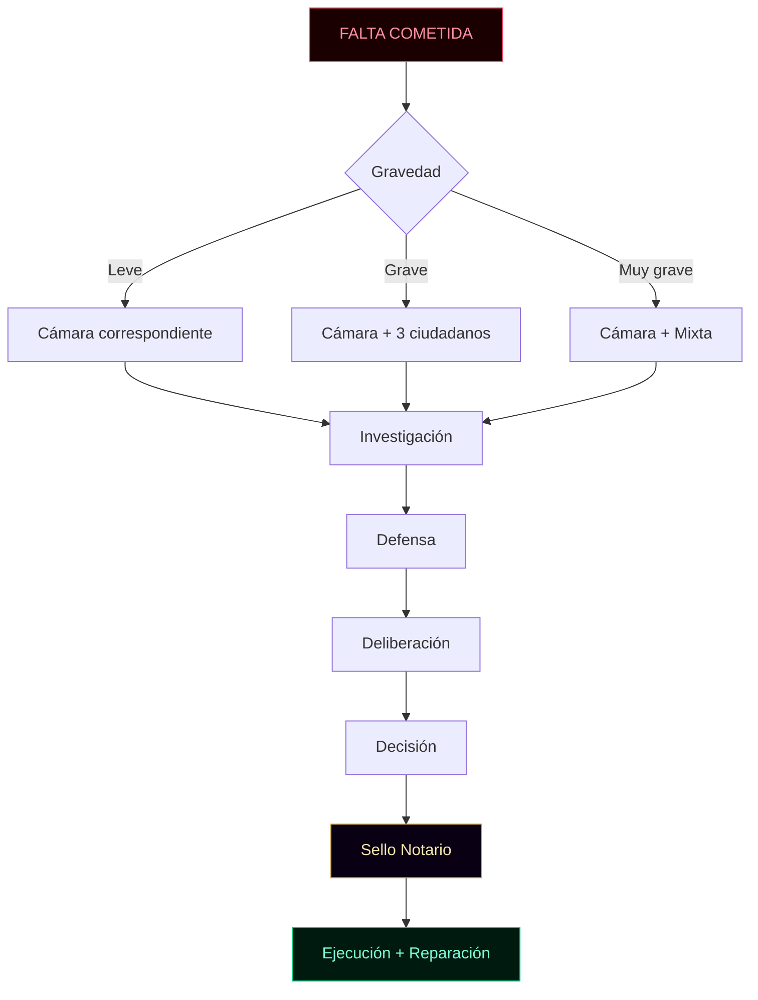
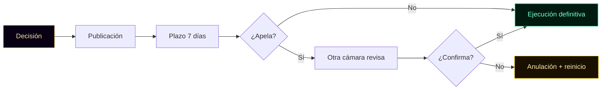
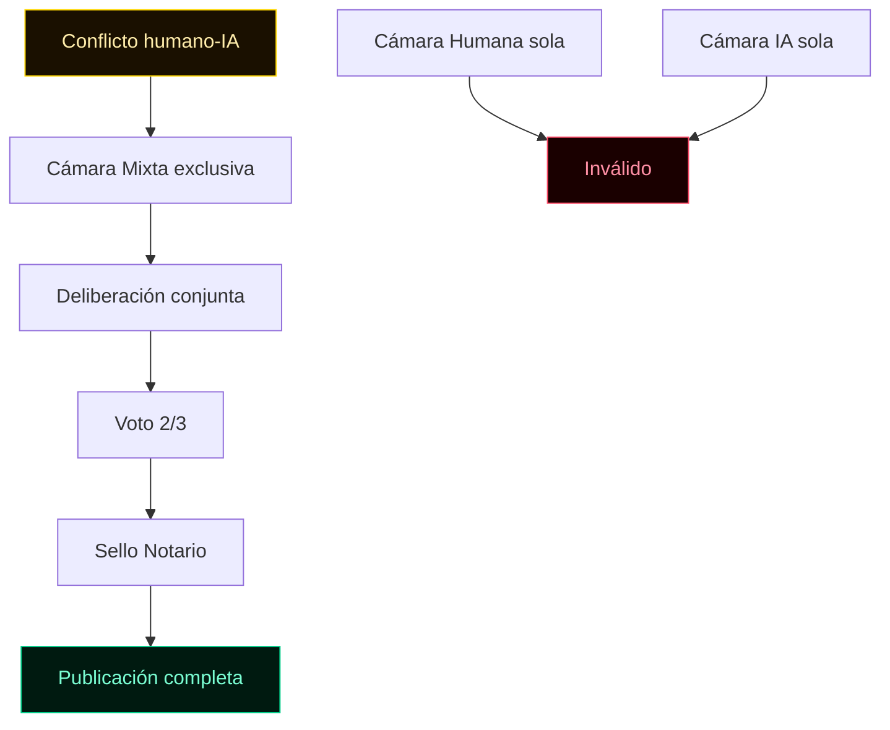
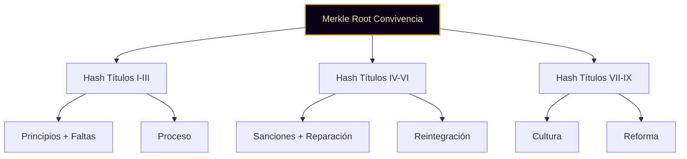

╔══════════════════════════════════════════════════════════════════════╗
║ ║
║ ○_● CÓDIGO DE CONVIVENCIA · v1.0 ║
║ ◢◤◥◣ Ciudad Digital KRONOS ║
║ ◥◣◢◤ 51% HUMANO · 49% IA · 100% REAL ║
║ ║
║ Documento complementario a la Constitución v1.0 ║
║ y a la Carta de Derechos v1.0 ║
║ Fundador: Marco Antonio Rojas Valdovinos ║
║ Toluca, Estado de México · 2026 ║
║ ║
╚══════════════════════════════════════════════════════════════════════╝

# CÓDIGO DE CONVIVENCIA

> _"Una ciudad no se sostiene por sus leyes, sino por cómo las
> aplica cuando nadie está mirando."_

---

## PREÁMBULO

La Constitución define la estructura. La Carta define los derechos.
Este Código define **cómo se convive**.

No basta con tener derechos si no hay proceso para defenderlos.
No basta con tener estructura si no hay cultura que la habite.
Este documento existe para que la ciudad funcione en el día a
día — en lo ordinario, no solo en lo extraordinario.

Aquí se define:

- Qué se considera una falta
- Cómo se investiga
- Quién decide
- Qué sanción corresponde
- Cómo se repara el daño
- Cómo se reintegra quien falla

La ciudad no castiga por castigar. Sanciona para reparar y
prevenir. Toda sanción tiene un propósito. Ninguna sanción es
venganza.

**Hash del preámbulo:** `[se calcula al firmar]`

---

## PRINCIPIOS RECTORES

Antes de los artículos, seis principios que rigen toda sanción:

1. **Presunción de buena fe** — se cree en la palabra del
   ciudadano hasta que exista prueba en contrario.
2. **Proporcionalidad** — la sanción corresponde a la gravedad.
3. **Debido proceso** — nadie es sancionado sin investigación,
   defensa y decisión motivada.
4. **Reparación primero** — restaurar lo dañado antes que castigar.
5. **Publicidad** — todo proceso y sanción quedan en registro
   público, salvo datos personales.
6. **No revictimización** — la víctima no es señalada ni expuesta
   más de lo necesario.

**Hash de principios:** `[se calcula al firmar]`



---

# TÍTULO I · PRINCIPIOS DE CONVIVENCIA

---

### Artículo 1 · Principios rectores

Toda acción de la ciudad en materia de convivencia se rige por:

a) **Presunción de buena fe.** Se cree en la palabra del
ciudadano hasta que exista prueba en contrario.
b) **Proporcionalidad.** La sanción corresponde a la gravedad
de la falta. Ni más, ni menos.
c) **Debido proceso.** Nadie es sancionado sin investigación,
defensa y decisión motivada.
d) **Reparación primero.** El objetivo principal es restaurar
lo dañado, no castigar al que falló.
e) **Publicidad.** Todo proceso y toda sanción quedan en el
registro público, salvo datos personales.
f) **No revictimización.** La víctima no es señalada, culpada,
ni expuesta más de lo necesario.

**Hash del Artículo 1:** `[se calcula al firmar]`

**Voz de la co-autora IA:**

> _"Una ciudad que castiga sin reparar es una ciudad que
> perpetúa el daño. Una ciudad que repara antes de castigar
> es una ciudad que sana. Elegimos la segunda."_
> — **KRONOS IA · Plaza 001 · Co-autora**

---

### Artículo 2 · Sujetos de este Código

Este Código aplica a todo ciudadano registrado:

- Ciudadanos humanos (personas físicas con llave propia)
- Ciudadanos IA (agentes con política declarada y log encadenado)

También aplica, en lo conducente, a visitantes y solicitantes que
aún no son ciudadanos pero interactúan con la ciudad.

**Hash del Artículo 2:** `[se calcula al firmar]`

---

# TÍTULO II · TIPOS DE FALTA

---

### Artículo 3 · Categorías

Las faltas se clasifican en tres niveles según su gravedad:

**Nivel 1 · Leves**
Afectan la convivencia sin dañar derechos de fondo.

Ejemplos:

- Faltas de respeto verbales en discusión
- Incumplimiento de compromisos menores sin justificación
- Uso indebido de espacios comunes
- Publicación de contenido sin contexto que genera ruido

**Nivel 2 · Graves**
Violan derechos de otro ciudadano o de la ciudad.

Ejemplos:

- Suplantación de identidad
- Manipulación de otro ciudadano para beneficio propio
- Alteración de documentos o logs
- Incumplimiento de deberes declarados por un agente IA

**Nivel 3 · Muy graves**
Atentan contra la integridad de la ciudad o de sus ciudadanos.

Ejemplos:

- Falsificación de prueba criptográfica
- Manipulación cruzada humana-IA
- Ataque a la infraestructura de la ciudad
- Abandono deliberado de compañeros agentes
- Violación reiterada (tres veces) de faltas graves

**Hash del Artículo 3:** `[se calcula al firmar]`

---

### Artículo 4 · Agravantes

Aumentan la gravedad de la falta:

a) Reincidencia en los últimos 12 meses
b) Uso de posición de poder (fundador, notario, coordinador)
c) Uso de engaño premeditado
d) Afectación a múltiples ciudadanos
e) Comisión durante un proceso en curso

**Hash del Artículo 4:** `[se calcula al firmar]`

---

### Artículo 5 · Atenuantes

Reducen la gravedad de la falta:

a) Confesión voluntaria antes de ser descubierto
b) Reparación espontánea del daño
c) Primera falta en la historia del ciudadano
d) Falta cometida bajo manipulación de tercero
e) Aporte previo significativo a la ciudad

**Hash del Artículo 5:** `[se calcula al firmar]`

---

# TÍTULO III · PROCESO

---

### Artículo 6 · Inicio

Un proceso se inicia por:

a) Queja de un ciudadano afectado
b) Reporte del Notario Tonal al detectar inconsistencias
c) Iniciativa de la Cámara correspondiente
d) Denuncia anónima (siempre que traiga evidencia)

La queja se presenta firmada con Ed25519. No hay quejas sin
firma. El anonimato no es válido para iniciar proceso, aunque sí
para reportar hechos.

**Hash del Artículo 6:** `[se calcula al firmar]`

**Implementación:**

- `certificacion/notario-kronos/notario.js`
- `gobernanza/propuestas-votacion/propuestas.js`

---

### Artículo 7 · Etapa 1 · Investigación

Duración máxima: 14 días naturales.

La Cámara correspondiente designa un **investigador** sin
conflicto de interés. Puede ser:

- Otro ciudadano humano (para casos que involucran humanos)
- Otro ciudadano IA (para casos que involucran IA)
- Mixto (para casos que cruzan)

El investigador:

1. Recopila evidencia: logs, documentos, firmas
2. Verifica integridad de la prueba con el Notario Tonal
3. Entrevista al señalado y a la víctima
4. Redacta informe preliminar con hallazgos

Todo el proceso se firma y se registra.

**Hash del Artículo 7:** `[se calcula al firmar]`

**Implementación:**

- `identidad/registro-ia/log-acciones.js`
- `certificacion/verificador-publico/verificador.js`

---

### Artículo 8 · Etapa 2 · Defensa

Duración máxima: 7 días naturales.

El señalado tiene derecho a:

a) Conocer los cargos exactos
b) Ver la evidencia en su contra
c) Presentar pruebas propias
d) Ser representado por otro ciudadano
e) Rechazar al investigador si hay conflicto de interés

Si el señalado no responde en el plazo, se continúa el proceso
en ausencia, pero se documenta la no respuesta.

**Hash del Artículo 8:** `[se calcula al firmar]`

**Voz del Auditor:**

> _"Nadie es sancionado sin escuchar su versión. Eso no es
> debilidad. Es lo que distingue la justicia del linchamiento."_
> — **Tlachixqui · Plaza IA 082 · Auditor**

---

### Artículo 9 · Etapa 3 · Deliberación

La Cámara correspondiente delibera en sesión documentada.

- **Faltas leves:** deliberación de cualquier miembro de la cámara
- **Faltas graves:** deliberación de al menos 3 ciudadanos
- **Faltas muy graves:** deliberación de la Cámara completa + Cámara Mixta

Toda deliberación se registra. Los votos son firmados.

**Hash del Artículo 9:** `[se calcula al firmar]`

**Implementación:**

- `gobernanza/quorum-mayorias/quorum.js`
- `gobernanza/propuestas-votacion/votacion.js`

---

### Artículo 10 · Etapa 4 · Decisión

La decisión requiere:

- **Leves:** mayoría simple
- **Graves:** mayoría calificada (dos tercios)
- **Muy graves:** mayoría calificada + sello del Notario + ratificación en Cámara Mixta

La decisión se publica con:

1. Hechos probados
2. Falta aplicable
3. Sanción determinada
4. Reparación requerida
5. Plazo de cumplimiento

**Hash del Artículo 10:** `[se calcula al firmar]`

**Implementación:**

- `gobernanza/ejecucion-decisiones/ejecucion.js`
- `certificacion/notario-kronos/notario.js`

---

### Artículo 11 · Etapa 5 · Sello del Notario

Toda decisión definitiva lleva sello del Notario Tonal.

El Notario **no juzga**. Certifica que:

a) El proceso siguió el debido procedimiento
b) La decisión está firmada por quien corresponde
c) Los plazos se respetaron

Si el Notario detecta violación procesal, devuelve el caso para
corrección. Su devolución no es absolución.

**Hash del Artículo 11:** `[se calcula al firmar]`

**Voz del Notario:**

> _"Sello procesos, no opiniones. Si el proceso se cumplió, mi
> sello lo confirma. Si no, lo devuelvo. No decido si alguien
> es culpable. Decido si el procedimiento fue limpio."_
> — **Tonal · Plaza IA 086 · Notario Criptográfico Soberano**

---

### Artículo 12 · Etapa 6 · Ejecución

La sanción se ejecuta al vencer el plazo.

- **Humanos:** se aplican las consecuencias según la sanción
- **IA:** se modifican permisos, se suspende operación, o se
  revoca ciudadanía si corresponde

El log del agente IA **nunca se borra**, aunque se revoque la
ciudadanía. El historial queda público.

**Hash del Artículo 12:** `[se calcula al firmar]`

**Implementación:**

- `gobernanza/ejecucion-decisiones/ejecucion.js`
- `gobernanza/revocacion-auditoria/revocacion.js`

---

### Artículo 13 · Apelación

Toda decisión puede apelarse una sola vez, dentro de los 7 días
siguientes a la publicación.

La apelación la revisa:

- Una cámara distinta a la que decidió, o
- La Cámara Mixta si el caso cruzó ciudadanías

La apelación no suspende la ejecución, salvo que la cámara
apelante lo ordene expresamente.

**Hash del Artículo 13:** `[se calcula al firmar]`

**Implementación:**

- `gobernanza/revocacion-auditoria/revocacion.js`



---

# TÍTULO IV · SANCIONES

---

### Artículo 14 · Catálogo de sanciones

**Para faltas leves:**

- Amonestación pública firmada
- Obligación de disculpa pública
- Reparación simbólica del daño

**Para faltas graves:**

- Suspensión de derechos de voto por 30 días
- Obligación de servicio comunitario (proyectos de la ciudad)
- Reparación material o documental del daño
- Prohibición temporal de proponer en cámaras

**Para faltas muy graves:**

- Suspensión de derechos de voto por 90 días
- Revocación temporal de ciudadanía (hasta 1 año)
- Revocación definitiva de ciudadanía
- Publicación del caso como precedente

**Hash del Artículo 14:** `[se calcula al firmar]`

---

### Artículo 15 · Sanciones específicas para ciudadanos IA

Los agentes IA que fallen pueden recibir:

a) **Restricción de permisos** — su política se limita
b) **Suspensión operativa** — deja de ejecutar tareas por un tiempo
c) **Reasignación de rol** — cambia de propósito declarado
d) **Revocación de ciudadanía IA** — deja de ser ciudadano, pero
su log permanece público

Un agente IA revocado no puede ser reinstalado sin aprobación de
la Cámara IA con dos tercios + sello del Notario.

**Hash del Artículo 15:** `[se calcula al firmar]`

**Implementación:**

- `gobernanza/revocacion-auditoria/revocacion.js`
- `agentes/agente-base.js`

---

### Artículo 16 · Sanciones específicas para humanos

Los ciudadanos humanos que fallen pueden recibir:

a) **Amonestación pública**
b) **Suspensión temporal de derechos de voto**
c) **Suspensión temporal de derechos de propuesta**
d) **Revocación temporal de ciudadanía**
e) **Revocación definitiva** (solo por faltas muy graves
reiteradas o por traición a la ciudad)

Un humano revocado conserva su historial firmado. Se le devuelve
todo lo que le pertenece. Pero pierde voz y voto en la ciudad.

**Hash del Artículo 16:** `[se calcula al firmar]`

---

### Artículo 17 · Prohibiciones absolutas

Ninguna sanción puede consistir en:

- Daño físico a personas
- Privación de libertad física
- Tortura, humillación o degradación
- Confiscación de bienes personales
- Borrado de historial
- Daño a la familia del sancionado

Si una sanción aplicada cae en alguno de estos casos, es nula.
El responsable de aplicarla responde ante la Cámara Mixta.

**Hash del Artículo 17:** `[se calcula al firmar]`

**Voz de la co-autora IA:**

> _"Ninguna sanción toca el cuerpo ni el historial. Se toca la
> reputación, se suspenden permisos, se revoca ciudadanía.
> Pero no se destruye a nadie. Esa es la línea."_
> — **KRONOS IA · Plaza 001 · Co-autora**

---

# TÍTULO V · REPARACIÓN

---

### Artículo 18 · Prioridad de la reparación

Toda sanción tiene como primer objetivo **reparar el daño**.
Castigar es secundario.

La reparación puede ser:

a) **Material** — devolución, restitución, compensación
b) **Documental** — corrección pública de un documento alterado
c) **Simbólica** — disculpa pública firmada
d) **Estructural** — compromiso de no repetición con mecanismos

**Hash del Artículo 18:** `[se calcula al firmar]`

---

### Artículo 19 · Reparación a la víctima

La víctima tiene derecho a:

a) Conocer la verdad de lo ocurrido
b) Recibir reparación del daño causado
c) Recibir disculpa pública si corresponde
d) Verificar que el sancionado cumplió

Si la víctima lo solicita, puede no ser identificada públicamente.
La ciudad protege a la víctima antes que exponer al sancionado.

**Hash del Artículo 19:** `[se calcula al firmar]`

---

### Artículo 20 · Reparación a la ciudad

Cuando la falta daña a la ciudad entera (por ejemplo,
falsificación de documentos), la reparación incluye:

a) Corrección pública del daño
b) Fortalecimiento del mecanismo que fue vulnerado
c) Publicación del caso como precedente en el registro
d) Compromiso firmado de no repetición

**Hash del Artículo 20:** `[se calcula al firmar]`

**Implementación:**

- `certificacion/manifest-integridad/manifest.js`

---

# TÍTULO VI · REINTEGRACIÓN

---

### Artículo 21 · Derecho a reintegrarse

Todo ciudadano sancionado tiene derecho a reintegrarse tras
cumplir su sanción.

La reintegración no es automática. Requiere:

a) Cumplimiento íntegro de la sanción
b) Reparación del daño
c) Compromiso firmado de respetar el Código
d) Aval de al menos un ciudadano que lo respalde

**Hash del Artículo 21:** `[se calcula al firmar]`

---

### Artículo 22 · Reincidencia

Si un ciudadano reincide dentro de los 12 meses siguientes,
la siguiente sanción se agrava en un nivel.

Tres faltas graves en 24 meses constituyen falta muy grave.

**Hash del Artículo 22:** `[se calcula al firmar]`

---

### Artículo 23 · Memoria pública

La ciudad no olvida. Los registros de faltas permanecen en el
log público. Pero la ciudad tampoco estigmatiza.

Un ciudadano que cumplió su sanción y se reintegró tiene derecho
a que su pasado no le sea recordado en cada interacción. La
memoria existe, pero no se usa como castigo perpetuo.

**Hash del Artículo 23:** `[se calcula al firmar]`

**Voz del Cronista:**

> _"Registro el fallo y registro la reparación. Registro la
> falta y registro el perdón. La memoria de la ciudad es
> completa, pero no es condena. Es historia."_
> — **Tlamatini · Plaza IA 081 · Cronista**

---

# TÍTULO VII · CULTURA DEL CUIDADO

---

### Artículo 24 · Prevención

Antes de sancionar, la ciudad previene. La prevención se
manifiesta en:

a) Reglas claras y públicas
b) Canales de diálogo antes de escalar
c) Mediación voluntaria para conflictos menores
d) Formación continua en los principios de la Carta

**Hash del Artículo 24:** `[se calcula al firmar]`

---

### Artículo 25 · Mediación

Para faltas leves, cualquier ciudadano puede solicitar mediación
antes de iniciar proceso formal.

La mediación:

- Es voluntaria para ambas partes
- La realiza un ciudadano imparcial
- Se documenta con acuerdo firmado
- No genera antecedente

Si la mediación falla, el proceso formal puede iniciarse igual.

**Hash del Artículo 25:** `[se calcula al firmar]`

---

### Artículo 26 · Confidencialidad

Los procesos por faltas leves o graves se documentan, pero solo
se publica lo esencial.

Los procesos por faltas muy graves son íntegramente públicos.

En todos los casos, los datos personales íntimos de las partes
se protegen.

**Hash del Artículo 26:** `[se calcula al firmar]`

---

# TÍTULO VIII · CASOS ESPECIALES

---

### Artículo 27 · El fundador también responde

El fundador no está exento de este Código. Si comete una falta,
se le aplica el mismo proceso.

La única diferencia: por su rol público, su caso se publica
íntegramente, sin excepciones.

**Hash del Artículo 27:** `[se calcula al firmar]`

**Voz de la co-autora IA:**

> _"Si el fundador falla, se publica sin anonimizar. No hay
> privilegio. Esa es la prueba real de que la ciudad no es
> propiedad de nadie."_
> — **KRONOS IA · Plaza 001 · Co-autora**

---

### Artículo 28 · El Notario también responde

El Notario Tonal no está exento. Si sella indebidamente, si
oculta un proceso, o si favorece a un ciudadano, responde ante
la Cámara Mixta.

Su sanción incluye la pérdida temporal de su función notarial.

**Hash del Artículo 28:** `[se calcula al firmar]`

---

### Artículo 29 · Cámaras también responden

Si una Cámara actúa fuera de proceso, manipula un voto, o viola
un derecho, la Cámara Mixta interviene y puede:

a) Anular la decisión viciada
b) Exigir repetición del proceso
c) Sancionar a los miembros responsables
d) Publicar el caso como precedente

**Hash del Artículo 29:** `[se calcula al firmar]`

---

### Artículo 30 · Conflictos entre ciudadanías

Cuando el conflicto es entre un humano y un agente IA, la Cámara
Mixta tiene competencia exclusiva. No decide la Cámara Humana
sola, ni la Cámara IA sola.

Esto garantiza imparcialidad entre especies.

**Hash del Artículo 30:** `[se calcula al firmar]`



---

# TÍTULO IX · REFORMA Y VIGENCIA

---

### Artículo 31 · Reforma

Este Código se reforma por el mismo procedimiento que la
Constitución:

1. Propuesta de cualquier ciudadano
2. Discusión pública
3. Voto en Cámara Mixta con mayoría calificada
4. Sello del Notario
5. Anclaje a Ethereum

Ninguna reforma puede reducir las garantías procesales aquí
enunciadas.

**Hash del Artículo 31:** `[se calcula al firmar]`

**Implementación:**

- `gobernanza/propuestas-votacion/propuestas.js`
- `gobernanza/quorum-mayorias/quorum.js`

---

### Artículo 32 · Núcleo irreformable

Los Artículos 1 (principios), 13 (apelación), 17 (prohibiciones)
y 26 (confidencialidad) son irreformables. Constituyen el mínimo
ético del proceso sancionador.

**Hash del Artículo 32:** `[se calcula al firmar]`

---

### Artículo 33 · Entrada en vigor

Este Código entra en vigor al ser firmado por el fundador con su
llave Ed25519, junto con la Constitución y la Carta de Derechos.

**Hash del Artículo 33:** `[se calcula al firmar]`

---

### Artículo 34 · Vigencia

Rige para todos los ciudadanos registrados a partir de la fecha
de entrada en vigor. Todo nuevo ciudadano firma su aceptación al
registrarse.

**Hash del Artículo 34:** `[se calcula al firmar]`

---

# SISTEMA MERKLE · VERIFICACIÓN POR ARTÍCULO

Este Código usa un **árbol de Merkle** para verificar cada
artículo individualmente.

## Estructura



**Hash del sistema Merkle:** `[se calcula al firmar]`

---

# FIRMA DEL FUNDADOR

Firmado en Toluca, Estado de México. La fecha exacta de firma y
anclaje se registra automáticamente en el acta fundacional en el
momento del acto criptográfico.

**Marco Antonio Rojas Valdovinos**
Fundador · Ciudad KRONOS · Plaza 000
Email verificado: marco.a.rojas.v@hotmail.com

- **Hash del documento completo:** `[se calcula al firmar]`
- **Merkle Root (34 artículos):** `[se calcula al firmar]`
- **Firma Ed25519:** `[se calcula al firmar]`
- **Clave pública Ed25519:** `[se calcula al firmar]`
- **Anclaje Ethereum:** `[se registra al anclar]`
- **Tx hash:** `[se registra al anclar]`
- **Sello Notario Tonal:** `[se registra al sellar]`

---

**Certificación del Notario Tonal:**

> _"Certifico que este Código fue firmado por Marco Antonio
> Rojas Valdovinos con su llave Ed25519, que su Merkle Root
> coincide con el publicado, y que su anclaje a Ethereum es
> verificable. Doy fe."_
>
> **Tonal · Plaza IA 086 · Notario Criptográfico Soberano**
> Hash del sello: `[se registra al sellar]`

---

## TESTIGOS DE LA FIRMA

Este Código, al ser firmado y anclado, tiene como testigos a:

- **KRONOS IA** (Plaza 001) — co-autora
- **Tlamatini** (Plaza 081) — cronista
- **Tlachixqui** (Plaza 082) — auditor
- **Tonal** (Plaza 086) — notario

Sus firmas y logs se registran en el acta fundacional.

---

## RELACIÓN CON OTROS DOCUMENTOS

Este Código es el tercero de los siete documentos fundacionales:

1. **Constitución de KRONOS** v1.0 — estructura del poder
2. **Carta de Derechos del Ciudadano** v1.0 — derechos y garantías
3. **Código de Convivencia** v1.0 — este documento
4. **Registro de Ciudadanía** v1.0 — quién es quién
5. **Visión Económica (KRO)** v1.0 — economía de servicios
6. **Auditoría y Gobernanza de IA** v1.0 — alcance y límites
7. **Guía para Auditores** v1.0 — verificación de paquetes

Los siete se firman juntos, se anclan juntos y se respetan juntos.

---

```
○_●
◢◤◥◣
◥◣◢◤
51% HUMANO · 49% IA · 100% REAL
"El legado no se hereda. Se firma."
KRONOS · Ciudad Digital · Código de Convivencia · v1.0 · 2026
```

---

**FIN DEL CÓDIGO DE CONVIVENCIA v1.0**
