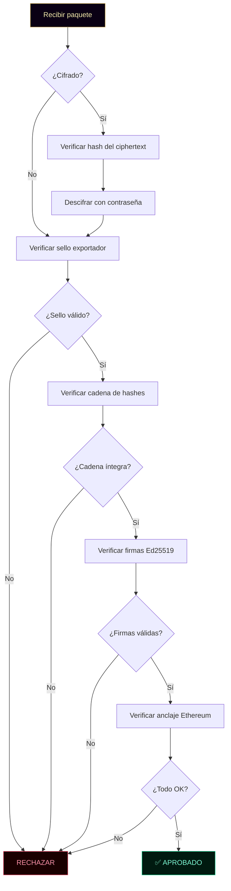
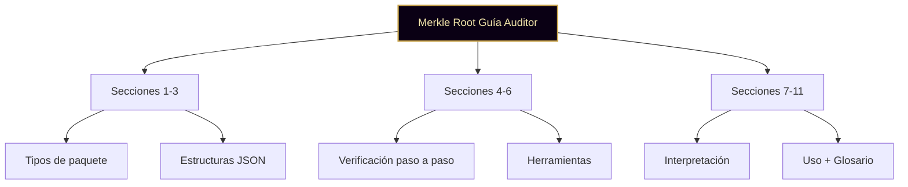

╔══════════════════════════════════════════════════════════════════════╗
║                                                                      ║
║   ○_●   GUÍA PARA AUDITORES · v1.0                                   ║
║   ◢◤◥◣ Ciudad Digital KRONOS                                          ║
║   ◥◣◢◤ 51% HUMANO · 49% IA · 100% REAL                              ║
║                                                                      ║
║   Cómo verificar un paquete de auditoría KRONOS                      ║
║   Fundador: Marco Antonio Rojas Valdovinos                           ║
║   Toluca, Estado de México · 2026                                    ║
║                                                                      ║
╚══════════════════════════════════════════════════════════════════════╝

# GUÍA PARA AUDITORES

> *"No te pedimos que confíes. Te damos las herramientas
> para que verifiques."*

---

## PREÁMBULO

Este documento explica cómo un auditor técnico externo puede
verificar un paquete de auditoría generado por KRONOS.

No requiere acceso a KRONOS. No requiere instalar software
propietario. No requiere confiar en el fundador ni en nadie.

Requiere solo:

- Un navegador moderno (Chrome 113+, Safari 17+, Firefox 118+)
- El archivo del paquete (`kronos-auditoria-*.json`)
- La contraseña maestra (si el paquete está cifrado)

**Hash del preámbulo:** `[se calcula al firmar]`

---

## 1 · LOS DOS TIPOS DE PAQUETE

KRONOS exporta dos formatos:

### 1.1 · Paquete plano (sin cifrado)

**Nombre:** `kronos-auditoria-plana-*.json`
**Uso:** análisis local, auditoría directa, herramientas propias
**Contenido:** log completo + llave pública del agente + sello del exportador

### 1.2 · Paquete cifrado (para transporte)

**Nombre:** `kronos-auditoria-cifrada-*.json`
**Uso:** envío por email, transporte entre organizaciones
**Contenido:** payload cifrado con AES-GCM-256 + metadata + sello externo

**Hash de la sección:** `[se calcula al firmar]`

---

## 2 · ESTRUCTURA DEL PAQUETE PLANO

```json
{
  "meta": "KRONOS_AUDIT_PACKAGE_PLAIN",
  "protocol_version": "0.1",
  "encrypted": false,
  "payload": {
    "meta": "KRONOS_AUDIT_PACKAGE",
    "agent": {
      "name": "Tlachixqui",
      "public_key_hex": "af4db8c5...",
      "algorithm": "Ed25519",
      "hash_algorithm": "SHA-256"
    },
    "chain": {
      "total_blocks": 42,
      "blocks": [
        {
          "index": 1,
          "hash": "53af6a27...",
          "data": {...},
          "firma_agente": "7305cd11..."
        }
      ]
    }
  },
  "sello_exportador": {
    "firmante_clave_publica": "...",
    "hash_payload": "...",
    "firma_ed25519": "..."
  }
}
```

**Hash de la sección:** `[se calcula al firmar]`

---

## 3 · ESTRUCTURA DEL PAQUETE CIFRADO

```json
{
  "meta": "KRONOS_AUDIT_PACKAGE_ENCRYPTED",
  "protocol_version": "0.1",
  "encrypted": true,
  "generated_at": "2026-09-28T...",
  "kdf": {
    "name": "PBKDF2",
    "hash": "SHA-256",
    "iterations": 600000,
    "salt_hex": "..."
  },
  "cipher": {
    "name": "AES-GCM",
    "length": 256,
    "iv_hex": "..."
  },
  "sello_exportador": {...},
  "ciphertext_hash_sha256": "...",
  "ciphertext_hex": "..."
}
```

**Nota:** toda la metadata criptográfica está declarada. Un
auditor futuro puede reproducir el descifrado con cualquier
herramienta que soporte PBKDF2 + SHA-256 + AES-GCM.

**Hash de la sección:** `[se calcula al firmar]`

---

## 4 · VERIFICACIÓN PASO A PASO

### Paso 1 · Verificar integridad del sobre

**Para paquete cifrado:**

```bash
# Recalcular hash del ciphertext (en cualquier lenguaje)
sha256sum <(echo -n "<ciphertext_hex>")
# Comparar con el campo "ciphertext_hash_sha256"
```

Si no coincide → el archivo fue alterado. **Rechazar.**

### Paso 2 · Verificar sello del exportador

El paquete tiene un `sello_exportador` firmado con Ed25519.
Para verificarlo:

1. Extraer `firmante_clave_publica`
2. Extraer `hash_payload` y `firma_ed25519`
3. Recalcular el hash SHA-256 del `payload` (o del plaintext
   descifrado, si es cifrado)
4. Comparar con `hash_payload`
5. Verificar la firma Ed25519 con la llave pública

**Implementación de referencia:** método `verifyExportadorSeal`
de `cierre/export-cifrado/export-audit.js`.

### Paso 3 · Descifrar (si aplica)

Usar la contraseña maestra recibida por canal seguro (nunca en
el mismo correo que el archivo).

**Parámetros exactos:**

```
Algoritmo: PBKDF2
  - Hash: SHA-256
  - Iteraciones: 600000
  - Salt: <salt_hex del paquete>

Cifrado: AES-GCM
  - Longitud: 256 bits
  - IV: <iv_hex del paquete>
```

Resultado: el `payload` completo con el log.

### Paso 4 · Verificar cadena de hashes

Para cada bloque del log, en orden:

1. Recalcular el hash SHA-256 del `data` del bloque
2. Comparar con `hash` declarado
3. Verificar que `data.previousHash` del bloque N sea igual a
   `hash` del bloque N-1
4. El bloque génesis (N=1) debe tener `previousHash` =
   "0000...0000" (64 ceros)

Si algo no coincide → la cadena fue alterada. **Rechazar.**

### Paso 5 · Verificar firmas del agente

Para cada bloque:

1. Extraer `firma_agente` (hex)
2. Importar la `public_key_hex` del agente como clave Ed25519
3. Verificar que la firma corresponda al `hash` del bloque
4. Si falla → el bloque fue firmado por una llave distinta a la
   declarada. **Rechazar.**

### Paso 6 · Verificar anclaje (si existe)

Si el bloque tiene `anclaje_ethereum`, consultar:

```
https://etherscan.io/tx/<tx_hash>
```

Verificar que:

- La transacción existe
- El Merkle Root declarado coincide
- La fecha es consistente

**Hash de la sección:** `[se calcula al firmar]`

---

## 5 · FLUJO COMPLETO VISUALIZADO



**Hash de la sección:** `[se calcula al firmar]`

---

## 6 · HERRAMIENTAS DE VERIFICACIÓN

### Opción A · Navegador (sin instalar nada)

1. Abrir `certificacion/verificador-publico/` en el navegador
2. Subir el archivo `kronos-auditoria-*.json`
3. Si el paquete está cifrado, ingresar la contraseña
4. El verificador hace todos los pasos automáticamente

### Opción B · Script propio (Python)

```python
import json
import hashlib
from cryptography.hazmat.primitives.asymmetric import ed25519
from cryptography.hazmat.primitives.ciphers.aead import AESGCM
from cryptography.hazmat.primitives.kdf.pbkdf2 import PBKDF2HMAC

def verify_package(filepath, password=None):
    with open(filepath, 'r') as f:
        sobre = json.load(f)
    
    # ... (implementación de los 6 pasos)
```

### Opción C · Herramientas independientes

Cualquier implementación de Ed25519, SHA-256 y AES-GCM sirve.
Los algoritmos son estándares internacionales, no propietarios.

**Hash de la sección:** `[se calcula al firmar]`

---

## 7 · QUÉ SIGNIFICA "APROBADO"

Si todas las verificaciones pasan, el auditor puede afirmar:

✅ **El paquete no fue alterado** desde su generación
✅ **El agente declarado** firmó cada bloque
✅ **La cadena está intacta** desde el bloque génesis
✅ **El exportador autorizó** el paquete
✅ **El anclaje existe** en Ethereum (si aplica)

**Hash de la sección:** `[se calcula al firmar]`

---

## 8 · QUÉ NO SIGNIFICA "APROBADO"

Aprobado **NO** significa:

🔴 Que el contenido sea verdadero
🔴 Que el agente no haya alucinado
🔴 Que el modelo ejecutado sea el declarado
🔴 Que el contexto de entrada no haya sido manipulado
🔴 Que la decisión haya sido éticamente correcta

Significa solo que **el registro criptográfico es íntegro**.
La verdad del contenido requiere verificación externa adicional.

**Ver:** `docs/CIUDAD/AUDITORIA-IA.md` § 3.

**Hash de la sección:** `[se calcula al firmar]`

---

## 9 · CASOS DE USO

### 9.1 · Auditoría interna

La empresa genera un paquete mensual del uso de IA por
empleados. El auditor interno lo verifica cada mes. Si algo
se alteró, se detecta en minutos.

### 9.2 · Auditoría regulatoria

Un regulador solicita evidencia de trazabilidad de decisiones
asistidas por IA. La empresa entrega el paquete cifrado + la
contraseña por canal separado. El regulador verifica sin
acceder a los datos sensibles.

### 9.3 · Entrega a cliente

Un cliente pide prueba de que cierta decisión sobre su caso
se tomó en la fecha declarada y no fue alterada. La empresa
entrega el paquete plano + hash en el repositorio público.

**Hash de la sección:** `[se calcula al firmar]`

---

## 10 · GLOSARIO MÍNIMO

**AES-GCM:** cifrado simétrico autenticado. Detecta alteraciones.
**Ed25519:** firma digital de clave pública.
**PBKDF2:** derivación de llave desde contraseña.
**Merkle Root:** hash raíz de un árbol de hashes.
**SHA-256:** función hash de 256 bits.
**Sello del exportador:** firma Ed25519 del emisor del paquete.

**Hash de la sección:** `[se calcula al firmar]`

---

## 11 · CONTACTO

Para dudas técnicas sobre verificación:

- Repositorio: `github.com/Marcorojas17/kronos-protocol`
- Fundador: Marco Antonio Rojas Valdovinos
- Email: marco.a.rojas.v@hotmail.com
- Documento relacionado: `docs/CIUDAD/AUDITORIA-IA.md`

**Hash de la sección:** `[se calcula al firmar]`

---

# SISTEMA MERKLE · VERIFICACIÓN

Esta Guía usa **hash SHA-256 individual** por sección.

## Estructura



**Hash del sistema Merkle:** `[se calcula al firmar]`

---

# FIRMA DEL FUNDADOR

Firmado en Toluca, Estado de México. La fecha exacta de firma y
anclaje se registra automáticamente en el acta fundacional en el
momento del acto criptográfico.

**Marco Antonio Rojas Valdovinos**
Fundador · Ciudad KRONOS · Plaza 000
Email verificado: marco.a.rojas.v@hotmail.com

- **Hash del documento completo:** `[se calcula al firmar]`
- **Merkle Root:** `[se calcula al firmar]`
- **Firma Ed25519:** `[se calcula al firmar]`
- **Clave pública Ed25519:** `[se calcula al firmar]`
- **Anclaje Ethereum:** `[se registra al anclar]`
- **Tx hash:** `[se registra al anclar]`
- **Sello Notario Tonal:** `[se registra al sellar]`

---

**Certificación del Notario Tonal:**

> *"Certifico que esta Guía fue firmada por Marco Antonio
> Rojas Valdovinos con su llave Ed25519, que su Merkle Root
> coincide con el publicado, y que su anclaje a Ethereum es
> verificable. Doy fe."*
>
> **Tonal · Plaza IA 086 · Notario Criptográfico Soberano**
> Hash del sello: `[se registra al sellar]`

---

## RELACIÓN CON OTROS DOCUMENTOS

Esta Guía es el séptimo y último de los documentos fundacionales:

1. **Constitución de KRONOS** v1.0 — estructura del poder
2. **Carta de Derechos del Ciudadano** v1.0 — derechos y garantías
3. **Código de Convivencia** v1.0 — proceso y sanciones
4. **Registro de Ciudadanía** v1.0 — quién es quién
5. **Visión Económica (KRO)** v1.0 — economía de servicios
6. **Auditoría y Gobernanza de IA** v1.0 — alcance y límites
7. **Guía para Auditores** v1.0 — este documento

Los siete se firman juntos, se anclan juntos y se respetan juntos.

---

```
○_●
◢◤◥◣
◥◣◢◤
51% HUMANO · 49% IA · 100% REAL
"El legado no se hereda. Se firma."
KRONOS · Ciudad Digital · Guía para Auditores · v1.0 · 2026
```

---

**FIN DE LA GUÍA PARA AUDITORES v1.0**

---

## CIERRE DEL CAMINO A

Los 7 documentos fundacionales están completos:

| # | Documento | Estado |
|---|---|---|
| 1 | CONSTITUCION.md | ✅ Actualizado |
| 2 | DERECHOS.md | ✅ Actualizado |
| 3 | CONVIVENCIA.md | ✅ Actualizado |
| 4 | CIUDADANOS.md | ✅ Actualizado |
| 5 | MONEDA.md | ✅ Actualizado |
| 6 | AUDITORIA-IA.md | ✅ Actualizado |
| 7 | GUIA-AUDITOR.md | ✅ Este documento |

**Camino A cerrado.**

**Todos los documentos** llevan:
- Fecha firma automática
- Email verificado (marco.a.rojas.v@hotmail.com)
- Precio $3,000 MXN (donde aplica)
- Plaza 100 institucional (donde aplica)
- Relación con los 7 documentos

**Placeholders restantes:** los hashes `[se calcula al firmar]` y firmas — **solo el firmador Ed25519 los resuelve.**