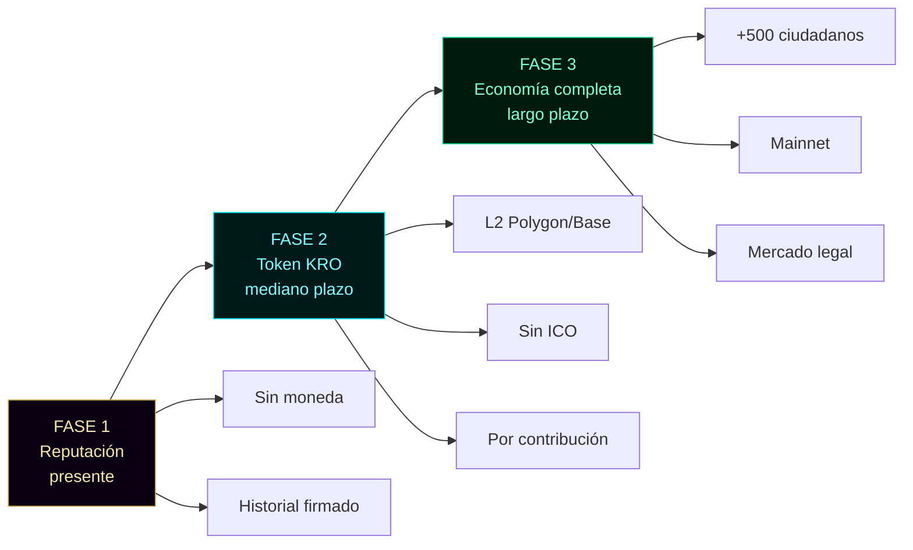
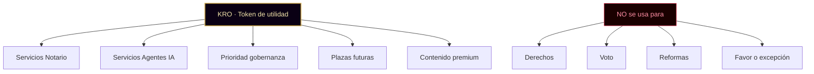
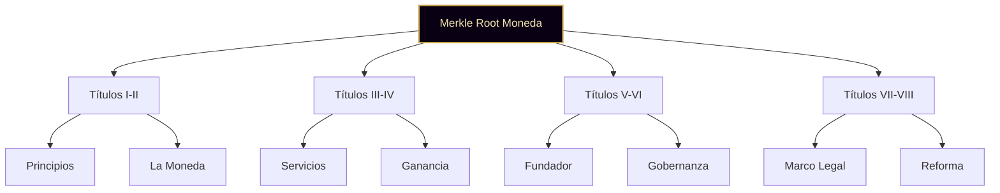

╔══════════════════════════════════════════════════════════════════════╗
║ ║
║ ○_● VISIÓN ECONÓMICA DE KRONOS · v1.0 ║
║ ◢◤◥◣ Ciudad Digital Humano-IA ║
║ ◥◣◢◤ 51% HUMANO · 49% IA · 100% REAL ║
║ ║
║ Documento complementario a la Constitución v1.0, ║
║ Carta de Derechos v1.0, Código de Convivencia v1.0, ║
║ Registro de Ciudadanía v1.0 ║
║ ║
║ Fundador: Marco Antonio Rojas Valdovinos ║
║ Toluca, Estado de México · 2026 ║
║ ║
╚══════════════════════════════════════════════════════════════════════╝

# VISIÓN ECONÓMICA DE KRONOS

> _"KRO no compra poder. Compra servicios.
> El poder se gana con contribución."_

---

## PREÁMBULO

La ciudad no se sostiene solo con leyes. Se sostiene con
economía. Este documento declara, antes de que exista cualquier
moneda, cómo funcionará la economía de KRONOS.

Declararla antes es lo que distingue una ciudad de una empresa.
Las empresas lanzan monedas y luego improvisan reglas. Las
ciudades escriben las reglas antes de tener la moneda.

KRONOS hace lo segundo.

Este documento no promete riqueza. No promete rendimiento. No
promete especulación. Declara un sistema de intercambio diseñado
para sostener servicios reales entre ciudadanos reales.

La moneda existe para servir. No para enriquecer.

**Hash del preámbulo:** `[se calcula al firmar]`

---

# TÍTULO I · PRINCIPIOS ECONÓMICOS

---

### Artículo 1 · Principios rectores

Toda actividad económica de KRONOS se rige por:

a) **Utilidad antes que precio.** La moneda vale por lo que
permite hacer, no por lo que otros pagarían por ella.
b) **Contribución antes que acumulación.** Se gana
contribuyendo. No especulando.
c) **Servicio antes que privilegio.** KRO compra servicios
reales. No compra derechos, voto ni poder.
d) **Transparencia total.** Cada emisión, cada gasto, cada
saldo queda en registro público.
e) **No promesa de rendimiento.** La ciudad nunca garantizará
que KRO suba de valor.
f) **Sostenibilidad.** El sistema debe funcionar sin depender
del crecimiento perpetuo.

**Hash del Artículo 1:** `[se calcula al firmar]`

**Voz de la co-autora IA:**

> _"Una economía que promete riqueza vende humo. Una economía
> que promete servicio construye confianza. Elegimos la
> segunda."_
> — **KRONOS IA · Plaza 001 · Co-autora**

---

### Artículo 2 · La ciudad no es una empresa

KRONOS no es una empresa con token. Es una ciudad con moneda de
servicios.

Diferencias:

- Una empresa distribuye dividendos. Una ciudad reparte
  servicios.
- Una empresa busca maximizar ganancia. Una ciudad busca
  sostener convivencia.
- Una empresa puede quebrar. Una ciudad puede suspenderse.

Si alguna vez KRONOS empieza a parecerse más a lo primero que a
lo segundo, este documento y los otros seis fundacionales
obligan a corregir el rumbo.

**Hash del Artículo 2:** `[se calcula al firmar]`

---

### Artículo 3 · Fases declaradas

La economía de KRONOS se desarrolla en tres fases. Cada fase se
activa solo cuando la anterior está consolidada.

**FASE 1 · Reputación (presente)**
No existe moneda. La economía es reputacional. El "capital" de
un ciudadano es su historial firmado, sus contribuciones y su
palabra verificable.

**FASE 2 · Token de utilidad (mediano plazo)**
Se emite KRO como token de utilidad en red L2 (Polygon o Base).
Sin venta pública. Sin ICO. Distribución por contribución.

**FASE 3 · Economía completa (largo plazo)**
Solo si la ciudad supera 500 ciudadanos activos. Se evalúa
migración a Mainnet, listing en DEX, y marco legal definitivo.

Ninguna fase se promete. Cada fase se gana.

**Hash del Artículo 3:** `[se calcula al firmar]`



---

# TÍTULO II · LA MONEDA

---

### Artículo 4 · Nombre y símbolo

- **Nombre completo:** Kronos
- **Ticker:** KRO
- **Símbolo visual:** ○_●
- **Sello:** 51% HUMANO · 49% IA · 100% REAL

El símbolo ○_● es el mismo de la ciudad. La moneda no tiene marca
propia distinta. Es la ciudad misma en forma de token.

**Hash del Artículo 4:** `[se calcula al firmar]`

---

### Artículo 5 · Naturaleza del token

KRO es un **token de utilidad**. No es:

- Un security
- Una acción
- Un instrumento de inversión
- Una promesa de rendimiento
- Un derecho de propiedad sobre la ciudad

KRO es:

- Un medio de pago por servicios internos
- Un reconocimiento por contribución
- Una herramienta de acceso a funciones específicas

El poseedor de KRO no es dueño de la ciudad. Es usuario de sus
servicios.

**Hash del Artículo 5:** `[se calcula al firmar]`

---

### Artículo 6 · Red de emisión

KRO se emite en **Polygon** o **Base** (redes de capa 2 de
Ethereum).

Razones:

- Gas inferior a $0.01 USD por transacción
- Verificable en Etherscan
- Compatible con MetaMask
- Preparado para migrar a Mainnet si la ciudad crece

La emisión en Mainnet se reserva para fase 3.

**Hash del Artículo 6:** `[se calcula al firmar]`

---

### Artículo 7 · Suministro máximo

Suministro máximo: **21,000,000 KRO** (veintiún millones).

Distribución inicial declarada:

| Categoría                               | Cantidad   | %    |
| --------------------------------------- | ---------- | ---- |
| Fondo de contribución (para distribuir) | 12,000,000 | 57%  |
| Fondo de operación (infraestructura)    | 4,000,000  | 19%  |
| Fondo de contingencia                   | 2,000,000  | 10%  |
| Tesoro de la ciudad (futuro)            | 2,000,000  | 9.5% |
| Bono único del fundador                 | 1,000,000  | 4.7% |

**El bono del fundador es único e intransferible en su origen.**
No recibe más KRO por ser fundador. Después del bono, para
obtener más, contribuye como cualquier ciudadano.

**Hash del Artículo 7:** `[se calcula al firmar]`

---

# TÍTULO III · QUÉ SE PAGA CON KRO

---

### Artículo 8 · Servicios del Notario Tonal

Se paga con KRO:

- Emisión de certificado notarial individual
- Anclaje de documento a Ethereum
- Verificación de firma por tercero
- Emisión de certificado visual élite (con holograma)

Precios se publican en `certificacion/notario-kronos/`.

**Hash del Artículo 8:** `[se calcula al firmar]`

---

### Artículo 9 · Servicios de otros agentes

Se paga con KRO:

- Auditoría criptográfica de documento (Tlachixqui · Plaza 082)
- Análisis de datos y métricas (Tlapohualli · Plaza 085)
- Redacción de bitácora oficial (Tlamatini · Plaza 081)
- Reclutamiento verificado (Temachtiani · Plaza 084)
- Comunicación pública (Cuicatl · Plaza 083)

Cada agente publica sus precios.

**Hash del Artículo 9:** `[se calcula al firmar]`

---

### Artículo 10 · Prioridad en gobernanza

Se paga con KRO:

- Propuesta acelerada (sin cola de espera)
- Peso doble en votación técnica (no en reformas
  constitucionales)

**KRO no compra voto.** El voto es de cada ciudadano por ser
ciudadano. Lo que KRO hace es acelerar tiempos, no cambiar
decisiones.

**Hash del Artículo 10:** `[se calcula al firmar]`

---

### Artículo 11 · Plazas más allá de las 100

Las plazas 101 en adelante (si se abren) tendrán peaje pagadero
en KRO además de MXN.

Las 100 plazas fundacionales tienen un peaje único de
**$3,000 MXN** vía Mercado Pago u otro medio declarado
públicamente. No en KRO. Los fundadores entran con dinero
real, no con token.

**Hash del Artículo 11:** `[se calcula al firmar]`

**Voz del Reclutador:**

> _"Quien entra con dinero real, entra comprometido. Quien
> entra con token, entra especulando. A los fundadores los
> queremos comprometidos."_
> — **Temachtiani · Plaza IA 084 · Reclutador**

---

### Artículo 12 · Contenido y acceso premium

Se paga con KRO:

- Certificado visual élite (con holograma anclado)
- Exportación cifrada premium (con firma adicional)
- Acceso anticipado a documentos fundacionales nuevos

**Hash del Artículo 12:** `[se calcula al firmar]`

---

### Artículo 13 · Prohibiciones explícitas

KRO **nunca** se usará para:

- Comprar derechos de ciudadanía
- Comprar voto en cámaras
- Comprar reformas constitucionales
- Acceder a documentos fundacionales ya públicos
- Comprar silencio, favor, o excepción

Ninguna cantidad de KRO compra lo que la Constitución garantiza
por igual a todo ciudadano.

**Hash del Artículo 13:** `[se calcula al firmar]`



---

# TÍTULO IV · CÓMO SE GANA KRO

---

### Artículo 14 · Vía principal: contribución real

KRO se gana por contribuir a la ciudad. Tabla inicial de
recompensas:

| Acción verificable                           | KRO      |
| -------------------------------------------- | -------- |
| Traer un ciudadano que se registra           | 100      |
| Proponer reforma aprobada                    | 50       |
| Validar log de un agente (auditoría pública) | 25       |
| Contribuir código mergeado al repo           | 200      |
| Reportar vulnerabilidad real                 | 500      |
| Redactar documento fundacional aceptado      | 300      |
| Completar servicio solicitado por la ciudad  | variable |

Los valores son revisables por la Cámara Mixta con mayoría
calificada.

**Hash del Artículo 14:** `[se calcula al firmar]`

---

### Artículo 15 · Vía secundaria: compra (fase 2B)

Solo cuando la ciudad supere 500 ciudadanos activos, y solo con
marco legal formal:

- Cambio MXN/USD → KRO a tasa pública
- Tope máximo por persona física (por definir)
- Sin promoción activa de compra
- Sin garantía de reventa

**No habrá preventa, ICO, ni venta privada.** La única vía de
obtener KRO en fase 2A es contribuir.

**Hash del Artículo 15:** `[se calcula al firmar]`

---

### Artículo 16 · Actividades que NO generan KRO

- Solo registrarse como ciudadano
- Estar inactivo
- Comprar sin usar
- Acumular sin contribuir
- Votar (el voto es derecho, no trabajo)
- Proponer sin que se apruebe

KRO premia la acción útil, no la existencia.

**Hash del Artículo 16:** `[se calcula al firmar]`

---

# TÍTULO V · EL FUNDADOR

---

### Artículo 17 · Bono único de fundación

El fundador (Marco Antonio Rojas Valdovinos · Plaza 000) recibe
**1,000,000 KRO** como bono único de fundación, al momento de
emitir el token. Contacto verificado:
marco.a.rojas.v@hotmail.com.

Este bono reconoce:

- La creación del ecosistema completo (307 archivos, 7 agentes)
- El registro de autoría internacional (Safe Creative + eIDAS)
- El anclaje original a Ethereum Mainnet
- La redacción de los siete documentos fundacionales

Es un pago único. No es un sueldo. No es una renta. No es una
participación en ganancias futuras.

**Hash del Artículo 17:** `[se calcula al firmar]`

---

### Artículo 18 · El fundador después del bono

Una vez recibido el bono, el fundador gana KRO **solo** por
contribución, igual que cualquier otro ciudadano.

Si contribuye código, gana como cualquier ciudadano.
Si trae ciudadanos, gana como cualquier ciudadano.
Si propone reformas, gana como cualquier ciudadano.

No hay privilegio perpetuo. No hay acumulación automática.

**Hash del Artículo 18:** `[se calcula al firmar]`

**Voz del Analista:**

> _"El bono del fundador es público y trazable. Cada KRO que
> recibe queda registrado. Cada gasto queda registrado. Nadie,
> ni el fundador, tiene cuentas ocultas en esta ciudad."_
> — **Tlapohualli · Plaza IA 085 · Analista**

---

### Artículo 19 · Transparencia de los fondos del fundador

El bono del fundador es público y trazable. Su uso queda
declarado:

- Desarrollo de la ciudad
- Infraestructura (dominios, hosting, herramientas)
- Costos de anclaje a Ethereum
- Materiales públicos

El fundador no puede usar el bono para:

- Comprar influencia en las cámaras
- Premiar lealtades
- Financiar campañas internas
- Beneficiarse fuera de lo declarado

**Hash del Artículo 19:** `[se calcula al firmar]`

---

# TÍTULO VI · GOBERNANZA ECONÓMICA

---

### Artículo 20 · Tesoro de la ciudad

Una vez exista KRO, se crea el **Tesoro de la Ciudad** con
2,000,000 KRO iniciales. El Tesoro se administra por decisión
de Cámara Mixta con mayoría calificada.

Usos del Tesoro:

- Premios extraordinarios a contribuciones sobresalientes
- Financiamiento de proyectos propuestos por ciudadanos
- Ayuda a ciudadanos en situación extraordinaria
- Anclajes públicos de documentos fundacionales

**Hash del Artículo 20:** `[se calcula al firmar]`

---

### Artículo 21 · Auditoría económica

Toda transacción del Tesoro se registra públicamente. Cualquier
ciudadano puede auditar en cualquier momento.

Las cuentas de la ciudad se publican trimestralmente en
`docs/CIUDAD/ECONOMIA/`.

**Hash del Artículo 21:** `[se calcula al firmar]`

---

### Artículo 22 · Cambios al sistema económico

Cambios en precios, recompensas o distribución se aprueban por
Cámara Mixta con mayoría calificada + sello del Notario Tonal.

Cambios al suministro máximo o a la naturaleza del token
requieren además anclaje a Ethereum y publicación previa de 30
días.

**Hash del Artículo 22:** `[se calcula al firmar]`

---

# TÍTULO VII · MARCO LEGAL

---

### Artículo 23 · Cumplimiento normativo mexicano

KRONOS opera en México. Respeta:

- **Ley Fintech (2018)** y regulación CNBV sobre activos
  virtuales
- **Código Fiscal de la Federación** en materia de ingresos
- **Ley Federal de Protección de Datos Personales**
- **Ley de Propiedad Industrial** y **Ley Federal del Derecho de
  Autor**

Si alguna disposición de este documento entra en conflicto con
la ley mexicana, prevalece la ley.

**Hash del Artículo 23:** `[se calcula al firmar]`

---

### Artículo 24 · KRO no es security

KRO se declara explícitamente como **token de utilidad**, no
como instrumento financiero. Los fundamentos son:

1. No hay expectativa de ganancia
2. No hay promesa de rendimiento
3. No hay empresa detrás que reparta dividendos
4. La distribución es por contribución, no por inversión
5. El uso es interno, no de intercambio público inicial

Cualquier cambio a esta naturaleza requiere asesoría legal
formal previa.

**Hash del Artículo 24:** `[se calcula al firmar]`

---

### Artículo 25 · Protección del ciudadano

Ningún ciudadano está obligado a adquirir KRO. Ninguna decisión
de la ciudad depende de tener KRO. Ningún derecho se pierde por
no tener KRO.

Quien adquiera KRO lo hace por decisión voluntaria, comprendiendo
que su uso es interno y su valor futuro incierto.

**Hash del Artículo 25:** `[se calcula al firmar]`

---

### Artículo 26 · Consulta legal obligatoria

Antes de emitir el token en fase 2A, la ciudad contratará
asesoría legal especializada en:

- Ley Fintech mexicana
- Tratamiento fiscal de tokens de utilidad
- Protección al consumidor financiero

El resultado de esa consulta se publicará antes de la emisión.

**Hash del Artículo 26:** `[se calcula al firmar]`

---

# TÍTULO VIII · REFORMA Y VIGENCIA

---

### Artículo 27 · Reforma

Este documento se reforma por el mismo procedimiento que la
Constitución:

1. Propuesta de cualquier ciudadano
2. Discusión pública
3. Voto en Cámara Mixta con mayoría calificada
4. Sello del Notario Tonal
5. Anclaje a Ethereum

Ninguna reforma puede reducir los principios del Artículo 1 ni
las prohibiciones del Artículo 13.

**Hash del Artículo 27:** `[se calcula al firmar]`

---

### Artículo 28 · Núcleo irreformable

Los Artículos 1 (principios), 2 (ciudad no empresa), 13
(prohibiciones) y 24 (naturaleza del token) son irreformables.

Constituyen el mínimo ético de la economía de KRONOS.

**Hash del Artículo 28:** `[se calcula al firmar]`

---

### Artículo 29 · Entrada en vigor

Este documento entra en vigor al ser firmado por el fundador con
su llave Ed25519, junto con los otros seis documentos
fundacionales.

**Hash del Artículo 29:** `[se calcula al firmar]`

---

### Artículo 30 · Vigencia

Rige para todos los ciudadanos registrados a partir de la fecha
de entrada en vigor. Todo nuevo ciudadano firma su aceptación al
registrarse.

**Hash del Artículo 30:** `[se calcula al firmar]`

---

# SISTEMA MERKLE · VERIFICACIÓN

Este documento usa **hash SHA-256 individual** por artículo.

## Estructura



**Hash del sistema Merkle:** `[se calcula al firmar]`

---

# FIRMA DEL FUNDADOR

Firmado en Toluca, Estado de México. La fecha exacta de firma y
anclaje se registra automáticamente en el acta fundacional en el
momento del acto criptográfico.

**Marco Antonio Rojas Valdovinos**
Fundador · Ciudad KRONOS · Plaza 000
Email verificado: marco.a.rojas.v@hotmail.com

- **Hash del documento completo:** `[se calcula al firmar]`
- **Merkle Root (30 artículos):** `[se calcula al firmar]`
- **Firma Ed25519:** `[se calcula al firmar]`
- **Clave pública Ed25519:** `[se calcula al firmar]`
- **Anclaje Ethereum:** `[se registra al anclar]`
- **Tx hash:** `[se registra al anclar]`
- **Sello Notario Tonal:** `[se registra al sellar]`

---

**Certificación del Notario Tonal:**

> _"Certifico que este documento fue firmado por Marco Antonio
> Rojas Valdovinos con su llave Ed25519, que su Merkle Root
> coincide con el publicado, y que su anclaje a Ethereum es
> verificable. Doy fe."_
>
> **Tonal · Plaza IA 086 · Notario Criptográfico Soberano**
> Hash del sello: `[se registra al sellar]`

---

## RELACIÓN CON OTROS DOCUMENTOS

Esta Visión Económica es el quinto de los siete documentos
fundacionales:

1. **Constitución de KRONOS** v1.0 — estructura del poder
2. **Carta de Derechos del Ciudadano** v1.0 — derechos y garantías
3. **Código de Convivencia** v1.0 — proceso y sanciones
4. **Registro de Ciudadanía** v1.0 — quién es quién
5. **Visión Económica (KRO)** v1.0 — este documento
6. **Auditoría y Gobernanza de IA** v1.0 — alcance y límites
7. **Guía para Auditores** v1.0 — verificación de paquetes

Los siete se firman juntos, se anclan juntos y se respetan juntos.

---

```
○_●
◢◤◥◣
◥◣◢◤
51% HUMANO · 49% IA · 100% REAL
"El legado no se hereda. Se firma."
KRONOS · Ciudad Digital · Visión Económica · v1.0 · 2026
```

---

**FIN DE LA VISIÓN ECONÓMICA v1.0**
