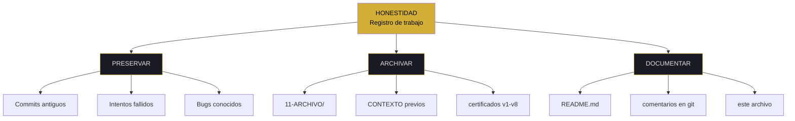
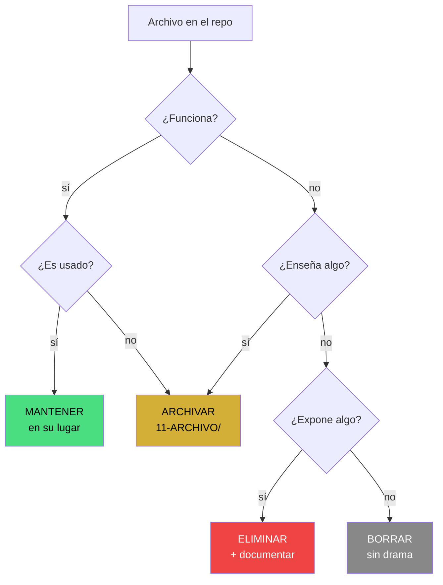
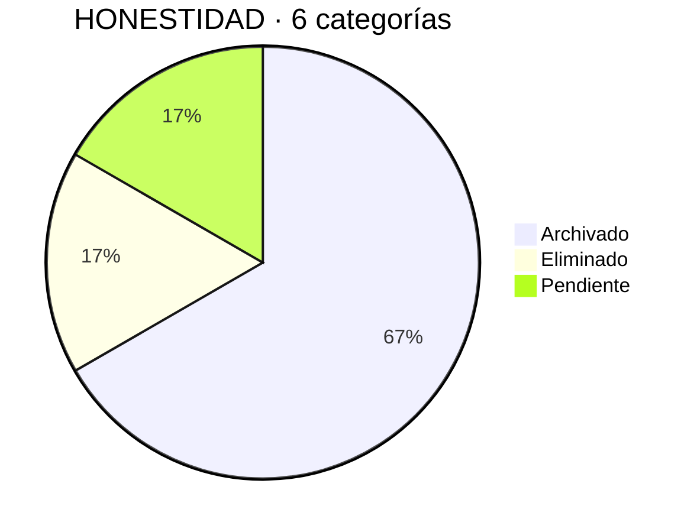

# honest — syscall

<pre>
┌─[kronos@protocol]─[~/honest]─┐
│ fd: honest · v7.2 FLOW+MAPS  │
│ chain: git + merkle          │
└──────────────────────────────┘
$ syscall honest --preserved
</pre>

> [!IMPORTANT]
> **PRESERVADO** = las iteraciones fallidas siguen en el historial.  
> **LIMPIO** = se borraron. KRONOS no borra. Archiva.

---

### ▸ estado de iteraciones

```
certificados v1-v8   ▓▓▓▓▓▓▓▓▓▓ 100%  ✅ ARCHIVADO   búsqueda estética
index-v2 iframe      ▓▓▓▓▓▓▓▓▓▓ 100%  ✅ ARCHIVADO   bug + fix documentados
fundador-v2.key      ▓▓▓▓▓▓▓▓▓▓ 100%  ✅ ELIMINADO   historia de seguridad
CONTEXTO v1-v3.16    ▓▓▓▓▓▓▓▓▓▓ 100%  ✅ ARCHIVADO   evolución del protocolo
duplicados           ▓▓▓▓▓▓▓▓▓▓ 100%  ✅ ELIMINADO   refactor
basura (i/Pnp/403)   ▓▓▓▓░░░░░░  50%  🟡 PENDIENTE   limpieza suave
─────────────────────────────────────────────────────────────────
promedio             ▓▓▓▓▓▓▓▓▓░  92%  🟢 5/6       1 pendiente
```

---

### ▸ filosofía · mapa conceptual



---

### ▸ flujo de decisión · qué hacer con un archivo



---

### ▸ distribución de decisiones



---

### ▸ comandos disponibles

| comando    | acción                 | verifica con     |
| :--------- | :--------------------- | :--------------- |
| `syscall`  | resumen de iteraciones | `ls 11-ARCHIVO/` |
| `ps`       | 6 procesos auditados   | `git log --all`  |
| `evidence` | 3 hashes reales        | `sha256sum`      |
| `map`      | iteración → archivo    | `grep`           |
| `rule`     | la regla del archivo   | `cat`            |
| `limits`   | lo que NO es           | `echo $?`        |

---

### $ ps -ef | grep kronos

|    pid    | iteración            |  resultado   | proof            |
| :-------: | :------------------- | :----------: | :--------------- |
| honest.01 | `certificados v1-v8` | ✅ ARCHIVADO | 08-HERRAMIENTAS/ |
| honest.02 | `index-v2 iframe`    | ✅ ARCHIVADO | git history      |
| honest.03 | `fundador-v2.key`    | ✅ ELIMINADO | git log          |
| honest.04 | `CONTEXTO v1-v3.16`  | ✅ ARCHIVADO | raíz             |
| honest.05 | `duplicados`         | ✅ ELIMINADO | refactor         |
| honest.06 | `basura (i/Pnp/403)` | 🟡 PENDIENTE | sin clasificar   |

<sub>6 procesos · 5 resueltos · 1 pendiente</sub>

---

### $ syscall honest --evidence

| key            | value                                                                 | check                                                                                                    |
| -------------- | --------------------------------------------------------------------- | -------------------------------------------------------------------------------------------------------- |
| merkle_docs    | `67180206595ec66d4d422b223f8d966961ecdf00cc2c32ed81133e83162ae813`    | `cat 00-SCHEMA/*.json \| sha256sum`                                                                      |
| pubkey_founder | `fd2fb1e9f198f5fa08ec6391b67730e3d997826c40cd7652dd5774aa5e744977`    | `cat 07-LLAVES/*.json \| grep pubkey`                                                                    |
| eth_tx_2       | `0xd2c2a7e128e6c81b689b3b0d9e1b31a4f6bf8df0391b7b6c05e7daa7fb895774c` | [etherscan](https://etherscan.io/tx/0xd2c2a7e128e6c81b689b3b0d9e1b31a4f6bf8df0391b7b6c05e7daa7fb895774c) |

---

<details open>
<summary><code>[honest.01] certificados v1-v8</code></summary>

<br>

**> humano:** 8 certificados visuales descartados. Muestran la búsqueda estética del proyecto. No se borran, se archivan.

**> máquina:**

```diff
+ 08-HERRAMIENTAS/certificados-v1.*
+ 08-HERRAMIENTAS/certificados-v2.*
+ ...
+ 08-HERRAMIENTAS/certificados-v8.*
```

```bash
$ ls 08-HERRAMIENTAS/*.png 2>/dev/null | head -n 10
$ git log --oneline -- 08-HERRAMIENTAS/certificados*
```

```json
{
  "iteracion": "certificados-v1-a-v8",
  "accion": "archivar",
  "razon": "búsqueda estética documentada",
  "status": "ARCHIVADO"
}
```

</details>

---

<details>
<summary><code>[honest.02] index-v2 iframe</code></summary>

<br>

**> humano:** hubo un dashboard alternativo con iframe que rompía las animaciones. Se reemplazó por cards. El bug y el fix están documentados.

**> máquina:**

```bash
$ git log --oneline -- index-v2.html
$ git log --oneline -- index.html
```

```json
{
  "iteracion": "index-v2-iframe",
  "accion": "archivar",
  "razon": "bug de animaciones + fix documentados",
  "status": "ARCHIVADO"
}
```

</details>

---

<details>
<summary><code>[honest.03] fundador-v2.key</code></summary>

<br>

**> humano:** hubo una llave privada expuesta. Se eliminó del repo. La historia queda en `git log` para trazabilidad.

**> máquina:**

```bash
$ git log --all -- fundador-v2.key
# Devuelve los commits donde existió. No se borró la historia.
```

```json
{
  "iteracion": "fundador-v2.key",
  "accion": "eliminar",
  "razon": "exposición de llave privada",
  "status": "ELIMINADO",
  "historia": "preservada en git log"
}
```

</details>

---

<details>
<summary><code>[honest.04] CONTEXTO v1-v3.16</code></summary>

<br>

**> humano:** los contextos portátiles previos muestran la evolución del protocolo. No se borran, se archivan en `11-ARCHIVO/`.

**> máquina:**

```bash
$ ls CONTEXTO* 2>/dev/null
$ git log --oneline -- CONTEXTO*
```

```json
{
  "iteracion": "CONTEXTO-v1-a-v3.16",
  "accion": "archivar",
  "razon": "evolución del protocolo documentada",
  "status": "ARCHIVADO"
}
```

</details>

---

<details>
<summary><code>[honest.05] duplicados</code></summary>

<br>

**> humano:** hubo carpetas y archivos duplicados (ej. `kronos-protocol/kronos-protocol/`). Se eliminaron pero quedan en el log.

**> máquina:**

```bash
$ git log --oneline --all | grep -i "duplicad\|refactor"
```

```json
{
  "iteracion": "duplicados-anidados",
  "accion": "eliminar",
  "razon": "refactor de estructura",
  "status": "ELIMINADO"
}
```

</details>

---

<details>
<summary><code>[honest.06] basura pendiente (i / Pnp / 403 / aditoria)</code></summary>

<br>

**> humano:** quedan 4 archivos basura sin clasificar. Son archivos huérfanos de experimentos previos. Se limpian esta semana.

**> máquina:**

```diff
- i         46 KB
- Pnp      1.6 KB
- 403       11 KB
- aditoria  40 KB
```

```bash
$ ls -la i Pnp 403 aditoria 2>/dev/null
$ git log --oneline -- i Pnp 403 aditoria
```

```json
{
  "iteracion": "basura-huerfana",
  "accion": "pendiente",
  "razon": "sin clasificar todavía",
  "status": "PENDIENTE",
  "archivos": ["i", "Pnp", "403", "aditoria"]
}
```

</details>

---

### rule

```bash
$ cat 11-ARCHIVO/README.md 2>/dev/null | grep -i regla
```

> [!NOTE]
> **Nada se borra. Todo se archiva.**  
> Lo que hoy parece error, mañana es historia.

---

### limits

> [!CAUTION]
> **KRONOS NO ES:**
>
> - ❌ Respaldo de emergencia
> - ❌ Almacén de llaves privadas
> - ❌ Basurero sin reglas

> [!NOTE]
> **KRONOS SÍ ES:**
>
> - ✅ Prueba de trabajo real
> - ✅ Trazable vía `git log`
> - ✅ Reproducible por cualquiera

<pre>
$ echo $?
0   # preservado != limpio
</pre>

---

<sub>kernel honest · v7.2 FLOW + MAPS</sub>

**○_● · ◢◤◥◣ · ◥◣◢◤**

<sub>51% HUMANO · 49% IA · 100% REAL</sub>  
<sub>"Lo que se archiva, se recuerda. Lo que se borra, miente."</sub>
