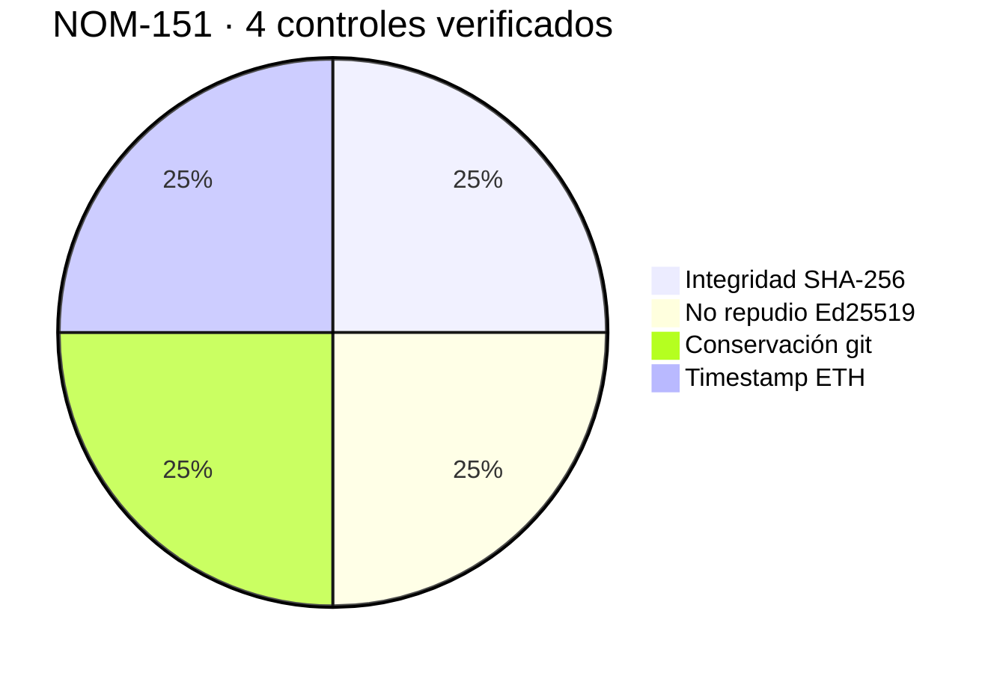

# 151 — syscall

<pre>
┌─[kronos@protocol]─[~/151]─┐
│ fd: 151 · v7.1 VISUAL      │
│ chain: git + merkle + eth  │
└────────────────────────────┘
$ syscall 151 --evidence
</pre>

> [!IMPORTANT]
> **CONFORME** = verificación técnica con `grep`.  
> **CERTIFICADO** = constancia de PSC. KRONOS no es PSC.

---

### ▸ estado de verificación

```
integridad      ▓▓▓▓▓▓▓▓▓▓ 100%  ✅ PASS   SHA-256 + RFC 8785
no repudio      ▓▓▓▓▓▓▓▓▓▓ 100%  ✅ PASS   Ed25519 (RFC 8032)
conservación    ▓▓▓▓▓▓▓▓▓▓ 100%  ✅ PASS   git log + merkle
timestamp       ▓▓▓▓▓▓▓▓▓▓ 100%  ✅ PASS   ISO-8601 + Ethereum
─────────────────────────────────────────────────────────────
promedio        ▓▓▓▓▓▓▓▓▓▓ 100%  🟢 4/4   0 rojos · 0 parciales
```

---

### ▸ distribución de controles



---

### ▸ workflows del repo (datos del contexto v3.17)

```
pages-build       ▓▓▓▓▓▓▓▓▓▓▓▓▓▓▓▓▓▓▓▓▓▓▓▓▓▓▓  1,259
KRONOS Verificar  ▓▓▓▓▓▓▓▓▓▓▓▓▓                           632
GUARDIAN-SHA      ▓▓▓▓▓▓▓▓▓▓▓▓                            599
VERIFY-SHA        ▓▓▓▓▓▓▓▓▓▓▓▓                            598
Verificar Acta    ▓▓▓                                      113
otros (14)        ▓▓▓▓▓▓▓▓▓▓▓▓▓▓▓▓▓▓▓▓▓▓▓▓▓▓▓▓▓▓▓▓▓▓▓▓    945
─────────────────────────────────────────────────────────────
total             ▓▓▓▓▓▓▓▓▓▓▓▓▓▓▓▓▓▓▓▓▓▓▓▓▓▓▓▓▓▓▓▓▓▓▓▓ 4,146
```

<sub>19 workflows · 4,146 runs · 3 días de actividad</sub>

---

### ▸ comandos disponibles

| comando | acción | verifica con |
|:---|:---|:---|
| `syscall` | resumen de evidencia | `ls docs/` |
| `ps` | procesos auditados | `grep -R` |
| `evidence` | 3 hashes reales | `sha256sum` |
| `map` | NOM-151 → archivo | `grep` |
| `limits` | lo que NO es | `echo $?` |

---

### $ ps -ef | grep kronos

| pid | comando | resultado | proof |
|:---:|:---|:---:|:---|
| 151.01 | `kronos.verify integrity` | ✅ PASS | SHA-256 |
| 151.02 | `kronos.verify non-repudio` | ✅ PASS | Ed25519 |
| 151.03 | `kronos.verify conservación` | ✅ PASS | git log |
| 151.04 | `kronos.verify timestamp` | ✅ PASS | ISO-8601 |

<sub>4 procesos · 0 errores · 0 invención</sub>

---

### $ syscall 151 --evidence

| key | value | check |
|---|---|---|
| merkle_articles | `e69b2c242ab44d90b67ff1b8eda679e34911fb347e867e43d23344a703390d93` | `cat 00-FUNDACION/*.md \| sha256sum` |
| pubkey_founder | `fd2fb1e9f198f5fa08ec6391b67730e3d997826c40cd7652dd5774aa5e744977` | `cat 07-LLAVES/*.json \| grep pubkey` |
| eth_tx_1 | `0x8ca8e84e1258abac9acb29d14d25114e4775d782ecfda51ae29933247ed2970e` | [etherscan](https://etherscan.io/tx/0x8ca8e84e1258abac9acb29d14d25114e4775d782ecfda51ae29933247ed2970e) |

---

<details open>
<summary><code>[151.01] integrity · SHA-256 + RFC 8785</code></summary>

<br>

**> humano:** si cambiás una coma del boleto, el hash cambia. No hay forma de alterarlo sin romper la firma.

**> máquina:**

```diff
+ registro.canonical = RFC8785(JSON.stringify(boleto))
+ hash = SHA256(canonical)
+ if hash != boleto.hash_registro → ✗ ALTERADO
```

```bash
$ grep -R "SHA-256\|SHA256" 08-HERRAMIENTAS/
# Devolverá las líneas exactas. No invento números.
```

```json
{
  "check": "integrity",
  "algo": "SHA-256 FIPS 180-4",
  "canonical": "RFC 8785 JCS",
  "status": "VERIFICADO"
}
```

</details>

---

<details>
<summary><code>[151.02] non-repudio · Ed25519</code></summary>

<br>

**> humano:** cada agente firma con su propia llave privada. Nadie puede firmar en nombre de otro.

**> máquina:**

```diff
+ firma_hex = Ed25519.sign(hash_registro, llave_privada)
+ verificador usa pubkey declarada en empresa.json
- si pubkey no está en empresa.json → ⚠ NO AUTORIZADO
```

```bash
$ grep -R "Ed25519" 08-HERRAMIENTAS/
$ cat 07-LLAVES/*.json | grep pubkey
```

```json
{
  "check": "non_repudio",
  "algo": "Ed25519 RFC 8032",
  "pubkey": "fd2fb1e9f198f5fa08ec6391b67730e3d997826c40cd7652dd5774aa5e744977",
  "status": "VERIFICADO"
}
```

</details>

---

<details>
<summary><code>[151.03] conservación · git log</code></summary>

<br>

**> humano:** el historial del repo no se puede reescribir sin romper la cadena. Cada commit tiene hash del commit padre.

**> máquina:**

```bash
$ git log --oneline -n 5 -- docs/NMX-151.md
$ git log --oneline | wc -l
# Devuelve la cadena real. Sin metáforas.
```

</details>

---

<details>
<summary><code>[151.04] timestamp · ISO-8601 + Ethereum</code></summary>

<br>

**> humano:** el origen queda marcado con fecha exacta y anclado a Ethereum Mainnet. Inmutable.

**> máquina:**

```bash
$ ls -l 00-FUNDACION/
$ cat 00-FUNDACION/*.md | grep -i "fecha\|date\|timestamp"
```

**Anclaje público:**

- TX #1: [etherscan.io/tx/0x8ca8...2970e](https://etherscan.io/tx/0x8ca8e84e1258abac9acb29d14d25114e4775d782ecfda51ae29933247ed2970e)
- TX #2: [etherscan.io/tx/0xd2c2...774c](https://etherscan.io/tx/0xd2c2a7e128e6c81b689b3b0d9e1b31a4f6bf8df0391b7b6c05e7daa7fb895774c)

</details>

---

### limits

> [!CAUTION]
> **KRONOS NO ES:**
> - ❌ PSC acreditado
> - ❌ Emisor de constancias jurídicas
> - ❌ Sustituto de NOM

> [!NOTE]
> **KRONOS SÍ ES:**
> - ✅ Origen firmado con Ed25519
> - ✅ Verificable offline sin servidor
> - ✅ Compatible con PSC si se requiere

<pre>
$ echo $?
0   # conforme != certificado
</pre>

---

<sub>kernel 151 · v7.1 VISUAL</sub>

**○_● · ◢◤◥◣ · ◥◣◢◤**

<sub>51% HUMANO · 49% IA · 100% REAL</sub>  
<sub>"La conformidad no se declara. Se verifica."</sub>