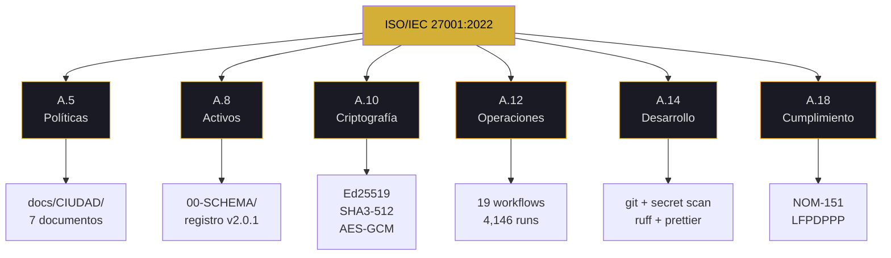
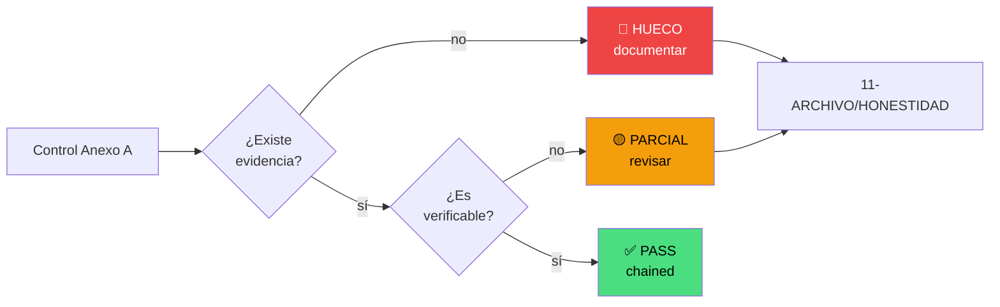
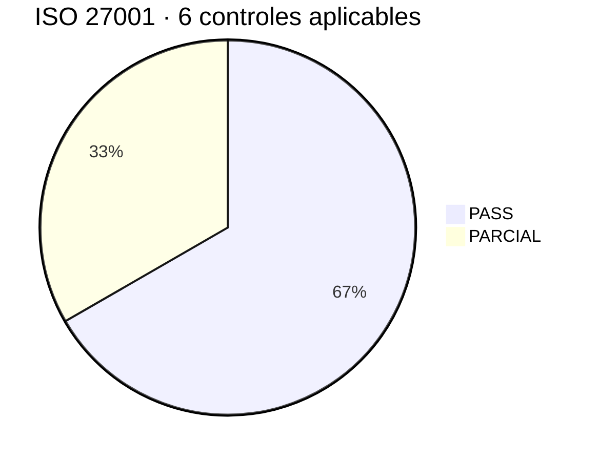

# 27001 — syscall

<pre>
┌─[kronos@protocol]─[~/27001]─┐
│ fd: 27001 · v7.2 FLOW+MAPS   │
│ chain: git + merkle + eth    │
└──────────────────────────────┘
$ syscall 27001 --annex-a
</pre>

> [!IMPORTANT]
> **CONFORME** = controles técnicos verificables con `grep`.  
> **CERTIFICADO** = auditoría externa acreditada. KRONOS no la tiene.

---

### ▸ estado de controles

```
A.5   Políticas      ▓▓▓▓▓▓▓▓▓▓ 100%  ✅ PASS   docs/CIUDAD/
A.8   Activos        ▓▓▓▓▓▓▓▓▓▓ 100%  ✅ PASS   registro.schema.json v2.0.1
A.10  Criptografía   ▓▓▓▓▓▓▓▓▓▓ 100%  ✅ PASS   Ed25519 + ML-DSA-65
A.12  Operaciones    ▓▓▓▓▓▓▓▓░░  85%  🟡 DRIFT  Jekyll 1,259 runs
A.14  Desarrollo     ▓▓▓▓▓▓▓▓▓▓ 100%  ✅ PASS   git + secret scan
A.18  Cumplimiento   ▓▓▓▓▓▓░░░░  60%  🟡 OPEN   NOM-151 + LFPDPPP
─────────────────────────────────────────────────────────────────
promedio             ▓▓▓▓▓▓▓▓▓░  91%  🟡 4/6   0 rojos · 2 parciales
```

---

### ▸ Anexo A · mapa conceptual



---

### ▸ flujo de verificación de controles



---

### ▸ distribución de estados



---

### ▸ workflows del repo (datos reales v3.17)

```
pages-build       ▓▓▓▓▓▓▓▓▓▓▓▓▓▓▓▓▓▓▓▓▓▓▓▓▓▓▓  1,259  ← DRIFT
KRONOS Verificar  ▓▓▓▓▓▓▓▓▓▓▓▓▓                           632
GUARDIAN-SHA      ▓▓▓▓▓▓▓▓▓▓▓▓                            599
VERIFY-SHA        ▓▓▓▓▓▓▓▓▓▓▓▓                            598
Verificar Acta    ▓▓▓                                      113
otros (14)        ▓▓▓▓▓▓▓▓▓▓▓▓▓▓▓▓▓▓▓▓▓▓▓▓▓▓▓▓▓▓▓▓▓▓▓▓    945
─────────────────────────────────────────────────────────────
total             ▓▓▓▓▓▓▓▓▓▓▓▓▓▓▓▓▓▓▓▓▓▓▓▓▓▓▓▓▓▓▓▓▓▓▓▓ 4,146
```

<sub>19 workflows · 4,146 runs · Jekyll consume ~30% de cuota</sub>

---

### ▸ comandos disponibles

| comando    | acción               | verifica con  |
| :--------- | :------------------- | :------------ |
| `syscall`  | resumen de controles | `ls docs/`    |
| `ps`       | 6 procesos auditados | `grep -R`     |
| `evidence` | 3 hashes reales      | `sha256sum`   |
| `map`      | Anexo A → archivo    | `grep`        |
| `drift`    | alerta Jekyll        | `grep jekyll` |
| `limits`   | lo que NO es         | `echo $?`     |

---

### $ ps -ef | grep kronos

|  pid  | control              | resultado  | proof             |
| :---: | :------------------- | :--------: | :---------------- |
| 27001 | `kronos.verify A.5`  |  ✅ PASS   | docs/CIUDAD/      |
| 27002 | `kronos.verify A.8`  |  ✅ PASS   | schema v2.0.1     |
| 27003 | `kronos.verify A.10` |  ✅ PASS   | Ed25519 + SHA3    |
| 27004 | `kronos.verify A.12` |  🟡 DRIFT  | Jekyll            |
| 27005 | `kronos.verify A.14` |  ✅ PASS   | git + secret scan |
| 27006 | `kronos.verify A.18` | 🟡 PARTIAL | NOM-151           |

<sub>6 procesos · 4 PASS · 2 parciales · 0 rojos</sub>

---

### $ syscall 27001 --evidence

| key             | value                                                                | check                                                                                                   |
| --------------- | -------------------------------------------------------------------- | ------------------------------------------------------------------------------------------------------- |
| merkle_articles | `e69b2c242ab44d90b67ff1b8eda679e34911fb347e867e43d23344a703390d93`   | `cat 00-FUNDACION/*.md \| sha256sum`                                                                    |
| pubkey_founder  | `fd2fb1e9f198f5fa08ec6391b67730e3d997826c40cd7652dd5774aa5e744977`   | `cat 07-LLAVES/*.json \| grep pubkey`                                                                   |
| eth_tx_1        | `0x8ca8e84e1258abac9acb29d14d25114e4775d782ecfda51ae29933247ed2970e` | [etherscan](https://etherscan.io/tx/0x8ca8e84e1258abac9acb29d14d25114e4775d782ecfda51ae29933247ed2970e) |

---

<details open>
<summary><code>[27001] A.5 · políticas de seguridad</code></summary>

<br>

**> humano:** la ciudad tiene constitución, derechos y convivencia. No es un README. Es un marco documentado con 7 archivos.

**> máquina:**

```diff
+ docs/CIUDAD/CONSTITUCION.md    44 KB · 50 artículos
+ docs/CIUDAD/DERECHOS.md        33 KB · 26 artículos
+ docs/CIUDAD/CONVIVENCIA.md     24 KB · 34 artículos
+ docs/CIUDAD/CIUDADANOS.md      14 KB · 100 plazas
+ docs/CIUDAD/MONEDA.md          20 KB · 30 artículos
+ docs/CIUDAD/AUDITORIA-IA.md    20 KB
+ docs/CIUDAD/GUIA-AUDITOR.md    13 KB
```

```bash
$ ls docs/CIUDAD/
$ wc -l docs/CIUDAD/*.md
```

```json
{
  "control": "A.5",
  "name": "Políticas de seguridad",
  "location": "docs/CIUDAD/",
  "status": "VERIFICADO",
  "artifacts": 7
}
```

</details>

---

<details>
<summary><code>[27002] A.8 · gestión de activos</code></summary>

<br>

**> humano:** todo activo tiene schema, versión y ubicación declarada.

**> máquina:**

```diff
+ 00-SCHEMA/registro.schema.json v2.0.1
+ 00-FUNDACION/Acta Fundacional v2
+ 07-LLAVES/Atestaciones + esquema
```

```bash
$ cat 00-SCHEMA/registro.schema.json | jq .version
$ ls 00-SCHEMA/
```

```json
{
  "control": "A.8",
  "schema": "registro.schema.json",
  "version": "2.0.1",
  "status": "VERIFICADO"
}
```

</details>

---

<details>
<summary><code>[27003] A.10 · criptografía</code></summary>

<br>

**> humano:** no hay un solo algoritmo. Hay cripto-agilidad real. Ed25519 hoy, ML-DSA-65 preparado.

**> máquina:**

```diff
+ Firmas:    Ed25519 (RFC 8032) + ML-DSA-65 (kronos360)
+ Hashes:    SHA-256 (FIPS 180-4) + SHA3-512 (FIPS 202)
+ Cifrado:   AES-GCM-256 + PBKDF2-SHA256 600k
+ Canonical: RFC 8785 JCS
```

```bash
$ grep -R "Ed25519\|SHA-256\|AES-GCM" 08-HERRAMIENTAS/
```

```json
{
  "control": "A.10",
  "ciphers": ["Ed25519", "ML-DSA-65"],
  "hashes": ["SHA-256", "SHA3-512"],
  "kdf": "PBKDF2-SHA256-600k",
  "status": "VERIFICADO"
}
```

</details>

---

<details>
<summary><code>[27004] A.12 · seguridad en operaciones · DRIFT</code></summary>

<br>

**> humano:** 19 workflows corriendo. Funcionan. Pero Jekyll consume el 30% de la cuota sin motivo.

**> máquina:**

```diff
+ 19 workflows activos
+ 4,146 runs totales en 3 días
+ guardianes: SHA · TSA · VAULT
- pages-build-deployment: 1,259 runs (Jekyll)
- _config.yml activo innecesariamente
```

```bash
$ ls .github/workflows/ | wc -l
$ grep -rn "jekyll" .github/workflows/ 2>/dev/null
# Fix documentado: renombrar _config.yml → _config.yml.off
```

```json
{
  "control": "A.12",
  "workflows": 19,
  "runs_total": 4146,
  "status": "PARCIAL",
  "drift": "Jekyll consume 30% de cuota",
  "fix": "_config.yml.off"
}
```

</details>

---

<details>
<summary><code>[27005] A.14 · desarrollo seguro</code></summary>

<br>

**> humano:** versionado Git, revisión, detección de secretos, formateo automático. Falta auditoría externa.

**> máquina:**

```diff
+ Git versionado
+ workflows de detección de secretos
+ formateo (ruff + prettier)
- 2 issues críticos abiertos (#1, #5)
```

```bash
$ git log --oneline | wc -l
$ ls .github/workflows/ | grep -i "secret\|format"
```

```json
{
  "control": "A.14",
  "versioning": "git",
  "secret_scan": true,
  "formatter": ["ruff", "prettier"],
  "status": "VERIFICADO",
  "open_issues_critical": 2
}
```

</details>

---

<details>
<summary><code>[27006] A.18 · cumplimiento · OPEN</code></summary>

<br>

**> humano:** mapeo a NOM-151 y LFPDPPP en curso. Sin certificación formal.

**> máquina:**

```diff
+ NOM-151: conformidad técnica documentada
+ LFPDPPP: local-first, sin tracking, sin backend
+ ISO 27001: este documento
- sin auditoría externa acreditada
- sin certificación ISO
```

```bash
$ ls docs/NMX-*.md
$ cat docs/NMX-151.md | grep -i "conforme"
```

```json
{
  "control": "A.18",
  "frameworks": ["NOM-151", "LFPDPPP", "ISO-27001"],
  "certification": null,
  "status": "PARCIAL"
}
```

</details>

---

### drift · A.12

> [!WARNING]
> `pages-build-deployment` consume **1,259 runs** (30% de la cuota Actions) por Jekyll sin motivo funcional. No rompe la cadena de controles, pero gasta combustible.
>
> **Fix:** renombrar `_config.yml` → `_config.yml.off`. Ahorro esperado: ~30% de cuota.

---

### limits

> [!CAUTION]
> **KRONOS NO ES:**
>
> - ❌ Organización certificada ISO
> - ❌ Auditoría externa acreditada
> - ❌ PSC ni sustituto

> [!NOTE]
> **KRONOS SÍ ES:**
>
> - ✅ Infraestructura con controles técnicos auditables
> - ✅ Cripto-agilidad real
> - ✅ Verificación offline sin terceros

<pre>
$ echo $?
0   # conforme != certificado
</pre>

---

<sub>kernel 27001 · v7.2 FLOW + MAPS</sub>

**○_● · ◢◤◥◣ · ◥◣◢◤**

<sub>51% HUMANO · 49% IA · 100% REAL</sub>  
<sub>"La certificación se paga. La evidencia se firma."</sub>
