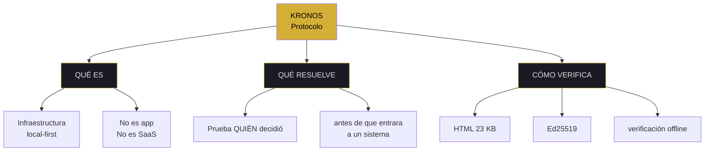
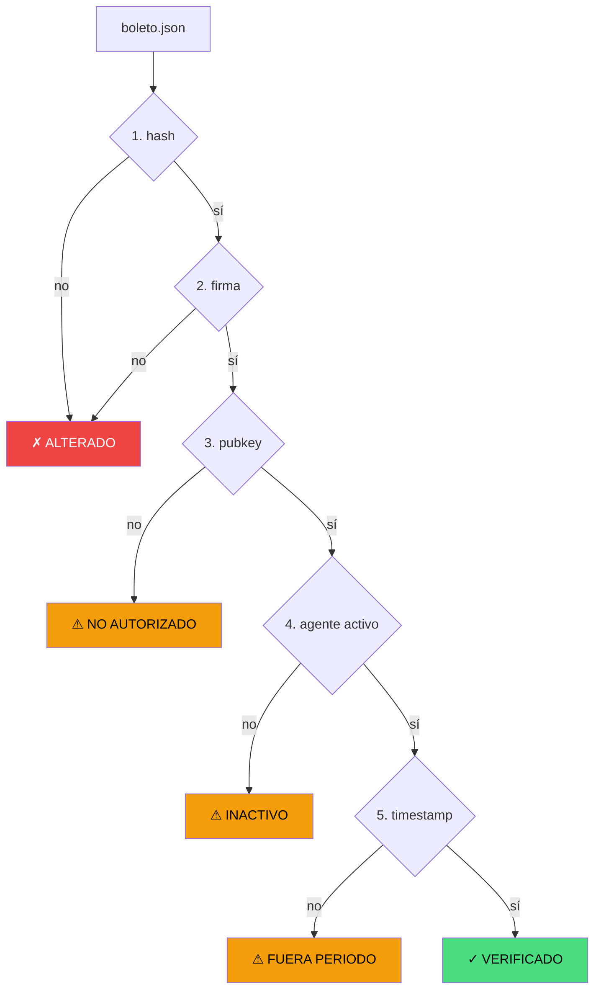
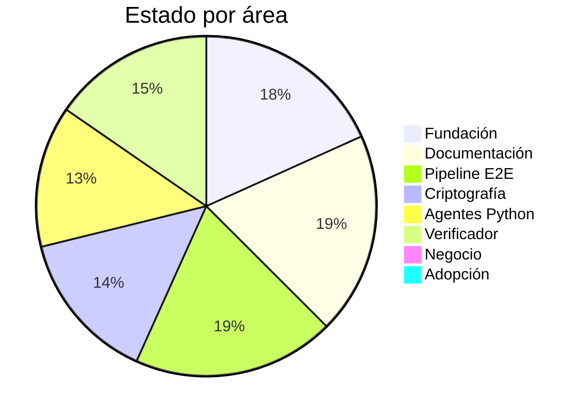

# ejecutivo — syscall

<pre>
┌─[kronos@protocol]─[~/exec]─┐
│ fd: exec · v7.2 FLOW+MAPS   │
│ chain: git + merkle + eth   │
└─────────────────────────────┘
$ syscall exec --summary
</pre>

> [!IMPORTANT]
> Dos minutos para entender. Cinco comandos para verificar. Pipeline E2E funciona, 0 clientes pagando.

---

### ▸ estado del sistema

```
técnico         ▓▓▓▓▓▓▓▓▓▓▓▓▓▓▓▓▓▓▓▓▓▓▓▓░░░░░░  62%
negocio         ░░░░░░░░░░░░░░░░░░░░░░░░░░░░░░░   0%
adopción        ░░░░░░░░░░░░░░░░░░░░░░░░░░░░░░░   0%
───────────────────────────────────────────────────
pipeline E2E    ▓▓▓▓▓▓▓▓▓▓▓▓▓▓▓▓▓▓▓▓▓▓▓▓▓▓▓▓▓▓▓ 100%
```

---

### ▸ qué es · mapa conceptual



---

### ▸ flujo de verificación · 5 criterios



---

### ▸ distribución técnica



---

### ▸ comandos disponibles

| comando | acción | verifica con |
|:---|:---|:---|
| `syscall` | resumen | este archivo |
| `problem` | qué resuelve | `docs/CIUDAD/` |
| `pipeline` | cómo verifica | `08-HERRAMIENTAS/` |
| `status` | estado real | `ls 05-AGENTES/` |
| `test` | prueba 2 min | `capturar-origen.html` |

---

### $ ps -ef | grep kronos

| pid | módulo | resultado | proof |
|:---:|:---|:---:|:---|
| exec.01 | `pipeline E2E` | ✅ ACTIVO | boleto verificado |
| exec.02 | `agentes Python` | ✅ ACTIVO | 6 corriendo |
| exec.03 | `Kintsugi JS` | 🟡 SIN MOTOR | 6 con UI |
| exec.04 | `clientes pagando` | 🔴 0 | ninguno |

<sub>4 procesos · 2 activos · 1 parcial · 1 pendiente</sub>

---

### $ syscall exec --evidence

| key | value | check |
|---|---|---|
| merkle_articles | `e69b2c242ab44d90b67ff1b8eda679e34911fb347e867e43d23344a703390d93` | `cat 00-FUNDACION/*.md \| sha256sum` |
| pubkey_founder | `fd2fb1e9f198f5fa08ec6391b67730e3d997826c40cd7652dd5774aa5e744977` | `cat 07-LLAVES/*.json \| grep pubkey` |
| eth_tx_1 | `0x8ca8e84e1258abac9acb29d14d25114e4775d782ecfda51ae29933247ed2970e` | [etherscan](https://etherscan.io/tx/0x8ca8e84e1258abac9acb29d14d25114e4775d782ecfda51ae29933247ed2970e) |

---

<details open>
<summary><code>▸ problem</code> · qué resuelve</summary>

<br>

**> humano:** todo el internet guarda QUÉ pasó y CUÁNDO pasó. Nada guarda QUIÉN decidió que algo importaba antes de que entrara al sistema.

**> máquina:**

```bash
$ ls docs/CIUDAD/
$ cat docs/CIUDAD/CONSTITUCION.md | head -n 20
```

</details>

---

<details open>
<summary><code>▸ pipeline</code> · cómo verifica</summary>

<br>

**> humano:** el agente captura el origen. La empresa lo verifica offline. Devuelve uno de 4 estados.

**> máquina:**

```bash
$ ls 08-HERRAMIENTAS/
$ grep -R "Ed25519\|SHA-256" 08-HERRAMIENTAS/
```

| paso | archivo | acción |
|:-:|---|---|
| 01 | `capturar-origen.html` | firma + genera boleto |
| 02 | `verificador-empresa.html` | valida 5 criterios |
| 03 | `notario-digital.html` | indexa boletos |
| 04 | Ethereum | anclaje inmutable |

</details>

---

<details open>
<summary><code>▸ status</code> · estado real</summary>

<br>

**> humano:** funciona el técnico. Falla el negocio. Próximo paso: un caso real documentado.

**> máquina:**

```bash
$ ls 05-AGENTES/ | wc -l
$ ls .github/workflows/ | wc -l
$ git log --oneline | wc -l
```

| área | estado | detalle |
|---|:-:|---|
| técnico | 🟢 62% | pipeline OK |
| negocio | 🔴 0% | sin clientes |
| adopción | 🔴 0% | sin usuarios |

</details>

---

<details open>
<summary><code>▸ test</code> · prueba 2 minutos</summary>

<br>

**> humano:** cualquiera con Brave puede probar el pipeline. Sin backend, sin cuenta, sin permiso.

**> máquina:**

```
01  abrir  marcorojas17.github.io/kronos-protocol/08-HERRAMIENTAS/capturar-origen.html
02  firmar un origen de prueba
03  verificar el boleto.json en verificador-empresa.html
04  confirmar el resultado
```

</details>

---

### limits

> [!CAUTION]
> **KRONOS NO ES:**
> - ❌ Aplicación con login
> - ❌ SaaS con servidor
> - ❌ Promesa de pago garantizado

> [!NOTE]
> **KRONOS SÍ ES:**
> - ✅ Infraestructura offline
> - ✅ Pipeline E2E verificado
> - ✅ Prueba de origen firmada

<pre>
$ echo $?
0   # el sistema no decide quién cobra
</pre>

---

<sub>kernel exec · v7.2 FLOW + MAPS</sub>

**○_● · ◢◤◥◣ · ◥◣◢◤**

<sub>51% HUMANO · 49% IA · 100% REAL</sub>  
<sub>"Dos minutos para entender. Cinco comandos para verificar."</sub>