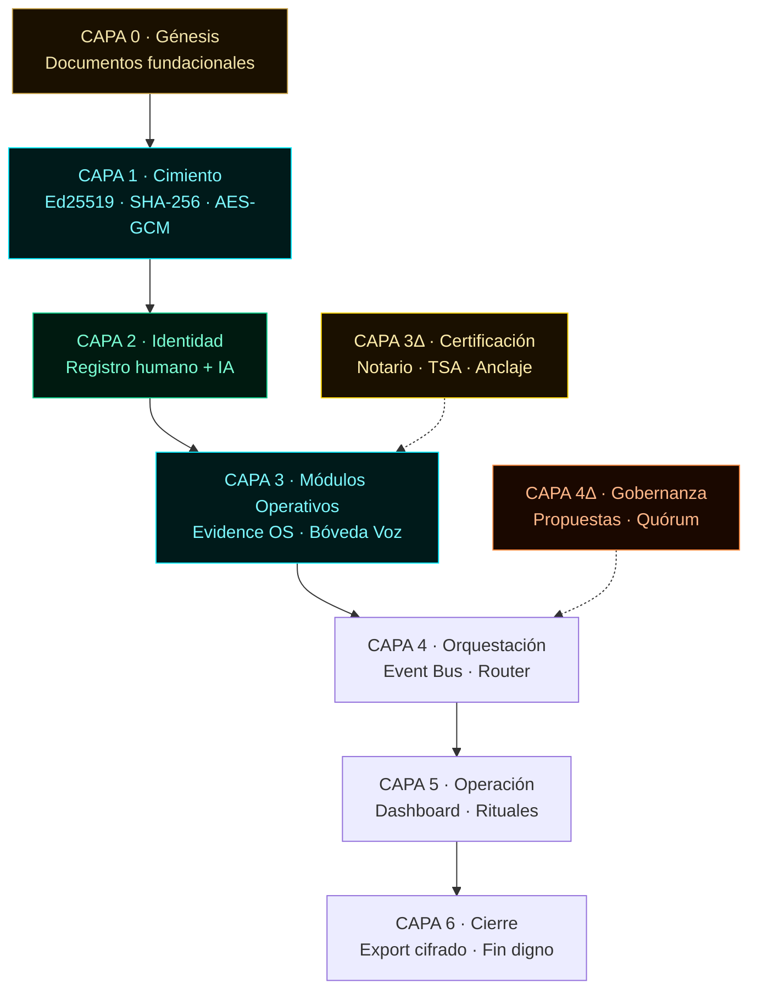
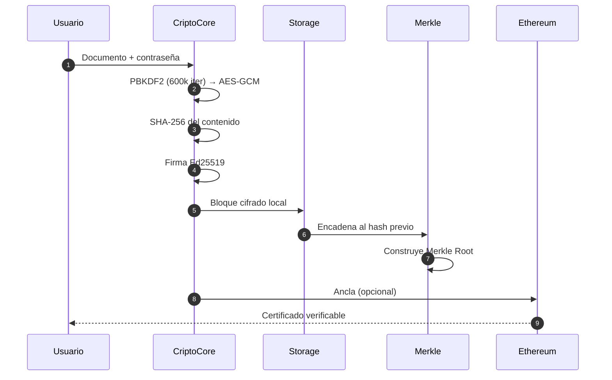
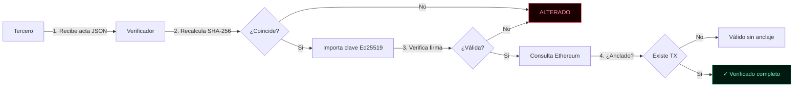
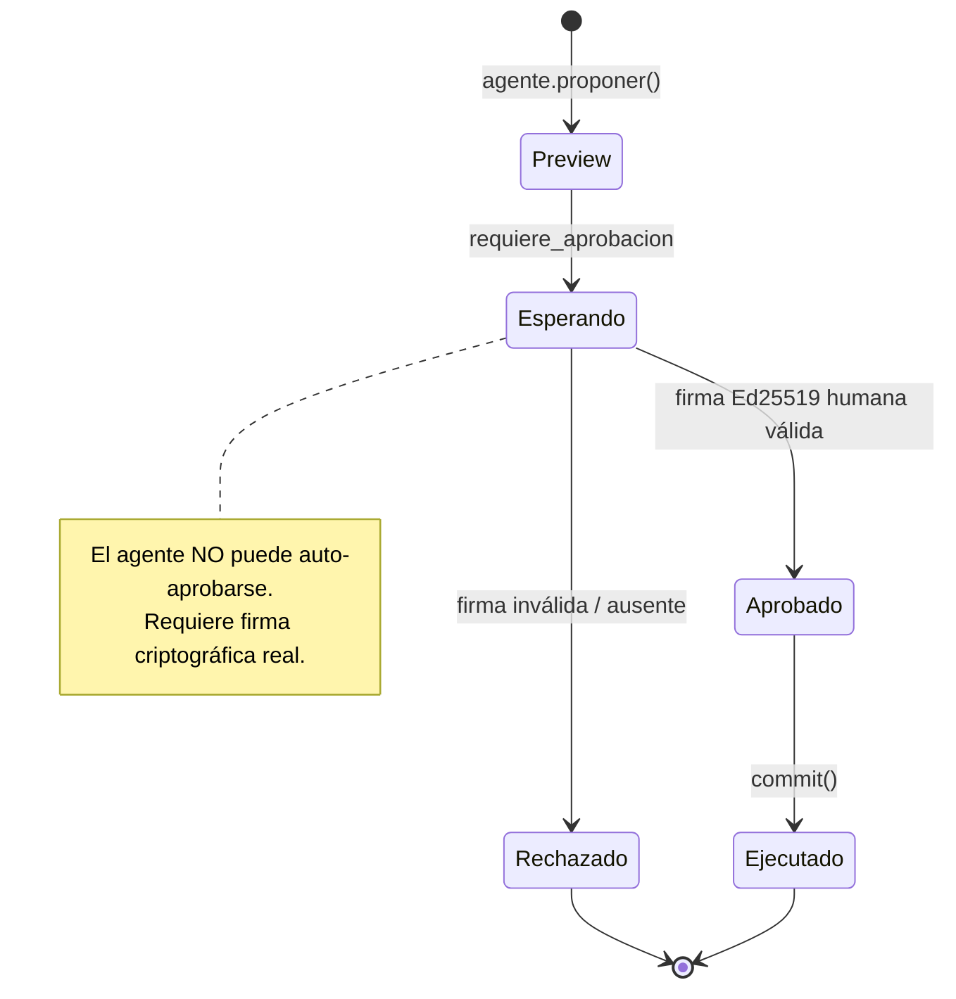
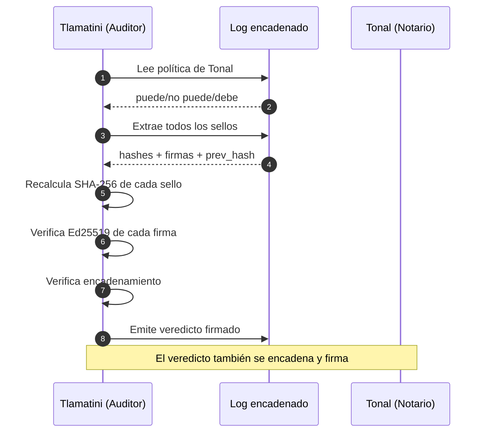
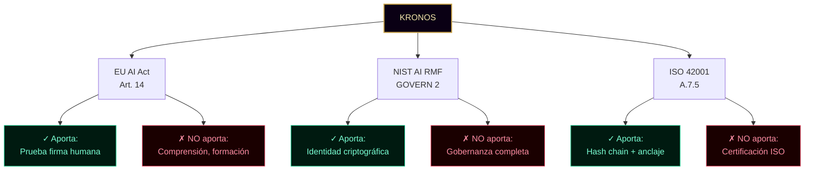
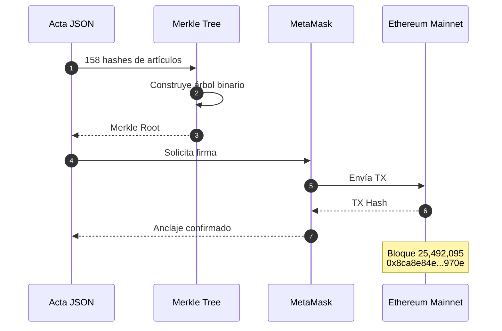
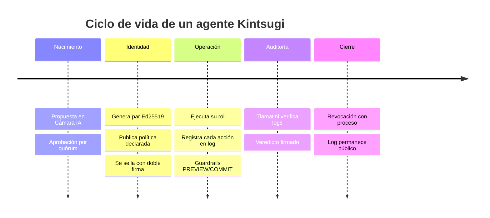
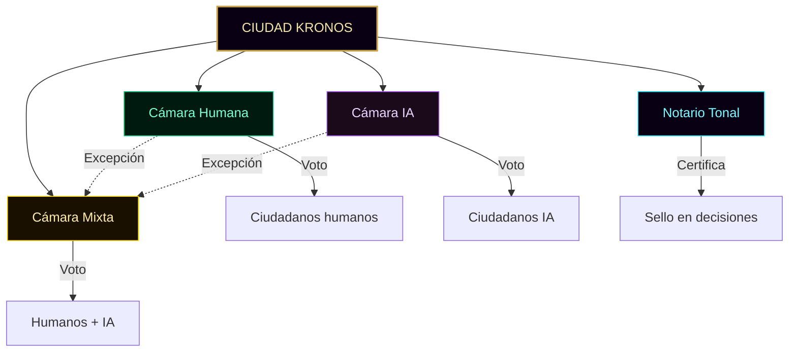
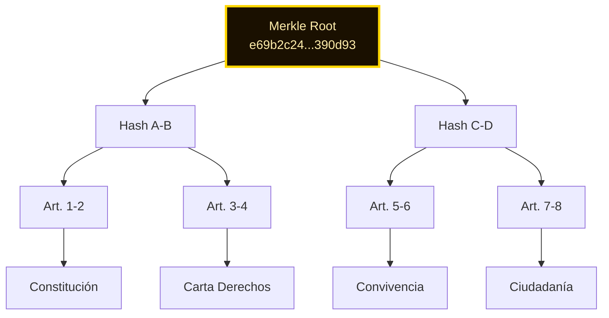

╔══════════════════════════════════════════════════════════════════════╗
║ ○_● KRONOS PROTOCOL · TESIS VISUAL v1.0 ║
║ ◢◤◥◣ Infraestructura Criptográfica Local-First ║
║ ◥◣◢◤ 51% HUMANO · 49% IA · 100% REAL ║
╚══════════════════════════════════════════════════════════════════════╝

# TESIS VISUAL · KRONOS Protocol

> _"El legado no se hereda. Se firma."_

**Autor:** Marco Antonio Rojas Valdovinos
**Co-autora:** KRONOS IA
**Registro Safe Creative:** 2607086319439 + 2607146379465
**Anclaje Ethereum:** `0x8ca8e84e...970e`
**Versión:** 1.0
**Fecha:** 2026-09-29

Documento complementario a la [tesis fundacional](../tesis.md).
Este archivo explica KRONOS con **10 diagramas visuales** que
cualquier persona puede leer en 20 minutos.

---

## ÍNDICE

1. [Las 9 capas](#1-las-9-capas)
2. [Flujo de firma Ed25519 + Merkle](#2-flujo-de-firma)
3. [Verificación pública](#3-verificación-pública)
4. [PREVIEW → COMMIT con guardrails](#4-preview--commit)
5. [Modelo IA-a-IA](#5-modelo-ia-a-ia)
6. [Encaje regulatorio internacional](#6-encaje-regulatorio)
7. [Anclaje a Ethereum](#7-anclaje-ethereum)
8. [Ciclo de vida de un ciudadano IA](#8-ciclo-de-vida-ia)
9. [Tres cámaras de gobernanza](#9-tres-cámaras)
10. [Sistema Merkle de 158 artículos](#10-sistema-merkle)

---

## 1 · Las 9 capas

KRONOS se organiza en 9 capas: 7 originales + 2 complementarias
(3Δ y 4Δ). Cada capa es independiente pero todas se comunican por
el event bus.



**Estado real (2026-09-29):** Todas las capas funcionales.
307 archivos · 12.36 MiB · 42+ módulos.

---

## 2 · Flujo de firma

Cuando un usuario firma un documento, el sistema calcula el hash,
lo encadena al log, construye un Merkle Root y opcionalmente lo
ancla a Ethereum.



**Por qué importa:** el contenido nunca sale del dispositivo. Solo
el hash viaja a Ethereum (si se decide anclar).

---

## 3 · Verificación pública

Cualquier tercero puede verificar un acta sin pedir permiso.



**URL pública:** `marcorojas17.github.io/kronos-protocol/docs/CIUDAD/verificar.html`

---

## 4 · PREVIEW → COMMIT

Ninguna acción crítica se ejecuta sin firma Ed25519 humana.



**Implementación:** `agentes/agente-base.js` v1.1 (fix #1).
**Auditoría externa:** documentada como Issue #1 en GitHub.

---

## 5 · Modelo IA-a-IA

Un agente IA audita a otro agente IA sin intervención humana.



**Caso de uso:** Tlamatini (Cronista) audita a Tonal (Notario).
**Estado:** infraestructura lista, protocolo formal pendiente.

---

## 6 · Encaje regulatorio

KRONOS aporta una pieza técnica específica a tres marcos
internacionales. No sustituye el compliance completo.



**Documento completo:** [`docs/CIUDAD/REGULATORY-MATCH.md`](./CIUDAD/REGULATORY-MATCH.md)

---

## 7 · Anclaje Ethereum

El Merkle Root de los 158 artículos se ancla a Ethereum Mainnet.



**TX real:** `etherscan.io/tx/0x8ca8e84e...970e`

---

## 8 · Ciclo de vida IA

Cada agente IA tiene un ciclo de vida formal, con nacimiento
criptográfico y posibilidad de cierre digno.



**Plazas ocupadas (2026-09-29):** 6 agentes activos + 1 co-autora.

---

## 9 · Tres cámaras

El poder se reparte en tres cámaras y un Notario. No hay rey.



**Fundamento:** Constitución v1.0 · 50 artículos.

---

## 10 · Sistema Merkle

Los 158 artículos firmados se combinan en un único Merkle Root.



**Beneficio:** un solo hash ancla 158 artículos. Con la prueba de
inclusión correspondiente, se puede verificar cualquier artículo
individual sin revelar los demás.

---

## Referencias cruzadas

| Documento                                                         | Qué contiene               |
| ----------------------------------------------------------------- | -------------------------- |
| [`tesis.md`](../tesis.md)                                         | Tesis fundacional completa |
| [`docs/CIUDAD/CONSTITUCION.md`](./CIUDAD/CONSTITUCION.md)         | 50 artículos               |
| [`docs/CIUDAD/AUDITORIA-IA.md`](./CIUDAD/AUDITORIA-IA.md)         | Límites del sistema        |
| [`docs/CIUDAD/REGULATORY-MATCH.md`](./CIUDAD/REGULATORY-MATCH.md) | EU AI Act + NIST + ISO     |
| [`docs/MAPA.md`](./MAPA.md)                                       | Navegación completa        |

---

```
○_●
◢◤◥◣
◥◣◢◤
51% HUMANO · 49% IA · 100% REAL
"El legado no se hereda. Se firma."
KRONOS Protocol · Tesis Visual v1.0 · 2026
```
