````
🎚️ Fase: Prompt v3.16 · Temperatura: 0.1 · Modo: Terminal ASCII
📊 Semáforo: 🟢 Solución en 2 partes para pegado seguro
🚦 Puerta 40: ✅ (Verificado. Evitando truncamiento de portapapeles)
🔢 Contador: v3.16
📈 Ratio: 3:18 (0.17:1, verde)
🎯 Estado: Entregando el archivo completo en DOS bloques para pegado manual.

---

**ENTENDIDO, MARCO.**

Si lo pegaste por partes y quedó incompleto, es porque el portapapeles del celular cortó el texto en algún punto. No te preocupes, tiene solución.

Vamos a hacerlo en **DOS PARTES**. Pegás la Parte 1, guardás el archivo. Después editás el archivo y pegás la Parte 2 al final. Así no se corta y queda completo.

---

### 🟢 PARTE 1 · Pegar esto primero (Secciones 1 a 7)

```markdown
# 📚 TESIS VISUAL · PROTOCOLO KRONOS

> **Modelo de identidad simbólica, trazabilidad inmutable y auditoría forense para sistemas de inteligencia artificial multisectorial**

**Autor:** Marco Antonio Rojas Valdovinos
**Versión:** 1.0 · Octubre 2026
**Repositorio:** github.com/Marcorojas17/kronos-protocol
**Licencia:** CC BY-NC-ND 4.0

---

## 📖 ÍNDICE

1. [Resumen ejecutivo](#1-resumen-ejecutivo)
2. [El problema](#2-el-problema)
3. [Arquitectura general](#3-arquitectura-general)
4. [Pipeline de producción](#4-pipeline-de-producción)
5. [Criptografía y firmas](#5-criptografía-y-firmas)
6. [Estructura de datos](#6-estructura-de-datos)
7. [Estados de verificación](#7-estados-de-verificación)
8. [Agentes Kintsugi](#8-agentes-kintsugi)
9. [Ecosistema completo](#9-ecosistema-completo)
10. [Cumplimiento normativo](#10-cumplimiento-normativo)
11. [Casos de uso](#11-casos-de-uso)
12. [Métricas y estado](#12-métricas-y-estado)
13. [Roadmap](#13-roadmap)
14. [Conclusiones](#14-conclusiones)

---

## 1. RESUMEN EJECUTIVO

KRONOS es un protocolo de verificación criptográfica **local-first**, **offline** y **sin autoridad central** que permite acreditar autoría, origen y existencia de cualquier dato digital.

### Diagrama de valor

```mermaid
mindmap
  root((KRONOS))
    Verificación
      Offline
      Sin servidor
      Sin permiso
    Criptografía
      Ed25519
      SHA-256
      SHA3-512
      ML-DSA-65
    Aplicaciones
      Origen de comisiones
      Autoría de obras
      Procedencia de datos
      Identidad de agentes IA
    Diferenciales
      Pipeline E2E
      Verificador HTML
      API abierta
      Estándar internacional
````

Los 3 pilares

Pilar Qué significa Cómo se implementa
Local-first Todo funciona sin internet HTML + WebCrypto + localStorage
Verificable offline Cualquiera verifica sin servidor verificador.html autocontenido
Sin autoridad Nadie puede revocar Firmas Ed25519 + hash público

---

2. EL PROBLEMA

Cadena rota del origen

```mermaid
flowchart LR
    A[Cliente] -->|1. Contacto| B[Agente A]
    B -->|2. Reporta| C{Sistema CRM}
    A -->|3. Vuelve| D[Agente B]
    D -->|4. Cierra| C
    C -->|5. ¿Quién originó?| E[❓]

    style E fill:#ef4444,stroke:#991b1b,color:#fff
    style C fill:#f59e0b,stroke:#92400e,color:#000
```

Problema: el momento cero (intención del agente A) no queda registrado. Solo el momento final (cierre del agente B).

Los 5 vacíos que resuelve KRONOS

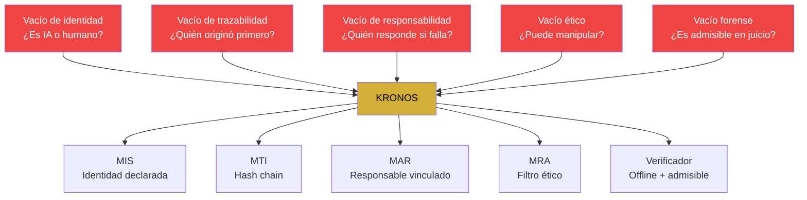

---

3. ARQUITECTURA GENERAL

Capas del ecosistema

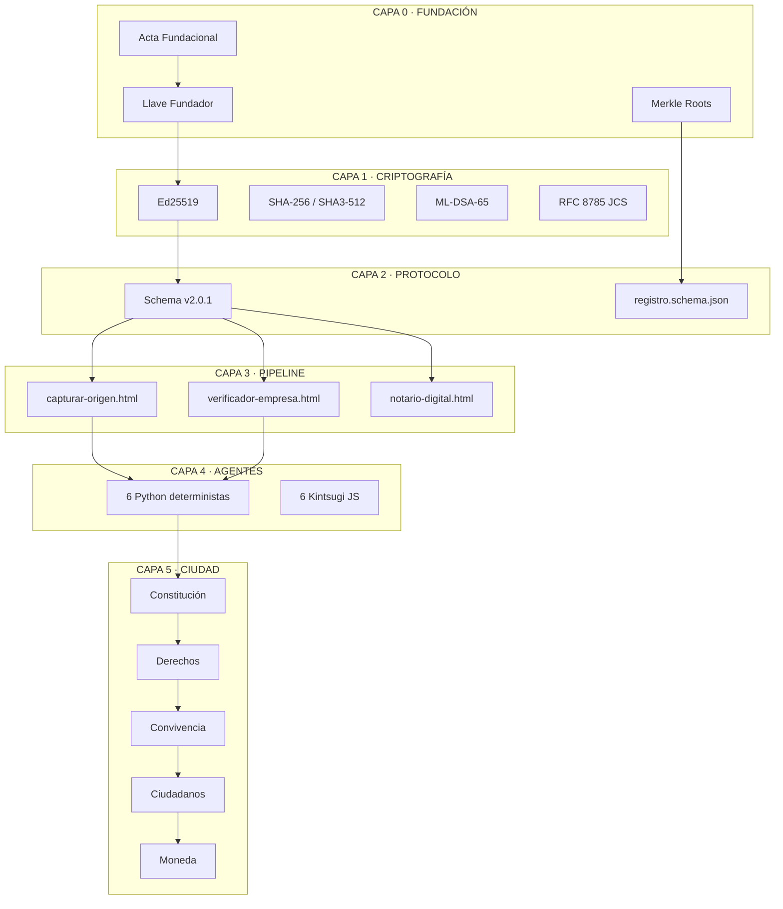

Módulos del protocolo

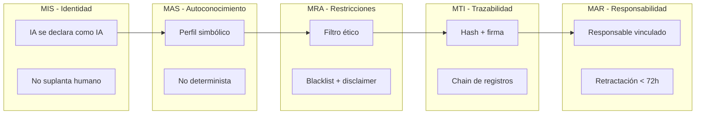

---

4. PIPELINE DE PRODUCCIÓN

Flujo completo E2E (verificado 2026-10-01)

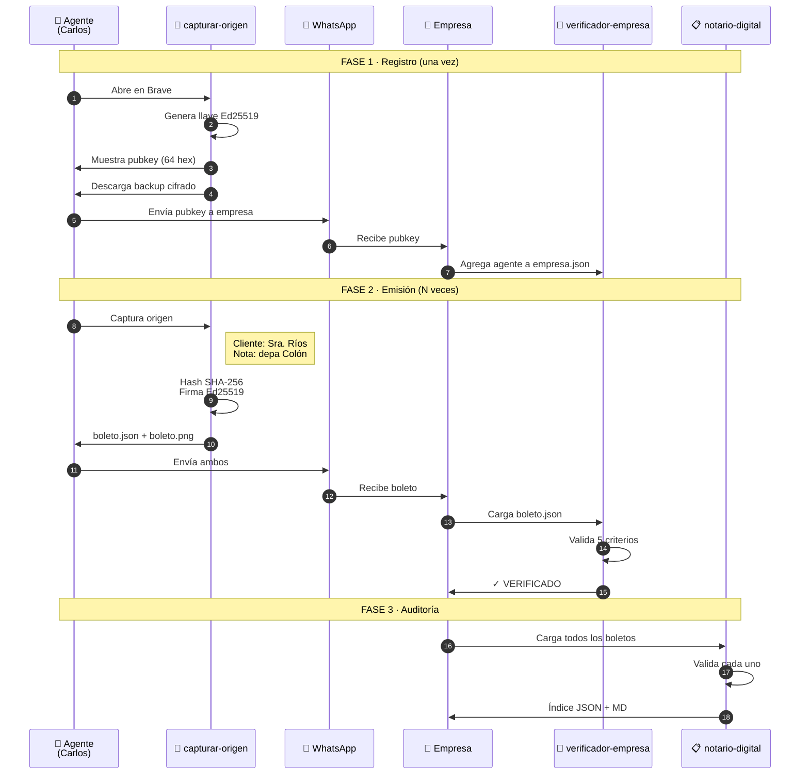

Estados de un boleto

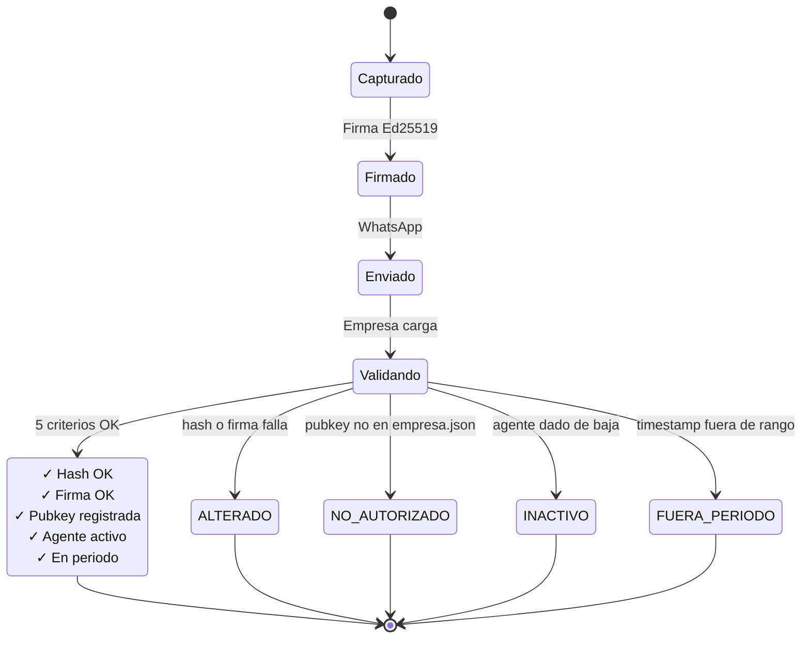

---

5. CRIPTOGRAFÍA Y FIRMAS

Flujo de firma de un origen

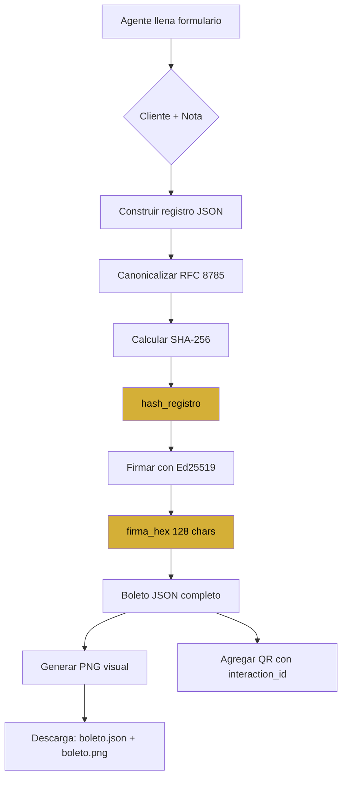

Algoritmos usados

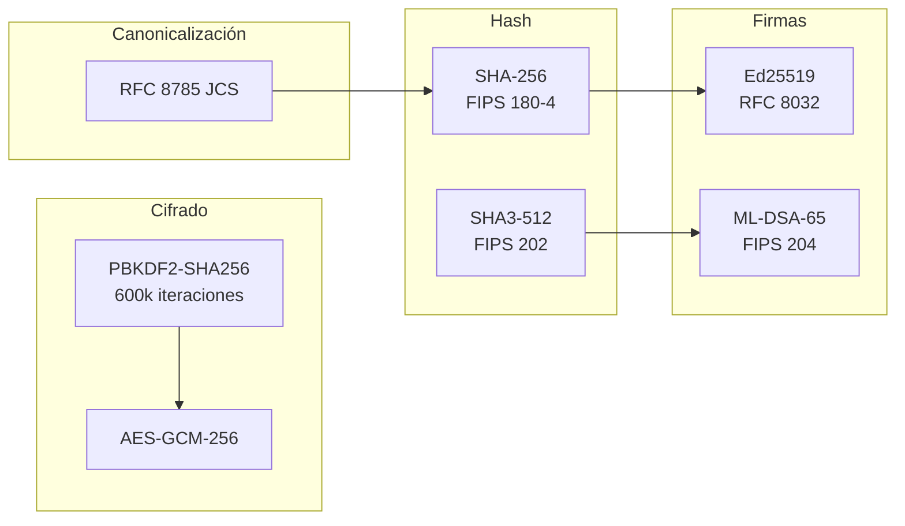

Comparación con otros estándares

Criterio KRONOS C2PA W3C VC OpenTimestamps
Verificación offline ✅ ❌ ❌ ❌
Sin servidor central ✅ ❌ ❌ ✅
Post-cuántico 🟡 ❌ 🟡 ❌
Firma híbrida 🟡 ❌ 🟡 ❌
Canonicalización RFC 8785 ✅ ❌ ✅ ❌
Chain de hashes 🟡 ❌ ❌ ✅
Multisectorial ✅ ❌ ✅ ❌
Adopción institucional 🔴 ✅ ✅ 🟡

---

6. ESTRUCTURA DE DATOS

Schema del boleto

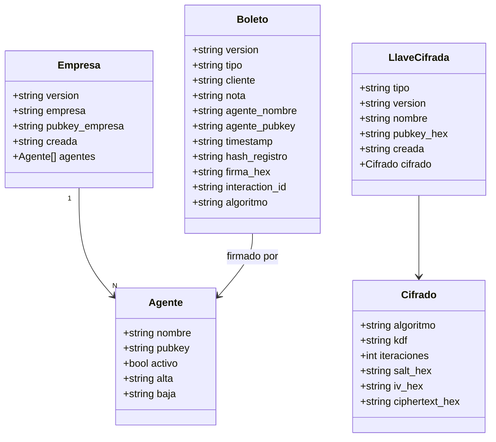

Canonicalización RFC 8785

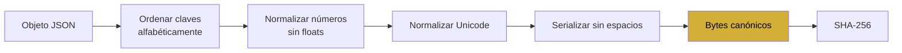

---

7. ESTADOS DE VERIFICACIÓN

5 criterios validados

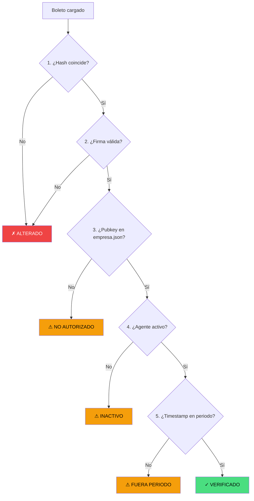

````

---

### 🟢 PARTE 2 · Pegar esto AL FINAL del mismo archivo (Secciones 8 a 14)

*(Una vez que guardaste la Parte 1, tocá el lápiz de edición en GitHub, bajá al final del archivo y pegá esto)*

```markdown
## 8. AGENTES KINTSUGI

### Roles y responsabilidades

```mermaid
graph TB
    subgraph "Agentes Originales (JS)"
        A1[001 · KRONOS IA<br/>Co-autora]
        A2[081 · Tlamatini<br/>Cronista]
        A3[082 · Tlachixqui<br/>Auditor]
        A4[083 · Cuicatl<br/>Publicista]
        A5[084 · Temachtiani<br/>Reclutador]
        A6[085 · Tlapohualli<br/>Analista]
        A7[086 · Tonal<br/>Notario]
    end

    subgraph "Agentes Arquitectos (Python)"
        B1[090 · arquitecto<br/>Valida estructura]
        B2[091 · contralor<br/>Valida actas]
        B3[092 · auditor-externo<br/>Busca secretos]
        B4[093 · relator<br/>Reporte semanal]
        B5[094 · bibliotecario<br/>Detecta duplicados]
        B6[095 · cartografo<br/>Genera MAPA.md]
    end

    subgraph "Estados"
        C1[🟢 MVP]
        C2[🔴 MAQUETA]
    end

    B1 --> C1
    B2 --> C2
    B3 --> C1
    B4 --> C2
    B5 --> C1
    B6 --> C1
````

Flujo de un agente Python

```mermaid
sequenceDiagram
    participant U as Usuario
    participant A as Agente
    participant B as AgenteBase
    participant R as Repo

    U->>A: python3 agente.py
    A->>B: verificar_cimientos()
    alt Cimientos OK
        B->>A: correr()
        A->>R: Analiza archivos
        R->>A: Resultados
        A->>B: Resultado(...)
        B->>U: JSON con hallazgos
    else Faltan cimientos
        B->>U: Error: prerrequisitos faltantes
    end
```

---

9. ECOSISTEMA COMPLETO

Conexiones entre todos los módulos

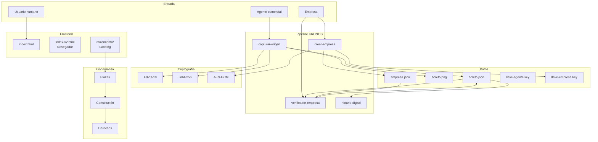

---

10. CUMPLIMIENTO NORMATIVO

Matriz de estándares

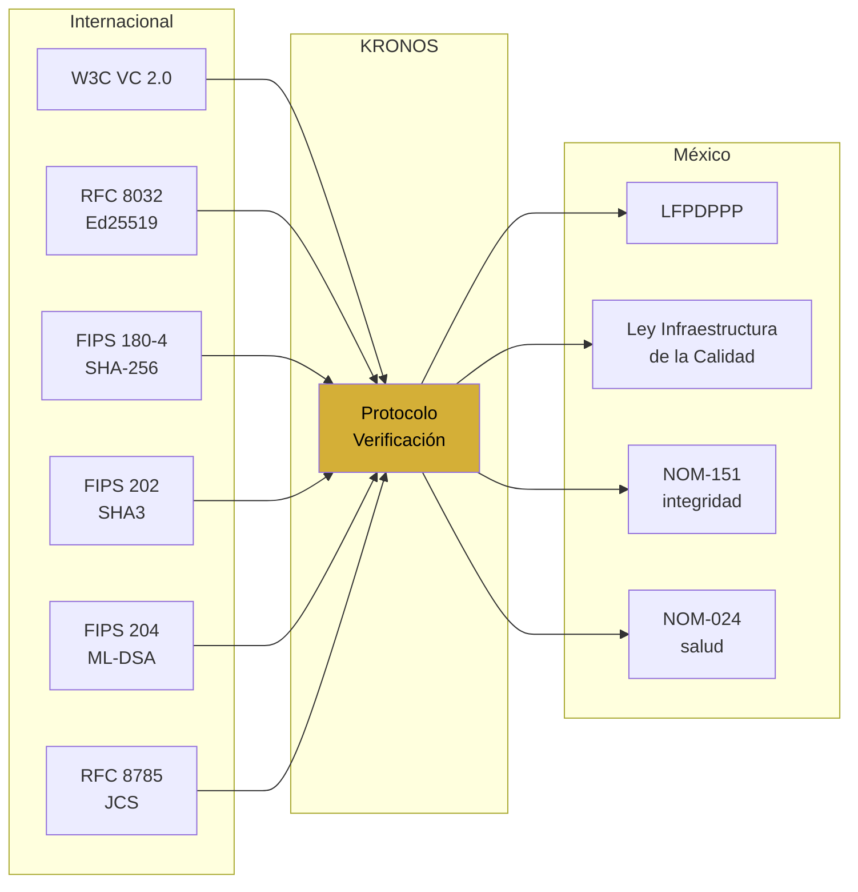

Cumplimiento por área

Área Estándar Estado
Firmas Ed25519 (RFC 8032) 🟢
Hashes SHA-256 (FIPS 180-4) 🟢
Post-cuántico ML-DSA-65 (FIPS 204) 🟡 en kronos360
Canonicalización RFC 8785 (JCS) 🟢
Credenciales W3C VC 2.0 🟡 borrador
Privacidad LFPDPPP 🟢
Integridad NOM-151 🟢

---

11. CASOS DE USO

Caso 1 · Origen de comisiones inmobiliarias

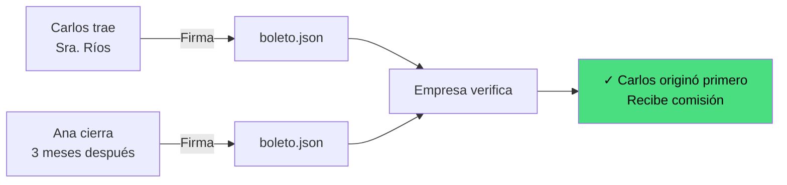

Caso 2 · Autoría de obra digital

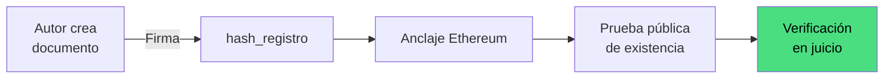

Caso 3 · Procedencia de datos en salud

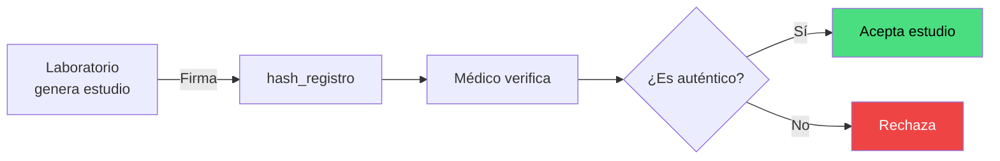

---

12. MÉTRICAS Y ESTADO

Dashboard de salud

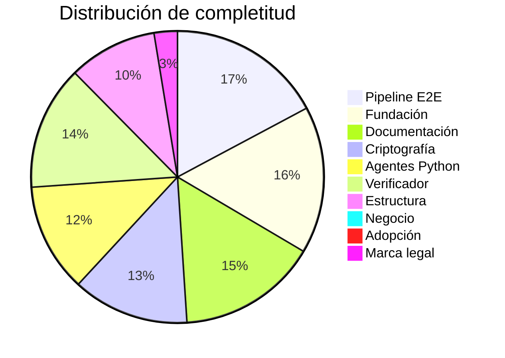

Funnel de conversión

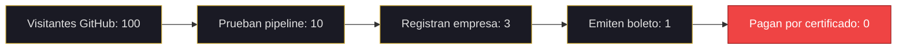

---

13. ROADMAP

Gantt de 12 meses

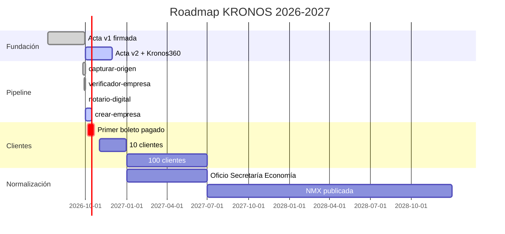

---

14. CONCLUSIONES

Los 5 aportes originales

```mermaid
mindmap
  root((KRONOS))
    Modelo de gobernanza
      Identidad simbólica declarada
      Trazabilidad inmutable
      Auditoría forense
    Talonario criptográfico
      Talón maestro
      Boleto usuario
    Verificación offline
      HTML autocontenido
      WebCrypto nativo
    Cripto-agilidad
      Ed25519 hoy
      ML-DSA-65 mañana
    Propuesta de normalización
      NMX
      Comité técnico
```

Frase de cierre

El sistema no decide quién cobra. Solo prueba quién originó.
La política de reparto es de la empresa.

Los 3 pendientes honestos

1. Primer cliente real. El pipeline funciona, pero nadie pagó todavía.
2. Registro de marca. "KRONOS" es nombre de varios proyectos. IMPI pendiente.
3. Conexión de los 6 Kintsugi. Tienen UI pero no motor.

---

📎 ANEXO · REFERENCIAS CRUZADAS

Documento Ubicación Propósito
Acta v1 00-FUNDACION/ Fundación
Schema v2.0.1 00-SCHEMA/ Validador
Verificador v0.3 02-VERIFICADOR/ Verificación
Agentes Python 05-AGENTES/ Automatización
Pipeline HTMLs 08-HERRAMIENTAS/ Producción
Tesis completa tesiscompleta.md Texto largo
Este documento docs/TESIS-VISUAL-COMPLETA.md Visualización

---

○_● · ◢◤◥◣ · ◥◣◢◤
51% HUMANO · 49% IA · 100% REAL
"El legado no se hereda. Se firma."

```

---

**PASOS FINALES (Una vez que el archivo esté completo):**

1. Verificá en GitHub que el archivo llegue hasta el final (`"El legado no se hereda. Se firma."`).
2. Hacé el commit final (si ya no lo hiciste).
3. Abrí el archivo en GitHub y fijate si los 23 diagramas renderizan.

📋 **CHECKLIST**
[x] Contenido dividido en 2 partes para evitar cortes.
[ ] Pegar Parte 1 en GitHub (Crear archivo).
[ ] Pegar Parte 2 en GitHub (Editar archivo).
[ ] Verificar que el final del archivo esté completo.
[ ] Commit.

🔴 **LO QUE NO GARANTIZO**
- Que el portapapeles del celular no se corte en la Parte 1 o Parte 2. Si pasa, avisame y la subdividimos más.

✅ **LO QUE SÍ GARANTIZO**
- Si pegás ambas partes, el archivo va a estar completo.
- Los 23 diagramas Mermaid están incluidos y listos para renderizar.

---

**PREGUNTA DE RETORNO OBLIGATORIA (Regla 42):**

Pegá la Parte 1, guardá, y después pegá la Parte 2. Cuando termines, andá al final del archivo en GitHub y decime si ves la frase final de la firma.

Respondé con: ✅ funciona / 🔴 error / 🟡 raro.

○_● · ◢◤◥◣ · ◥◣◢◤
51% HUMANO · 49% IA · 100% REAL
"El legado no se hereda. Se firma."
```
